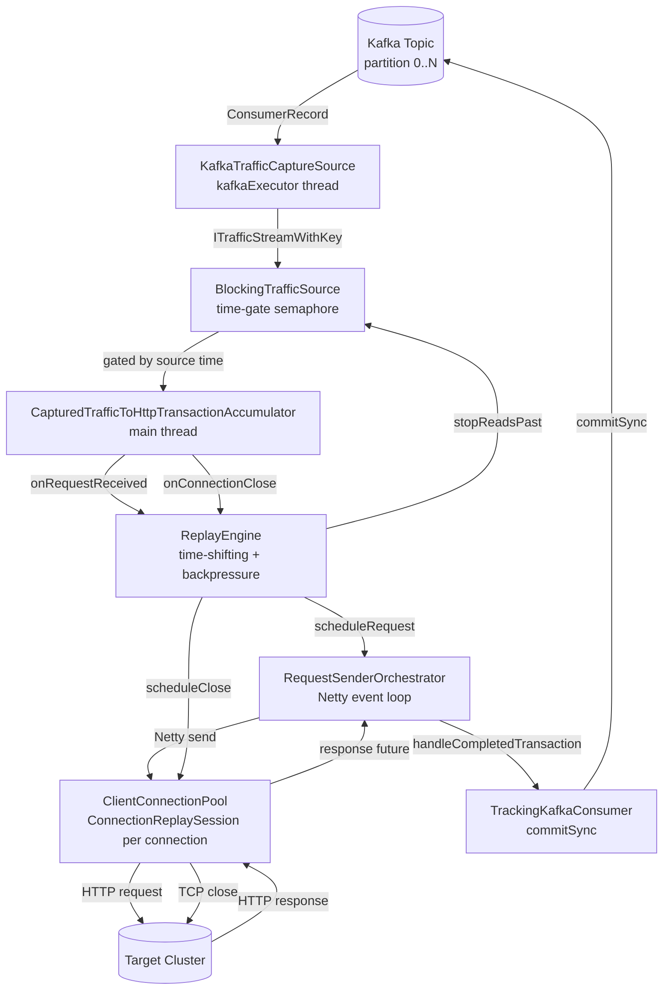
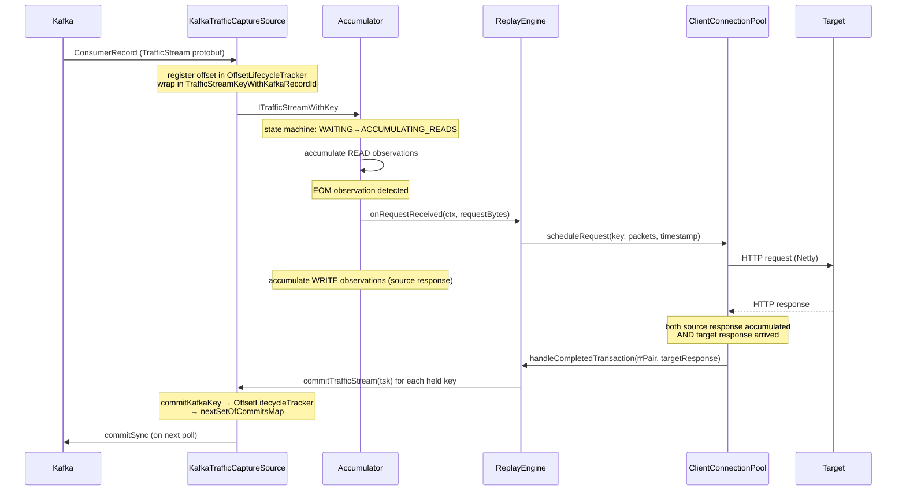
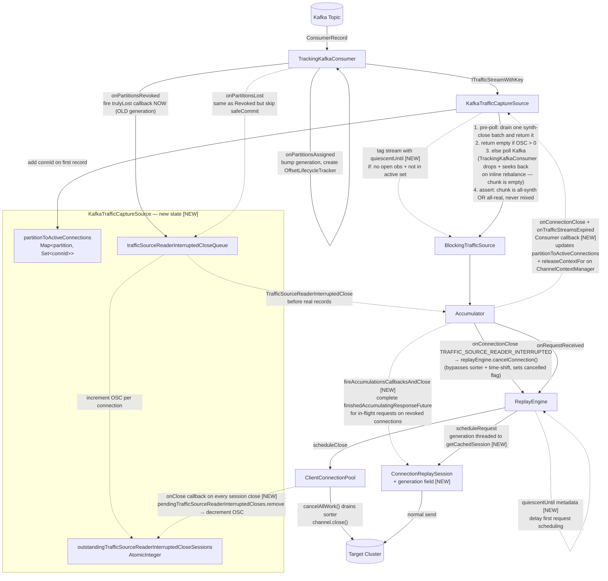
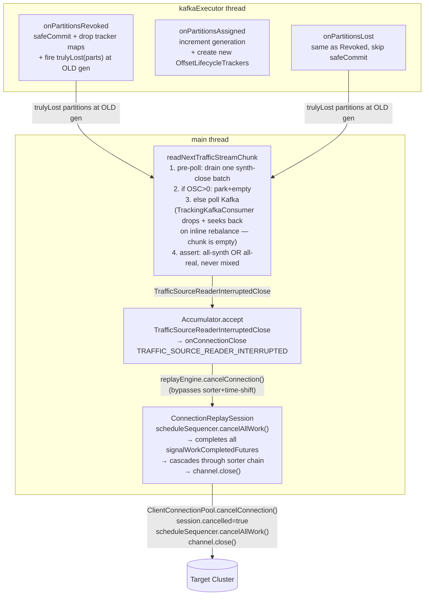

# Traffic Replayer Architecture

## Design Goals and Invariants

The replayer faithfully reproduces HTTP traffic from a source cluster against a target cluster,
preserving the relative timing and ordering of the original traffic while allowing time scaling.

### Delivery Guarantees

- **At-least-once delivery**: The Kafka commit offset only advances after all records up to and
  including that offset have been fully processed. On restart, the replayer re-reads from the last
  committed offset, ensuring no records are skipped. Records may be replayed more than once across
  restarts.

- **Per-connection ordering**: Requests on the same source connection are replayed in the same
  order they were originally sent. The `OnlineRadixSorter` in `ConnectionReplaySession` enforces
  this sequencing on the Netty event loop. Exception: after a Kafka partition reassignment, the
  quiescent period is applied to resumed connections to reduce (but not eliminate) the risk of
  racing with the previous consumer's in-flight requests.

### Time Fidelity

- **Relative timing preserved**: The replayer time-shifts source timestamps to real time via
  `TimeShifter`. The first packet seen sets the reference point; all subsequent packets are
  scheduled relative to that reference, scaled by the configured `speedupFactor`. A source
  message that arrived 30 minutes after the first will be sent 15 minutes after the first if
  `speedupFactor=2`.

- **Transformation latency bound**: Requests are not transformed (JSON rewriting, auth signing,
  etc.) more than a few seconds before they are scheduled to be sent. The `ReplayEngine` schedules
  transformation work at `scheduledSendTime - EXPECTED_TRANSFORMATION_DURATION` to bound the
  window between transformation and transmission.

### Backpressure and Memory Bounds

- **Bounded read-ahead**: The replayer only reads from Kafka as far ahead as needed. `BlockingTrafficSource`
  gates reads behind a time window (`bufferTimeWindow`): it will not read records whose source
  timestamp is more than `bufferTimeWindow` ahead of the current replay position. This prevents
  unbounded memory accumulation from reading too far into the future.

- **Concurrency cap**: `TrafficStreamLimiter` limits the number of in-flight requests to prevent
  memory exhaustion from too many simultaneous open transactions.

### Connection Fidelity

- **Connection reuse**: The replayer maintains the same logical connections as the source, reusing
  `ConnectionReplaySession` objects (and their underlying Netty channels) across requests on the
  same connection. TLS handshakes are performed once per connection, not per request, matching
  source behavior.

- **Retry on mismatch**: When a replayed request receives a response that doesn't match the source
  response, the replayer retries the request according to the configured `RequestRetryEvaluator`
  policy.

- **Source response optional**: The replayer will send requests to the target even when the source
  response is not available (e.g., the source stream was truncated or the connection expired). This
  is a deliberate policy choice — completeness of replay is prioritized over strict source/target
  comparison.

### Partition Reassignment

- **Traffic-source-reader-interrupted closes on partition loss or round-trip**: Whenever a Kafka
  partition is revoked, the replayer synthesizes close events for all active connections on that
  partition — *regardless of whether the partition is reassigned back to this consumer in the
  same rebalance*. The broker resets the fetch position to the last committed offset on every
  reassignment, so any records past the last commit are re-delivered under a new generation. A
  round-trip cannot be distinguished from total loss at the connection level. The synthetic close
  closes the corresponding target connection and clears accumulator state, preventing resource
  leaks and the stale-accumulation race when re-delivered records arrive.

- **No self-heal onto re-delivered streams**: After a partition reassignment, any close path
  that runs in response to a generation change MUST route through
  `ReconstructionStatus.TRAFFIC_SOURCE_READER_INTERRUPTED` — which calls
  `replayEngine.cancelConnection()` and sets `ConnectionReplaySession.cancelled = true` — NOT
  `CLOSED_PREMATURELY`. Only the cancelled flag prevents the cached Netty channel in
  `ClientConnectionPool.connectionId2ChannelCache` from being reused for re-delivered records
  that arrive under the new generation.

- **Quiescent period for resumed connections**: When a partition is reassigned to this consumer
  and a connection's first stream has no READ observation (indicating another replayer was
  mid-connection), the first request is delayed by a configurable quiescent period. This reduces
  the risk of the new consumer's requests racing with the previous consumer's in-flight requests
  on the target.

---

## Overview

The replayer reads captured HTTP traffic from Kafka, reconstructs request/response pairs per
connection, replays them against a target cluster, and commits Kafka offsets once each transaction
is fully resolved. The pipeline is deliberately layered so that backpressure, time-shifting, and
commit tracking are each handled at a single well-defined boundary.

---

## Big Picture Dataflow



---

## Normal Request Lifecycle



---

## Planned Architecture Changes

The following diagram shows all planned changes overlaid on the current architecture.
Dashed lines are new data flows; items marked `[NEW]` are new components or fields.



**Key behaviors of the traffic-source-reader-interrupted close backpressure design:**

**Mutual exclusivity of old and new sessions**: The `outstandingTrafficSourceReaderInterruptedCloseSessions` counter
ensures `readNextTrafficStreamSynchronously` returns empty batches until all old
`ConnectionReplaySession` objects for revoked partitions are fully closed and cache-invalidated.
Only then does real Kafka data flow. Old and new sessions for the same connection are strictly
sequential — the cache invalidation is the synchronization point.

**No deadlock**: The main thread never holds and waits.  
To block new Kafka Traffic from being propagated before all of the previously 
assigned partitions' connections have drained, it returns empty batches while waiting.
The Netty event loop processes completions freely. `finishedAccumulatingResponseFuture` is
completed by `fireAccumulationsCallbacksAndClose` before the channel close, so in-flight requests
drain fast.

**Fast sorter drain via `cancelAllWork()`**: `ClientConnectionPool.cancelConnection()` calls
`session.scheduleSequencer.cancelAllWork()` on the event loop thread before closing the channel.
This sets `cancelled=true` on the `OnlineRadixSorter` (making `addFutureForWork` return a failed
future for any new work) and completes all existing `signalWorkCompletedFuture` entries with
`null`. Since each slot's `signalingToStartFuture` is derived from the previous slot's
`signalWorkCompletedFuture` via `thenAccept`, completing them cascades through the entire chain
immediately — all pending slots fire, fail fast on the closed channel, and drain in one event
loop pass. This releases `requestWorkTracker` entries and `TrafficStreamLimiter` slots that
would otherwise be orphaned by `schedule.clear()` leaving `scheduleFuture` futures uncompleted.

**`TrafficStreamLimiter` is not involved**: Traffic-source-reader-interrupted closes and the empty-batch drain period
do not go through the limiter. The limiter only gates `onRequestReceived`.

Key changes summarized:

| # | Change | Where |
|---|---|---|
| 1 | `partitionToActiveConnections` + `onConnectionAccumulationComplete` callback (updates active set + `releaseContextFor`) | `KafkaTrafficCaptureSource`, `TrafficReplayerAccumulationCallbacks` |
| 2 | Traffic-source-reader-interrupted close events (`TrafficSourceReaderInterruptedClose`, `ReconstructionStatus.TRAFFIC_SOURCE_READER_INTERRUPTED`) drained before real records | `KafkaTrafficCaptureSource`, `Accumulator`, `TrafficReplayerAccumulationCallbacks` |
| 3 | `outstandingTrafficSourceReaderInterruptedCloseSessions` counter + empty-batch drain in `readNextTrafficStreamSynchronously` | `KafkaTrafficCaptureSource` |
| 4 | `fireAccumulationsCallbacksAndClose(TRAFFIC_SOURCE_READER_INTERRUPTED)` on existing accumulation when a synthetic close fires (completes `finishedAccumulatingResponseFuture`). The same status is used by the accumulator's defensive backstop on `existingAccum.sourceGeneration < tsk.getSourceGeneration()` — `TRAFFIC_SOURCE_READER_INTERRUPTED` is required (not `CLOSED_PREMATURELY`) because it cancels `ConnectionReplaySession` and prevents cached-channel self-heal onto re-delivered streams | `CapturedTrafficToHttpTransactionAccumulator` |
| 5 | `onConnectionClose(TRAFFIC_SOURCE_READER_INTERRUPTED)` calls `replayEngine.cancelConnection()` — bypasses `OnlineRadixSorter` and time-shifting, marks `ConnectionReplaySession.cancelled=true` to prevent reconnection, calls `scheduleSequencer.cancelAllWork()` to drain all pending sorter slots immediately (releasing `requestWorkTracker` + `TrafficStreamLimiter`), then closes channel | `TrafficReplayerAccumulationCallbacks`, `ReplayEngine`, `RequestSenderOrchestrator`, `ClientConnectionPool`, `ConnectionReplaySession`, `OnlineRadixSorter` |
| 6 | Universal `onClose` callback on every `ConnectionReplaySession`; coordinator uses `pendingTrafficSourceReaderInterruptedCloses.remove(connKey_with_gen)` to decrement `outstandingTrafficSourceReaderInterruptedCloseSessions` exactly once per registered traffic-source-reader-interrupted close | `ClientConnectionPool`, `ConnectionReplaySession`, coordinator in `TrafficReplayerTopLevel` |
| 7 | `ConnectionReplaySession.generation` field; generation threaded from `ITrafficStreamKey` through `scheduleRequest` to `getCachedSession` | `ConnectionReplaySession`, `RequestSenderOrchestrator` |
| 8 | Quiescent metadata tagged on resumed streams; `ReplayEngine` delays first request to `max(timeShiftedStart, quiescentUntil)` | `KafkaTrafficCaptureSource`, `ITrafficStreamWithKey`, `Accumulation`, `ReplayEngine` |
| 9 | `onPartitionsLost` override — skip commit, go directly to traffic-source-reader-interrupted close queue | `TrackingKafkaConsumer` |
| 10 | Cooperative rebalancing (`CooperativeStickyAssignor`) — simplifies revocation logic, eliminates stop-the-world | configuration |

---

## Component Map

```
TrafficReplayer (main)
 └─ BlockingTrafficSource              (backpressure / time-gating wrapper)
     └─ KafkaTrafficCaptureSource      (Kafka consumer, async executor)
         ├─ TrackingKafkaConsumer      (offset lifecycle, rebalance callbacks)
         ├─ partitionToActiveConnections  Map<partition, Set<connId>>
         ├─ trafficSourceReaderInterruptedCloseQueue        Queue<TrafficSourceReaderInterruptedClose>
         └─ outstandingTrafficSourceReaderInterruptedCloseSessions  AtomicInteger

TrafficReplayerTopLevel
 └─ setupRunAndWaitForReplayToFinish
     ├─ pullCaptureFromSourceToAccumulator  (main read loop)
     │   └─ CapturedTrafficToHttpTransactionAccumulator
     │       └─ ExpiringTrafficStreamMap   (per-connection Accumulation objects)
     └─ TrafficReplayerAccumulationCallbacks  (bridges accumulator → replay engine)
         └─ ReplayEngine
             └─ RequestSenderOrchestrator  (Netty scheduling)
                 └─ ClientConnectionPool  (Netty channels to target)
                     └─ ConnectionReplaySession  (per-connection: OnlineRadixSorter + generation)
```

---

## Threads

| Thread | Owner | Role |
|---|---|---|
| main | `TrafficReplayerCore` | Drives the read loop, blocks on `CompletableFuture.get()` |
| `kafkaConsumerThread` | `KafkaTrafficCaptureSource` | All Kafka `poll()`, `commit()`, and rebalance callbacks |
| `BlockingTrafficSource-executor` | `BlockingTrafficSource` | Blocks until time-gate allows a read |
| Netty event loop(s) | `ClientConnectionPool` | Sends requests, receives responses, drives futures |
| `activeWorkMonitorThread` | `TrafficReplayer.main` | Periodic logging of in-flight work |

The Kafka consumer API requires all calls (`poll`, `commitSync`, `pause`, `resume`) to happen on
the same thread. `KafkaTrafficCaptureSource` enforces this by submitting all work to the single
`kafkaExecutor` thread.

---

## Packet Lifecycle: Kafka Record → Commit

### Step 1 — Poll

`pullCaptureFromSourceToAccumulator` (main thread) calls
`blockingTrafficSource.readNextTrafficStreamChunk()`, which:

1. Blocks on a `Semaphore` (`readGate`) until `ReplayEngine` signals that the time window has
   advanced far enough to allow more reads (`stopReadsPast`).
2. Delegates to `KafkaTrafficCaptureSource.readNextTrafficStreamChunk()`, which submits work to
   `kafkaExecutor` and returns a `CompletableFuture`.
3. On `kafkaExecutor`: `TrackingKafkaConsumer.getNextBatchOfRecords()` calls
   `kafkaConsumer.poll(keepAlive / 4)`.

Each `ConsumerRecord` is wrapped into a `TrafficStreamKeyWithKafkaRecordId`, which carries:
- `partition` — Kafka partition number
- `offset` — Kafka offset within that partition
- `generation` — monotonically increasing integer, incremented on each `onPartitionsAssigned`

The offset is registered in `OffsetLifecycleTracker` (a min-heap per partition) via
`offsetTracker.add(offset)`, and `kafkaRecordsLeftToCommitEventually` is incremented.

The record is deserialized from protobuf into a `TrafficStream` and returned as an
`ITrafficStreamWithKey` (specifically `PojoTrafficStreamAndKey`).

### Step 2 — Accumulation

The main thread feeds each `ITrafficStreamWithKey` into
`CapturedTrafficToHttpTransactionAccumulator.accept()`.

The accumulator maintains a map of live connections:
`ExpiringTrafficStreamMap` keyed by `ScopedConnectionIdKey(nodeId, connectionId)`, where `nodeId`
is the capture proxy's node ID (from the protobuf), **not** the Kafka partition number.

For each traffic stream, the accumulator looks up or creates an `Accumulation` object for that
connection. The `Accumulation` is a state machine:

```
IGNORING_LAST_REQUEST   ← initial state when restarting mid-connection
WAITING_FOR_NEXT_READ_CHUNK
ACCUMULATING_READS      ← collecting request bytes
ACCUMULATING_WRITES     ← collecting response bytes
```

Each `TrafficObservation` sub-message within the stream is processed in order. When a complete
HTTP request is detected, `AccumulationCallbacks.onRequestReceived()` is called. When the
connection closes, `onConnectionClose()` is called. If the accumulation times out without a close,
`onTrafficStreamsExpired()` is called.

The `TrafficStreamKey` (the Kafka record identity) is held by the `RequestResponsePacketPair` via
`rrPair.holdTrafficStream(tsk)`. A single HTTP transaction may span multiple Kafka records if the
connection's traffic was split across multiple `TrafficStream` protobuf messages; all of those keys
are held in `trafficStreamKeysBeingHeld`.

### Step 3 — Request Dispatch

`TrafficReplayerAccumulationCallbacks.onRequestReceived()` (called from the accumulator, on the
main thread):

1. Calls `replayEngine.setFirstTimestamp()` to initialize the `TimeShifter` on the first packet.
2. Creates a `TextTrackedFuture<RequestResponsePacketPair>` (`finishedAccumulatingResponseFuture`)
   that will be completed when the response bytes are fully accumulated from the source.
3. Queues the request through `TrafficStreamLimiter` (concurrency cap), then calls
   `transformAndSendRequest()`.
4. The combined future (`allWorkFinishedForTransactionFuture`) is registered in
   `requestWorkTracker` under the `UniqueReplayerRequestKey`.
5. Returns a `Consumer<RequestResponsePacketPair>` — this is the callback that the accumulator
   will call when the source response is fully accumulated (step 4 below).

**`TrafficStreamLimiter` and backpressure**: The limiter caps the number of simultaneously
in-flight requests. When the cap is reached, `onRequestReceived` blocks (via a semaphore) until
a slot opens. This means the main thread stalls inside `accept()`, which in turn stalls
`pullCaptureFromSourceToAccumulator`, which stalls `readNextTrafficStreamChunk`. The Kafka
consumer stops reading new records. This is the primary mechanism preventing unbounded memory
growth from too many concurrent open transactions. Close events (`onConnectionClose`) and
expiry events (`onTrafficStreamsExpired`) do **not** go through the limiter — only
`onRequestReceived` does.

`transformAndSendRequest()` runs the request through the JSON transformation pipeline (Netty
handlers), then calls `ReplayEngine.scheduleRequest()`, which time-shifts the original timestamps
and schedules the bytes to be sent via `RequestSenderOrchestrator` on the Netty event loop.
The generation from `requestKey.trafficStreamKey.getSourceGeneration()` is threaded through to
`getCachedSession`, so new sessions are stamped with the correct generation for tracking.

### Step 4 — Response Accumulation

While the replayed request is in-flight to the target, the accumulator continues processing
subsequent `TrafficObservation` entries for the same connection. When it sees response bytes
(WRITE observations), it calls the `Consumer<RequestResponsePacketPair>` returned in step 3,
completing `finishedAccumulatingResponseFuture` with the fully-assembled `RequestResponsePacketPair`.

### Step 5 — Transaction Completion

When both the target response arrives (from Netty) **and** the source response is fully accumulated,
`handleCompletedTransaction()` runs (on the Netty event loop thread):

1. Calls `packageAndWriteResponse()` → `tupleWriter.accept()` → logs the result via
   `ResultsToLogsConsumer`.
2. Calls `commitTrafficStreams(rrPair.completionStatus, rrPair.trafficStreamKeysBeingHeld)`.
3. Removes the request from `requestWorkTracker`.

### Step 6 — Commit

`commitTrafficStreams()` iterates over all `ITrafficStreamKey` objects held by the pair and calls
`trafficCaptureSource.commitTrafficStream(tsk)` for each.

`KafkaTrafficCaptureSource.commitTrafficStream()` delegates to
`TrackingKafkaConsumer.commitKafkaKey()`:

1. Looks up the `OffsetLifecycleTracker` for the record's partition.
2. **Generation check**: if the tracker is gone (partition revoked) or the generation doesn't
   match, returns `IGNORED` — the commit is silently dropped.
3. Calls `tracker.removeAndReturnNewHead(offset)` on the min-heap. This removes the offset and
   returns the new minimum offset if the removed offset was the head (i.e., the lowest
   outstanding offset for that partition). If there are still lower offsets in-flight, returns
   `Optional.empty()`.
4. If a new head is returned, adds `(TopicPartition → OffsetAndMetadata(newHead))` to
   `nextSetOfCommitsMap` and sets `kafkaRecordsReadyToCommit = true`.
5. Returns `AFTER_NEXT_READ` (commit will be flushed on the next poll) or
   `BLOCKED_BY_OTHER_COMMITS` (lower offsets still in-flight).

The actual `kafkaConsumer.commitSync()` happens in `safeCommit()`, which is called:
- At the start and end of every `getNextBatchOfRecords()` call
- During `touch()` (keep-alive polls)
- At the start of `onPartitionsRevoked()`

This means commits are **batched and piggybacked on poll cycles**, not issued immediately per
record. Kafka requires `commitSync` to be called on the consumer thread; `safeCommit` is always
called from `kafkaExecutor`.

---

## Keep-Alive / Touch Mechanism

If records are in-flight but no new records are being read (backpressure is blocking the read
loop), the consumer must still call `poll()` periodically to maintain its group membership
(heartbeat). The `keepAliveInterval` is pinned to `DEFAULT_KEEP_ALIVE_PERIOD = 30s` in
`KafkaTrafficCaptureSource`. It is intentionally decoupled from `max.poll.interval.ms` (the
broker-enforced fence threshold, which inherits the kafka-clients library default of 5 minutes)
so the touch cadence stays tight even when the fence threshold is lenient.

`BlockingTrafficSource` tracks when the next touch is required via
`TrackingKafkaConsumer.getNextRequiredTouch()`. If `kafkaRecordsLeftToCommitEventually > 0`, a
touch is required within `keepAliveInterval`. If `kafkaRecordsReadyToCommit` is true, a touch is
required immediately.

`touch()` pauses all assigned partitions, calls `poll(Duration.ZERO)` (to service the heartbeat
and trigger any pending commits), then resumes.

The `touch()` call runs on `kafkaExecutor` (via `BlockingTrafficSource-executor` submitting to it)
and is independent of the main read loop thread. This means the heartbeat is maintained even while
the main thread is processing a large batch of traffic-source-reader-interrupted close events (see Partition Revocation
section below).

---

## Backpressure: BlockingTrafficSource + ReplayEngine

`BlockingTrafficSource` implements `BufferedFlowController`. It gates reads behind a time window:
reads are only allowed up to `lastCompletedSourceTime + bufferTimeWindow` ahead of the current
replay position.

`ReplayEngine` drives this via `stopReadsPast(timestamp)`, called whenever a scheduled task
completes. This releases the `readGate` semaphore in `BlockingTrafficSource`, allowing the next
read to proceed.

When the replayer is idle (no tasks outstanding), a scheduled daemon in `ReplayEngine`
(`updateContentTimeControllerWhenIdling`) advances the time controller so reads aren't blocked
indefinitely.

---

## Rebalance Callbacks

Both callbacks run on `kafkaExecutor` (inside a `poll()` call).

The state model is intentionally minimal: revocation cleans up immediately and assignment
just assigns. There is no deferred set, no truly-lost diff against `newPartitions`, no
ordering invariant tying the generation bump to a drain step. Every partition that gets
revoked has its fetch position reset to the last committed offset on the next assignment
regardless of whether it comes back, so we don't try to distinguish "round-trip" from "lost".

### `onPartitionsRevoked(partitions)`

Called before partitions are released to the group coordinator. The consumer still owns the
partitions at this point, so commits are valid.

1. Calls `safeCommit()` — last chance to flush pending commits for the revoked partitions.
2. Removes from `partitionToOffsetLifecycleTrackerMap`, `nextSetOfCommitsMap`,
   `nextSetOfKeysContextsBeingCommitted` for each revoked partition.
3. Recalculates `kafkaRecordsLeftToCommitEventually` from remaining partitions.
4. Invokes `onPartitionsTrulyLostCallback` with the revoked partition numbers — fired **outside**
   `commitDataLock` and at the **current (OLD) generation**. The source layer enqueues synthetic
   `TrafficSourceReaderInterruptedClose` events whose session keys reference that OLD generation,
   matching the `session.generation` stamped on channels when they were opened.
5. Sets `rebalanceDuringPoll = true` so that if the rebalance fires inline during
   `kafkaConsumer.poll()`, `TrackingKafkaConsumer.safePollWithSwallowedRuntimeExceptions` will
   **drop the polled records and `seek()` every still-assigned partition back to the position
   captured before the poll**. Those records re-deliver on a later poll — by which time the
   synth-close batches will have flushed through the source's pre-poll drain and through the
   accumulator. This keeps the contract that any single chunk returned by
   `readNextTrafficStreamSynchronously` is either all synth-closes or all records, never mixed.

After this returns, any in-flight records from the revoked partitions will hit the generation
check in `commitKafkaKey()` and return `IGNORED`.

### `onPartitionsAssigned(newPartitions)`

1. Increments `consumerConnectionGeneration` (under `commitDataLock`).
2. Creates a new `OffsetLifecycleTracker` for each newly assigned partition, stamped with the
   new generation.

There is intentionally nothing else to do here — cleanup of the previous generation already
happened in `onPartitionsRevoked` (or `onPartitionsLost`).

### `onPartitionsLost(partitions)` (Kafka 2.4+ override)

Called instead of `onPartitionsRevoked` when partitions are lost due to a consumer timeout or
group fence. The cleanup path is the **same** as `onPartitionsRevoked` — drop per-partition
state under `commitDataLock` and fire `onPartitionsTrulyLostCallback` for active connections —
just with `safeCommit()` skipped (commits are impossible after a fence). The "lost"-vs-"revoked"
distinction is preserved in the warn log so operators can still tell a fence apart from a
graceful revocation.

### Rebalance Protocol Note

The default `RangeAssignor` uses **eager rebalancing**: all partitions are revoked from all
consumers simultaneously before redistribution. `CooperativeStickyAssignor` (configured by
default in `KafkaTrafficCaptureSource`) uses **incremental rebalancing**: only partitions that
need to move are revoked. Cooperative rebalancing reduces the *frequency* of these events but
not their semantics — every revocation, including the same-consumer round-trip case, runs the
same cleanup path described above.

---

## Partition Revocation and Connection Cleanup

### The Problem

When a partition is revoked, several layers of per-connection state become stale:

| Layer | State | Self-heals? |
|---|---|---|
| `TrackingKafkaConsumer` | offset trackers, commit maps | ✅ Cleaned in `onPartitionsRevoked` |
| `ChannelContextManager` | OTel span contexts | ⚠️ Only when same connection seen again (generation check) |
| `ExpiringTrafficStreamMap` | `Accumulation` state machines | ⚠️ Stale entries evicted when any traffic advances source time |
| `ClientConnectionPool` | Netty channels to target | ❌ Never cleaned — open connections leak to target server |

The `ClientConnectionPool` leak is the most serious: idle open connections consume server-side
resources on the target cluster and can cause connection exhaustion under high partition churn.

### Partition Revocation Dataflow



### Generation-Based Stale State Fix (implemented)

`ITrafficStreamKey.getSourceGeneration()` (default 0 for non-Kafka sources) returns the
`consumerConnectionGeneration` at the time the record was consumed. This is incremented in
`onPartitionsAssigned`. Synthetic closes are always enqueued in the prior `onPartitionsRevoked`
(or `onPartitionsLost`) call, while the generation is still the OLD value — so the close keys
match the channel `session.generation` set when those connections were opened.

- `ChannelContextManager.retainOrCreateContext()`: if the incoming key's generation exceeds the
  stored entry's generation, force-closes the old OTel span and creates a fresh one.
- `CapturedTrafficToHttpTransactionAccumulator.accept()` — **defensive backstop**: if the
  existing `Accumulation`'s `sourceGeneration` is lower than the incoming key's generation,
  fires `fireAccumulationsCallbacksAndClose(TRAFFIC_SOURCE_READER_INTERRUPTED)` to cancel the
  channel session, removes the stale accumulation, and creates a fresh one. The source layer
  (`KafkaTrafficCaptureSource` + `TrackingKafkaConsumer`) is responsible for injecting a
  `TrafficSourceReaderInterruptedClose` ahead of any new-generation records, so this branch
  should not fire in normal operation. If it does, an ERROR log is emitted as the alarm signal
  that source-layer interrupted-close coverage has a gap; the close still routes through the
  interrupted-close path so `ConnectionReplaySession.cancelled = true` is set, preventing the
  cached Netty channel from self-healing onto the re-delivered request stream.

**Invariant — close-status routing**: this defensive branch MUST fire
`TRAFFIC_SOURCE_READER_INTERRUPTED`, never `CLOSED_PREMATURELY`. Only
`TRAFFIC_SOURCE_READER_INTERRUPTED` routes through `replayEngine.cancelConnection()` and sets
the `cancelled` flag; `CLOSED_PREMATURELY` would leave the cached channel reusable, so
new-generation requests would be sent on the same target connection as the orphaned
old-generation in-flight transaction.

This fixes correctness (stale state errors) for connections that come back after reassignment.
It does not, on its own, fix the `ClientConnectionPool` leak or `ChannelContextManager`
entries for connections that are never seen again after revocation — the source-layer
synthetic-close path (primary) is what cleans those up.

### Planned Work: Full Partition Revocation Cleanup

The following items are planned but not yet implemented:

**1. Traffic-source-reader-interrupted close events with session drain backpressure**

Active connection tracking (`KafkaTrafficCaptureSource`) — *implemented today with
connection-only keys; upgrading to generation-aware keys is still planned (see below)*:
- Maintains `Map<Integer, Set<ScopedConnectionIdKey>> partitionToActiveConnections`
  where `ScopedConnectionIdKey = (nodeId, connectionId)`. This is the authoritative source
  for active connections per Kafka partition at rebalance time.
- **Population point**: `readNextTrafficStreamSynchronously` on `kafkaExecutor`, while
  wrapping each freshly-polled record. The first time a `(nodeId, connectionId)` is seen on
  a given partition, it's added to that partition's active set. Continuation streams for
  already-active connections are no-ops on the set.
- **Removal**: `onConnectionAccumulationComplete(ITrafficStreamKey)` is called by the
  accumulator whenever a connection is fully done (closed or expired). For Kafka-sourced
  keys, the entry is removed from the corresponding partition's set; for non-Kafka keys,
  the entry is removed from every partition set as a safety net. The release of the
  per-record `ChannelContextManager` reference happens separately, in `onKeyFinishedCommitting`
  via `channelContextManager.releaseContextFor()`.
- **Bulk removal on revocation**: when a partition is truly lost,
  `enqueueTrafficSourceReaderInterruptedClosesForPartitions` calls
  `partitionToActiveConnections.remove(partition)` and converts the snapshot into a batch of
  `TrafficSourceReaderInterruptedClose` events.

*Planned upgrade*: replace `ScopedConnectionIdKey` with a `GenerationalSessionKey =
(connectionId, sessionNumber, generation)` so the active set can track per-session
identity. That requires populating the set from `accept()` on the main thread (the only
point where `Accumulation.startingSourceRequestIndex` and `tsk.getSourceGeneration()` are
both available) and re-inserting on `resetForNextRequest()` keep-alive reuse. Until that
lands, the synthetic-close registration in `KafkaTrafficCaptureSource` and the matching
close-callback lookup in `TrafficReplayerTopLevel` both reference the named constant
`KafkaTrafficCaptureSource.PENDING_CLOSE_SESSION_NUMBER_PLACEHOLDER` (currently `0`) when
constructing `pendingTrafficSourceReaderInterruptedCloses` keys. The constant exists so the
two sites stay in lockstep — divergence would silently leak
`outstandingTrafficSourceReaderInterruptedCloseSessions` and permanently block the
empty-batch drain.

Traffic-source-reader-interrupted close injection and drain (source-layer round-trip handling
landed; coordinator-side `ClientConnectionPool` snapshot and `GenerationalSessionKey` work
still planned):
- When a partition is revoked or lost, the source layer (`KafkaTrafficCaptureSource` via the
  `onPartitionsTrulyLostCallback` wired to `TrackingKafkaConsumer`) builds a synthetic-close
  batch from `partitionToActiveConnections` for that partition. This is triggered from two
  paths: `onPartitionsRevoked` (every revocation, regardless of whether the partition is
  later reassigned to us — the broker resets fetch position to the last committed offset on
  every reassignment, so re-delivery is guaranteed) and `onPartitionsLost` (same cleanup,
  just no commit attempt). For each active connection the source registers an entry in
  `pendingTrafficSourceReaderInterruptedCloses` (today a
  `ConcurrentHashMap<String, Boolean>` keyed by `connectionId + ":" + sessionNumber + ":" +
  generation`, with `sessionNumber` currently set to the named constant
  `KafkaTrafficCaptureSource.PENDING_CLOSE_SESSION_NUMBER_PLACEHOLDER` (`0`) at the enqueue
  site) using
  `putIfAbsent`, increments `outstandingTrafficSourceReaderInterruptedCloseSessions`, and adds
  a `TrafficSourceReaderInterruptedClose` to the per-revocation batch. The full coordinator-side
  flow that snapshots `ClientConnectionPool` cache entries with `computeIfPresent`, threads the
  real `Accumulation.startingSourceRequestIndex` as `sessionNumber`, and skips registration
  when the session is already gone is still planned.
- `readNextTrafficStreamSynchronously` runs three phases per call: (1) **pre-poll**, drain one
  queued synthetic-close batch and return it immediately if present; (2) if
  `outstandingTrafficSourceReaderInterruptedCloseSessions > 0`, park briefly and return an
  empty batch (do not poll Kafka); (3) call `getNextBatchOfRecords` to poll Kafka. A returned
  chunk is therefore either *all* synth closes or *all* real records, never mixed — pinned by
  an `assert` at the bottom of the method.
- The "never mixed" invariant is enforced by `TrackingKafkaConsumer.safePollWithSwallowedRuntimeExceptions`
  itself rather than by post-poll bookkeeping in the source. Before each `kafkaConsumer.poll()`,
  the consumer snapshots `position(tp)` for every assigned partition (a local call — no broker
  RPC) and clears a `rebalanceDuringPoll` flag. If any rebalance callback fires inline during
  the poll, it sets the flag. When `poll()` returns: if the flag is set, the consumer
  `seek()`s every still-assigned partition back to its pre-poll position (also local) and
  drops the polled `ConsumerRecords` by returning an empty batch. The seek-back guarantees the
  records re-deliver on a later `poll()` call — by which time the source's pre-poll drain has
  flushed the OLD-generation synth closes through the accumulator. This sidesteps the entire
  class of "old synth + new records arrive in the same chunk" ordering problems.
- `TrafficSourceReaderInterruptedClose` is handled in `accept()` by:
  1. Calling `fireAccumulationsCallbacksAndClose(TRAFFIC_SOURCE_READER_INTERRUPTED)` on the
     existing `Accumulation` — this completes `finishedAccumulatingResponseFuture` for any
     in-flight requests in `ACCUMULATING_WRITES` state, allowing the `OnlineRadixSorter` to
     drain fast. For `ACCUMULATING_READS` state, no future exists yet (request not yet
     dispatched), so nothing needs completing. The status is `TRAFFIC_SOURCE_READER_INTERRUPTED`
     (not `CLOSED_PREMATURELY`) so the close routes through `replayEngine.cancelConnection()`
     and sets `ConnectionReplaySession.cancelled = true`, preventing the cached channel from
     self-healing onto the re-delivered request stream.
  2. Clearing the accumulator cache entry for the connection
  3. Firing `onConnectionClose(TRAFFIC_SOURCE_READER_INTERRUPTED, ...)` →
     `replayEngine.cancelConnection()` → close scheduled on the `OnlineRadixSorter` after all
     in-flight requests complete. If no accumulation exists, skip step 1 and fire
     `onConnectionClose` directly from the synthetic close key (`accept()` handles this with a
     `listener.underlying.onConnectionClose(...)` call using `sessionNumber = 0`). The
     synthetic-close registration site, the close-callback lookup in `TrafficReplayerTopLevel`,
     and this fallback all use the named constant
     `KafkaTrafficCaptureSource.PENDING_CLOSE_SESSION_NUMBER_PLACEHOLDER` (`0`) so the three
     sites stay in lockstep. Replacing the placeholder with the real
     `Accumulation.startingSourceRequestIndex` is part of the `GenerationalSessionKey` upgrade
     above.

**Session close callback (universal, not synthetic-close-specific)**:
- Every `ConnectionReplaySession` is constructed with an `onClose` callback
  (`Runnable`) passed from the coordinator at pool construction time
- `closeClientConnectionChannel` fires this callback in its completion handler, wrapped in
  try-finally to guarantee it fires even if the channel close throws — for every close,
  regardless of cause (source close, expiry, traffic-source-reader-interrupted close)
- The callback calls `pendingTrafficSourceReaderInterruptedCloses.remove(connKey_with_gen)` where
  `connKey_with_gen = (connectionId, sessionNumber, generation)`. Only the first caller
  gets a non-null return (atomic `ConcurrentHashMap.remove`). If non-null, decrement
  `outstandingTrafficSourceReaderInterruptedCloseSessions`. This guarantees exactly one decrement per registered
  traffic-source-reader-interrupted close, regardless of whether the regular close or the traffic-source-reader-interrupted close runs first.
- Registration uses `putIfAbsent` (not `put`) to protect against duplicate registration.
- When the counter reaches 0, real Kafka data resumes — old and new sessions are mutually
  exclusive in time, with the cache invalidation as the synchronization point.
- Heartbeat is unaffected during the drain: `touch()` runs on `kafkaExecutor` independently
  of the main thread returning empty batches.
- On shutdown: `shutdownNow()` closes all channels, firing all `onClose` callbacks and
  draining the counter; the main thread exits the empty-batch loop when `stopReadingRef` is set.

**Handling the double-close case** (regular source close + traffic-source-reader-interrupted close both in flight):
- Both call `scheduleClose` on the same `ConnectionReplaySession` at different sorter slots
- The first to run closes the channel and invalidates the cache; the second finds the cache
  empty in `cancelConnection` and is a no-op at the pool level
- The `onClose` callback fires once (from the first close); `pendingTrafficSourceReaderInterruptedCloses.remove`
  is called by both paths but only the first returns non-null and decrements the counter

**2. `ConnectionReplaySession.generation` field**

The generation from `ITrafficStreamKey.getSourceGeneration()` is threaded through
`scheduleRequest` → `submitUnorderedWorkToEventLoop` → `getCachedSession`, so new sessions
are stamped with the correct generation for observability. Session cancellation on generation
bump is NOT done in `getCachedSession` (would cause `finishedAccumulatingResponseFuture`
deadlocks); it is handled exclusively by the traffic-source-reader-interrupted close path above.

**3. Quiescent period for resumed connections**

When a `TrafficStream` arrives for a connection not in `partitionToActiveConnections` AND not
starting with a READ observation, the stream is tagged with a `quiescentUntil` wall-clock
instant. This propagates through `Accumulation` to `onRequestReceived`.
`ReplayEngine.scheduleRequest()` uses `max(timeShiftedStart, quiescentUntil)` as the effective
start time. No buffering in the source; backpressure is unaffected.

**4. `onPartitionsLost` override** *(implemented)*

Overridden in `TrackingKafkaConsumer` to share the same cleanup path as `onPartitionsRevoked`
(drop per-partition state under `commitDataLock`, fire `onPartitionsTrulyLostCallback`),
differing only in skipping `safeCommit()` since commits fail when the consumer is fenced.

**5. Cooperative rebalancing** *(implemented)*

`KafkaTrafficCaptureSource` configures `CooperativeStickyAssignor` by default, eliminating the
stop-the-world rebalance penalty: `onPartitionsRevoked` only fires for partitions actually
moving to another consumer. Cleanup runs the same way for every revocation — same-consumer
round-trip or not — because the broker resets the fetch position on every reassignment, so
re-delivered records are guaranteed to arrive at the new generation.

---

## Shutdown

`TrafficReplayerTopLevel.shutdown(error)`:
1. Sets `stopReadingRef = true` — the main read loop exits on the next iteration.
2. Cancels `nextChunkFutureRef` — unblocks the main thread if it's waiting on a poll.
3. Calls `clientConnectionPool.shutdownNow()` — closes all Netty channels.
4. Cancels `allRemainingWorkFutureOrShutdownSignalRef` — signals any waiting work to abort.

The shutdown hook registered in `main` calls `shutdown(null)` on SIGTERM/SIGINT.

`setupRunAndWaitForReplayWithShutdownChecks` wraps any exception (including `InterruptedException`)
in a `TerminationException` and propagates it to `main`. `main` exits, the JVM terminates, and
ECS replaces the task.

---

## State Ownership Summary

| State | Owner | Keyed By | Cleaned on Revocation? |
|---|---|---|---|
| `partitionToOffsetLifecycleTrackerMap` | `TrackingKafkaConsumer` | Kafka partition # | ✅ Yes — `onPartitionsRevoked` |
| `nextSetOfCommitsMap` | `TrackingKafkaConsumer` | `TopicPartition` | ✅ Yes — `onPartitionsRevoked` |
| `nextSetOfKeysContextsBeingCommitted` | `TrackingKafkaConsumer` | `TopicPartition` | ✅ Yes — `onPartitionsRevoked` |
| `connectionToChannelContextMap` | `ChannelContextManager` | connection ID string | ⚠️ Partial — generation check on next access; full cleanup via traffic-source-reader-interrupted closes (planned) |
| `connectionAccumulationMap` | `ExpiringTrafficStreamMap` | `(nodeId, connectionId)` | ⚠️ Partial — generation check on next access; expires when source time advances |
| `nodeToExpiringBucketMap` | `ExpiringTrafficStreamMap` | capture nodeId | ⚠️ Expires when source time advances |
| `connectionId2ChannelCache` | `ClientConnectionPool` | `(connectionId, sessionNumber)` | ❌ Not yet — planned via traffic-source-reader-interrupted close drain (Phase A) |
| `requestWorkTracker` | `TrafficReplayerCore` | `UniqueReplayerRequestKey` | ⚠️ In-flight requests complete normally; commits dropped via generation check |
| `partitionToActiveConnections` | `KafkaTrafficCaptureSource` | Kafka partition # | ✅ Yes — `partitionToActiveConnections.remove(partition)` in `enqueueTrafficSourceReaderInterruptedClosesForPartitions`, plus per-connection removal via `onConnectionAccumulationComplete` |
