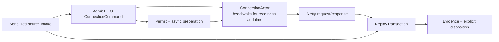

# Current-to-Proposed Replayer Architecture Map

**Status:** Draft migration crosswalk

**Date:** 2026-09-04

**Target design:** [replayerHardenedArchitectureDesign.md](replayerHardenedArchitectureDesign.md)

**Current architecture:** [replayerArchitecture.md](replayerArchitecture.md)

**Policy input:** [replayer-expiration-hardening.md](replayer-expiration-hardening.md)

**Lifecycle audit:** [replayerWorkLifecycleResponsibilityAudit.md](replayerWorkLifecycleResponsibilityAudit.md)

## 1. Purpose

This document maps current classes, queues, callbacks, responsibilities, and policy behavior to
the proposed hardened architecture. It is the migration ledger: when implementation changes, this
file should record whether each current responsibility was retained, moved, replaced, or removed.

The target design is intentionally implementation-independent. This document is not.

## 2. Summary of the Structural Change

Current ordering and cleanup are reconstructed after asynchronous work has already crossed
several threads:

```mermaid
flowchart LR
    SOURCE["Main source thread<br/>ordered observations"]
    LIMITER["TrafficStreamLimiter<br/>feeder thread"]
    TRANSFORM["Async transformation"]
    SORTER["OnlineRadixSorter<br/>restore connection order"]
    SCHEDULE["TimeToResponseFulfillmentFutureMap"]
    NETTY["Netty request/response"]
    CALLBACKS["Distributed cleanup and commit callbacks"]

    SOURCE --> LIMITER
    LIMITER --> TRANSFORM
    TRANSFORM --> SORTER
    SORTER --> SCHEDULE
    SCHEDULE --> NETTY
    NETTY --> CALLBACKS
```

The proposal records connection order before those asynchronous boundaries:

The `OnlineRadixSorter` is therefore removed because there is no longer an unordered command
admission problem.

## 3. Component Crosswalk

Proposed names are working names.

| Current component | Current responsibility | Proposed owner | Migration disposition |
| --- | --- | --- | --- |
| `TrafficReplayerCore.pullCaptureFromSourceToAccumulator` | Serial source intake | `ReplayCoordinator` / `SourceAssembler` intake loop | Retain serial ordering; emit typed data/control events |
| `CapturedTrafficToHttpTransactionAccumulator` | Reconstruct requests/responses and logical closes | `SourceAssembler` | Retain parser/state logic initially; replace callbacks with typed outcomes |
| `Accumulation` | Per-connection reconstruction state and request index | `ConnectionAssemblyState` inside `SourceAssembler` | Adapt; use typed `ConnectionSessionKey` |
| `AccumulationCallbacks` | Untyped bridge into replay and disposition | Typed coordinator events | Replace |
| `TrafficReplayerAccumulationCallbacks` | Request scheduling, tuple handling, commit, close policy | Split among `ReplayCoordinator`, `ReplayTransaction`, and `RecordDispositionLedger` | Replace |
| `TrafficStreamLimiter` | Global FIFO plus semaphore permit | `AsyncPermitPool` and owned `Permit` | Replace; remove feeder thread |
| `ReplayEngine` | Time shifting, task counting, read frontier, scheduling facade | `ReplayClock`, `ReplayProgressController`, coordinator facade | Split |
| `RequestTransformerAndSender` | Transformation plus transition into scheduling | `RequestPreparationService` | Retain transformation behavior; return owned preparation outcome |
| `RequestSenderOrchestrator` | Event-loop submission, sorter, schedule, send/retry | `ConnectionActor` plus target exchange helper | Replace |
| `OnlineRadixSorter` | Reorder late command admission and serialize completion | FIFO inside `ConnectionActor` | Remove after early admission |
| `TimeToResponseFulfillmentFutureMap` | Per-connection due-time queue and cancellation | Actor command deque plus one head timer | Remove |
| `ConnectionReplaySession` | Event loop, sorter, schedule, channel, timers, cancellation marker | `ConnectionActor` | Replace |
| `ClientConnectionPool` | Session cache, channel creation, close/cancel | `ConnectionActorRegistry` plus `TargetChannelFactory` | Split |
| `NettyPacketToHttpConsumer` | One active target exchange | Target exchange implementation used by actor | Retain behind owned outcome contract |
| `requestWorkTracker` / `OrderedWorkerTracker` | Outstanding finalization diagnostics and shutdown wait | `ReplayTransactionRegistry` | Replace with registry of terminal transaction futures |
| `handleCompletedTransaction` | Join source/target, write tuple, remove tracker | `ReplayTransaction` state machine | Replace |
| `commitTrafficStreams` | Close contexts and optionally commit | `RecordDispositionLedger` | Replace boolean/status-based API |
| `ThreadLocalTupleWriter` / `TupleSink` | Whole-tuple output | `EvidenceWriter` adapter | Retain sink initially; expose durable outcome |
| `ByteBufListProducer` and summary buffer sharing | Transformation/send/diagnostic buffer ownership | `OwnedPreparedRequest`, `AttemptPayload`, `DiagnosticPayload` | Replace ownership contract |
| `BlockingTrafficSource` | Time gate, read blocking, lifecycle forwarding | `ReplayReadGate` backed by `ReplayProgressController` | Retain wrapper initially; remove lifecycle callbacks |
| `KafkaTrafficCaptureSource` | Kafka source, active connections, synthetic closes | `KafkaSourceActor` and source-control event producer | Adapt |
| `TrackingKafkaConsumer` | Kafka-thread confinement, offset tracking, rebalance | Kafka adapter inside `KafkaSourceActor` | Retain and extend scan cursor |
| `OffsetLifecycleTracker` | Partition commit low-watermark | Kafka commit adapter behind disposition ledger | Retain initially |
| `partitionToActiveConnections` | Rebalance connection inventory | Generation-aware source-session registry | Replace key and lifecycle API |
| Pending synthetic-close counter/map | Block new generation until old sessions close | Awaited actor termination completion gates keyed by session | Replace counter bookkeeping |
| Heartbeat expiry proposal | Wall-clock mutation of accumulator | No replacement | Reject; diagnostics only |
| `ExpiringTrafficStreamMap` timestamp sweep | Data-driven source-time expiry | Retain as opportunistic optimization plus scanner evidence path | Adapt; cannot be sole expiry mechanism under epsilon |

## 4. Thread Ownership Crosswalk

| State | Current mutation sites | Proposed single owner |
| --- | --- | --- |
| Accumulations | Main thread, with proposed heartbeat expiry risking another thread | `SourceAssembler` intake thread only |
| Session affinity | Implicitly determined after target-channel/session creation | `ReplayCoordinator` assigns a `ConnectionRuntime` to an existing Netty event loop at admission |
| Session ordering | Netty event loop through sorter, but work arrives from several futures | `ConnectionActor` on the runtime's assigned Netty event loop |
| Session cancellation | Main thread flag plus event-loop drains and close callbacks | `ConnectionActor` on the same assigned Netty event loop |
| Transformation timers | Session set touched across cancellation and event-loop callbacks | Owning command on the assigned Netty event loop |
| Request finalization | Completion thread determined by source/target future timing | `ReplayTransaction` on the same event loop as its connection actor |
| Permit queue | Dedicated feeder plus semaphore/callback coordination | `AsyncPermitPool` on replay intake; releases posted to it |
| Kafka consumer state | Kafka executor | `KafkaSourceActor` Kafka executor |
| Scan positions | Not implemented | Same `KafkaSourceActor`; never another consumer |
| Record disposition | Core callbacks plus Kafka executor commit staging | `RecordDispositionLedger` on the Kafka executor |
| Tuple durability | Netty caller plus sink executor | `EvidenceWriter`; completion posted to the transaction's event loop |
| Read frontier | Replay engine callbacks and idle timer | `ReplayProgressController` work ledger on replay intake |
| Source admission | `BlockingTrafficSource` combines timing and lifecycle forwarding | `ReplayReadGate` on replay intake, driven by progress and lifecycle completion gates |

No new thread pool is introduced. A normal request crosses the existing Kafka/intake,
transformation, Netty, evidence, and Kafka disposition boundaries. Actor and transaction
communication is local to one Netty event loop, while the current limiter-feeder and
post-transformation sorter handoffs disappear.

## 5. Responsibility Audit Crosswalk

### 5.1 Per-request responsibilities

| Audit ID | Current owner/problem | Proposed owner | Required terminal proof |
| --- | --- | --- | --- |
| R1 | Accumulator response continuation | `SourceAssembler` and `ReplayTransaction.sourceOutcome` | Source side settles once |
| R2 | Limiter queue lacks close drain | `AsyncPermitPool` | Every queued acquire succeeds or cancels |
| R3 | Permit released by Core callback | Transaction-owned `Permit` | Transaction terminal close releases once |
| R4 | Transformation timer separately tracked | Request command | Timer settles or command cancellation settles it |
| R5 | Scheduled tracing context depends on timer | Request command resource scope | Scope closes on every preparation outcome |
| R6 | Sorter slot | Removed | FIFO admission is the proof |
| R7 | Timed schedule entry | Connection actor head timer | One timer belongs to one head command |
| R8 | Temporary producer retain and scheduled context | `OwnedPreparedRequest` and command resource scope | Actor/transaction closes explicit handles |
| R9 | Active target send not joined by cancel future | Connection actor active exchange | Abort completion gate joins exchange and channel close |
| R10 | Global task count approximates progress | `ReplayProgressController` | Admitted work leaves ledger only at terminal settlement |
| R11 | Request tracker removed before all durability | `ReplayTransactionRegistry` | Registry removal follows transaction terminal future |
| R12 | HTTP and tuple contexts depend on join path | Transaction resource scope | Terminal disposition closes all scopes |
| R13 | Tuple future dropped on failed target path | `EvidenceWriter` outcome owned by transaction | Disposition waits for or explicitly rejects evidence |
| R14 | Traffic-stream contexts bypassed on cancellation | `RecordDispositionLedger` | Every obligation closes context once |
| R15 | Offset decision bypassed or inferred from status | `RecordDispositionLedger` | Explicit `Commit` or `Retain` |
| R16 | Original producer reference has no owner | `OwnedPreparedRequest` | Transaction closes root handle |
| R17 | Attempt lists have no owner | `AttemptPayload` | Each attempt closes its payload |
| R18 | Diagnostic snapshot only released after packaging | `DiagnosticPayload` | Evidence completion/cancellation closes snapshot |

### 5.2 Per-connection and source responsibilities

| Audit ID | Current owner/problem | Proposed owner | Required terminal proof |
| --- | --- | --- | --- |
| C1 | Accumulator clearing routes through several callbacks | `SourceAssembler` | Assembly state emits one terminal source event |
| C2 | Active registration removal depends on a remaining key | Generation-aware source-session registry | Remove by typed session identity |
| C3 | Volatile cancellation marker | Connection actor state | All actor messages observe terminal state |
| C4 | Transformation timers omitted by ordinary close | Actor-owned commands | Abort/close settles every command resource |
| C5 | Schedule and sorter drained independently | Actor mailbox | One drain operation settles queued commands |
| C6 | Channel close started but not consistently awaited | Connection actor | Termination future includes channel close |
| C7 | Cache invalidated before other work finishes | Actor registry | Remove actor only after termination |
| C8 | No session means no callback | Source coordinator plus actor registry | Absence is an explicit completed termination result |
| C9 | Synthetic-close counter can remain blocked | Awaited termination futures | Source resumes after `allOf` old sessions |
| C10 | Cancellation returns an already-completed future | Connection actor | `abort()` returns the real completion gate |
| C11 | Pool shutdown does not drain sessions | Actor registry | Shutdown snapshots and awaits all actors |
| C12 | Read gate depends on scattered completion callbacks | `ReplayProgressController` | Contiguous settled watermark drives epsilon gate |
| C13 | Kafka contexts close only after successful commit | Disposition ledger plus Kafka adapter | Commit and retain paths each close their owned contexts |

## 6. Normal Request Flow

### Current

1. Accumulator recognizes request end.
2. Core queues work through the limiter.
3. Transformation is scheduled asynchronously.
4. Only after transformation completes is request work submitted to the session event loop.
5. Sorter reconstructs connection order using request index.
6. Schedule map waits for replay time.
7. Target and source futures are joined through callback composition.
8. Tuple handling and commit occur in later callbacks.

### Proposed

1. `SourceAssembler` recognizes request end and creates `ReplayTransaction`.
2. Coordinator immediately admits a `ReplayRequest` command to the connection actor in source
   order.
3. Transaction begins cancellable permit acquisition and preparation.
4. Preparation posts `Prepared` to the actor whenever it completes.
5. Actor waits for both head readiness and scheduled replay time.
6. Actor executes and settles the target exchange.
7. Transaction joins typed source and target outcomes.
8. Evidence writer reports durability.
9. Disposition ledger closes contexts and explicitly commits or retains every record.
10. Transaction registry removes the terminal transaction.

## 7. Close, Expiry, Rebalance, and Shutdown Mapping

| Event | Current path | Proposed path |
| --- | --- | --- |
| Captured normal close | Accumulator callback commits held keys, schedules close through sorter | Admit ordered close command; source outcome and record obligations finalize explicitly |
| Data-driven source expiry | Accumulator directly calls expiry callbacks with commit-eligible status | Emit typed source expiry outcome; transaction/disposition policy decides |
| Scanner-confirmed dead | Not implemented; design proposed synthetic expiry | Kafka source emits proof-bearing control event to serialized assembler |
| Wall-clock heartbeat expiry | PR proposal mutates accumulator from heartbeat thread and commits | Rejected; heartbeat only reports |
| Partition reassignment | Synthetic close, counter/map, cancel path, channel callback | Source emits interruption; abort matching actors; await typed completion gates; retain records |
| No replay session on synthetic close | Required acknowledgement can disappear | Actor registry returns explicit `AlreadyAbsent` termination result |
| Ordinary shutdown | Stop source, invalidate cache, cancel aggregate waits | Stop admission, abort all actors, await transactions, retain unfinished records, close dependencies |

## 8. Expiration-Hardening Policy Crosswalk

| Policy from expiration design | Current state | Proposed implementation |
| --- | --- | --- |
| Epsilon lookahead | Default 400s and validation requires lookahead greater than timeout | Small epsilon backed by settled-work watermark |
| Read-ahead coupled to completed work | `isWorkOutstanding()` suppresses idle advancement | Preserve through explicit progress ledger; do not remove coupling |
| Continuous scanner | Not implemented | Same-consumer scan cursor in `KafkaSourceActor` |
| Metadata-only scan | Not implemented | Decode identity/timestamp/observation type; discard payload |
| Partition affinity | Replay consumer owns assignment | Scanner uses same consumer and generation snapshot |
| Scan window | Conceptual timeout plus proxy cap | Required proof bound carried in `ScanEvidence` |
| Proxy liveness snapshots | Not implemented | Per-`(nodeId, partition)` idle-connection declarations; `LivenessIndex` in `KafkaSourceActor` |
| Offset-ordered absence proof | Not implemented; absence inferred from an empty window | `AbsenceProof.LivenessOmission` — two omissions with the last record preceding both |
| Node-sharded partitions | Traffic keyed by bare `connectionId`; partition chosen by key hash | Explicit partition from `S(nodeId)`; traffic and snapshots share the shard set |
| Per-process `nodeId` | `UUID.randomUUID()` per start (incidental) | Same value, now load-bearing as a fencing token |
| Confirmed dead commits | Current `EXPIRED_PREMATURELY` broadly commits | Explicit `SourceOutcome.ConfirmedDead` plus proof |
| Out of runway does not commit | `TRAFFIC_SOURCE_READER_INTERRUPTED` suppresses commit | Explicit interruption outcome maps to `Retain` |
| Wall-clock expiry rejected | Proposed by PR #3231 | No state mutation from heartbeat |
| Proxy max connection duration | Not implemented | Capture proxy emits real close; scanner validation requires finite cap for proof |
| Worst commit-head metrics | Partially present | Scanner selects blockers from authoritative per-partition metadata |
| Part-level tuple API | Whole-tuple sink | `EvidenceWriter` parts with whole-tuple adapter |
| Response recreation | Not implemented | Durable request lookup avoids resend for response-only redelivery |
| Scanner request/response refinement | Future Phase 2 note | `FollowUpRequirement` is part of scan query and evidence |

## 9. What Is Retained, Reused, or Removed

### Retain with narrow adapters

* Kafka client confinement and rebalance callbacks in `TrackingKafkaConsumer`.
* `OffsetLifecycleTracker` as the initial Kafka commit low-watermark.
* Source observation parsing and most accumulator state transitions.
* Existing request transformation pipeline.
* Netty channel creation and request/response consumer implementation.
* Existing tuple sink through a whole-tuple evidence adapter.
* `TimeShifter` mapping semantics.

### Replace

* Callback-based `AccumulationCallbacks`.
* `TrafficReplayerAccumulationCallbacks` as a combined policy/orchestration object.
* `TrafficStreamLimiter`.
* `ReplayEngine` task counting and frontier callbacks.
* `RequestSenderOrchestrator`.
* `ConnectionReplaySession`.
* `ClientConnectionPool` lifecycle coordination.
* Boolean/status-driven `commitTrafficStreams`.
* Raw transformed buffer ownership.
* Synthetic-close counters as completion tracking.

### Remove after cutover

* `OnlineRadixSorter` from the replay path.
* `TimeToResponseFulfillmentFutureMap`.
* Raw schedule `clear()`.
* Per-session transformation-timer side collection.
* Volatile session cancellation marker.
* Default no-op required lifecycle callbacks.
* Wall-clock expiry mutation.
* Aggregate shutdown cancellation that does not cancel children.

## 10. Migration Strategy

The redesign should be built as a replacement path behind a narrow interface, not as repeated
behavioral edits to the current callback graph.

### Slice 0: executable contracts

* Define identities, outcomes, commands, dispositions, and owned resource interfaces.
* Define `ConnectionRuntime` affinity and assertions against the existing Netty event-loop group.
* Define non-mutable completion-gate views whose mutable futures remain private to their owners.
* Build deterministic fake clock/event-loop/Kafka/evidence harnesses.
* Encode audit invariants before production wiring.

Exit gate: every outcome and disposition subtype is exhaustively tested; no actor or transaction
transition can execute off its assigned event loop, and no caller can complete or cancel an
operation's completion gate directly.

### Slice 1: transaction and disposition path

* Introduce `ReplayTransactionRegistry`.
* Introduce `RecordDispositionLedger`.
* Assign each session to an existing Netty event loop before creating its first transaction.
* Adapt existing whole-tuple writer and offset tracker.
* Route one request path through explicit target/source/evidence outcomes.

Exit gate: no transaction callback directly commits or closes traffic-stream contexts, and each
transaction remains on its session's assigned event loop.

### Slice 2: permit and resource ownership

* Replace limiter queue with `AsyncPermitPool`.
* Introduce owned prepared/attempt/diagnostic payloads.
* Add leak tests.

Exit gate: cancellation at every preparation stage leaves zero permits and buffers.

### Slice 3: connection actor

* Add `ConnectionExecutor` interface.
* Implement `ConnectionActor` with early FIFO command admission.
* Reuse current Netty target exchange behind the interface.
* Attach the actor to the existing `ConnectionRuntime` and route request and ordered close
  through it.

Exit gate: actor and transactions share one existing Netty event loop, out-of-order preparation
cannot reorder sends, and the sorter is unused by the new path.

### Slice 4: structured termination

* Add actor registry keyed by `ConnectionSessionKey`.
* Implement real abort and shutdown completion gates with explicit successful postconditions.
* Replace synthetic-close counter waiting with actor termination completion gates.

Exit gate: rebalance and shutdown tests prove no early successful completion, orphaned child
work, or teardown commit.

### Slice 5: scanner, epsilon, liveness, and proxy cap

These ship together:

* same-consumer scan cursor,
* proof-bearing scanner control events,
* epsilon lookahead,
* settled-work progress ledger,
* capture proxy maximum duration,
* capture proxy liveness snapshots and node-sharded partition selection,
* replayer-side `LivenessIndex` and the offset-ordered omission verdict,
* scanner/proxy/liveness metrics.

The proxy-side work (duration cap, snapshots, shard selection) is independently landable *before* the
replayer consumes any of it — snapshots that nobody reads are inert, so this half can ship and be
measured for cost and record size on its own. The replayer half is what must not precede it.

Exit gate: dead blockers clear (by omission when the proxy is alive, by window scan when it is not),
live long connections survive, silent nodes cause no expiration, and target stalls do not create
unbounded read-ahead.

### Slice 6: part-level evidence and response recreation

* Expose evidence-part receipts.
* Associate record obligations with required receipts.
* Add durable request lookup and response-only recovery.
* Refine scanner follow-up requirements.

Exit gate: restart tests demonstrate request offsets may advance without losing later responses.

### Slice 7: delete the old path

* Remove sorter, schedule map, old limiter, callback finalizer, and obsolete close/cancel paths.
* Remove compatibility feature flag after production qualification.

Exit gate: no production reference remains to old orchestration.

## 11. Migration Safety Rules

1. Do not run both old and new target-send paths for the same request.
2. A record obligation belongs to exactly one finalization implementation.
3. Do not enable epsilon until scanner and finite proxy bound are active.
4. Do not allow scanner and wall-clock expiry to coexist.
   - Do not derive a proxy `nodeId` from anything host-stable; a successor process must never be able
     to make liveness claims about its predecessor's connections.
   - Do not accept a liveness snapshot whose stamped partition disagrees with the partition it was
     read from; halt instead.
5. Do not remove replay-progress coupling unless a stronger low-watermark controller replaces it.
6. Do not switch rebalance handling until actor abort stages satisfy the completion-gate
   contract.
7. Do not split request/response commits until response recreation is implemented.
8. Preserve old implementation tests until each responsibility has a replacement test.

## 12. Verification Matrix

| Area | Required comparison |
| --- | --- |
| Ordering | Same source connection produces identical target send order |
| Timing | Commands are not sent before time-shifted due time; drift behavior documented |
| Retries | Existing retry policies produce equivalent attempt decisions |
| Filtering | Filtered requests produce evidence and disposition without target send |
| Tuple output | Whole-tuple bytes remain compatible in the initial adapter |
| Kafka commits | Normal successful runs produce equivalent committed offsets |
| Failure | New path intentionally differs by retaining on cancellation and unknown failure |
| Rebalance | Old generation fully terminates before new generation replay |
| Expiry | Scanner evidence replaces dependence on large lookahead |
| Memory | Epsilon bounds read-ahead; owned-resource counters return to zero |
| Shutdown | Every child future and actor reaches a terminal state |
| Threading | No new thread pool; actor and transaction affinity assertions never fail |

## 13. Documentation Maintenance

When a design decision changes:

1. Update the target design's invariant or state machine.
2. Update the corresponding row in this crosswalk.
3. Update the responsibility audit classification.
4. Record which migration slice and tests change.
5. Reconcile the expiration-hardening policy if scanner, lookahead, proxy cap, or part-level
   evidence semantics are affected.
