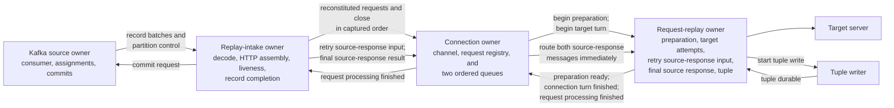
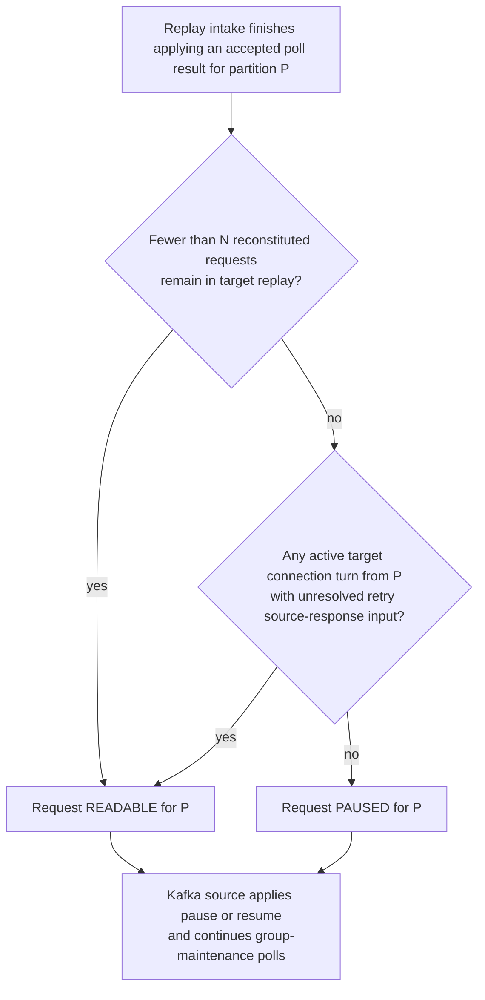
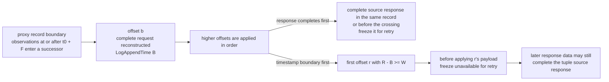
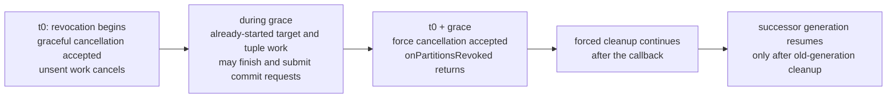

# Replayer Processing and Commit Architecture

**Status:** medium-level design contract; implementation conformance is incomplete

**Date:** 2026-09-14

This document explains how the traffic replayer implements the protocol defined by
[Capture and Replay Architecture](captureAndReplayArchitecture.md). It is intentionally one level
below that protocol and one level above class and interface design.

The top-level protocol defines what records mean, when source reconstruction expires, when target
replay and tuple output are required, and when a Kafka record may be committed. This document
defines the ownership, ordering, asynchronous-completion, cancellation, and accounting structure
that makes those behaviors implementable and provable.

Section 8 separates demand-driven Kafka input from source-event replay timing and the deterministic
Kafka-timestamp boundary used when retry policy waits for a captured source response.

## 1. Goals and boundaries

The replayer architecture must make these properties straightforward to reason about:

1. Kafka consumer state has one owner that orders poll, pause, resume, assignment, revocation,
   seek, and commit operations.
2. Each partition's Kafka records are applied in increasing offset order, and each record's
   `TrafficObservation` values are applied in their encoded order.
3. Requests from one captured connection reach the target in captured order.
4. Requests from different captured connections may run concurrently across Netty event loops.
5. A request has two explicit milestones: its turn on the target connection is finished, and all
   processing for the request is finished after its tuple is durable. The second milestone does not
   prevent the connection from beginning a later request.
6. The source-response input frozen for retry policy, the final captured source-response result
   used for tuple output, a captured connection close, and captured-connection expiration are
   distinct inputs. A retry decision may stop waiting while tuple accumulation continues.
7. One Kafka record may contribute to several requests, and no request may release that record
   before every other dependency of the record is finished.
8. Partition revocation cancels only work belonging to the revoked partition generation.
9. A newer generation of that partition waits for prior-generation cleanup, while unrelated
   partitions continue.
10. Expected outcomes are explicit typed values. An unexpected exception escaping an owner is a
   process failure.
11. Kafka input is demand-driven per partition. A partition is always readable when its
    reconstituted-request supply is below the configured target, and remains readable while an
    active target connection turn has unresolved source-response input for retry policy.
12. Correctness-relevant asynchronous work has a required typed return path to the owner that must
    act on its result.
13. Proxy-side periodic connection-record publication affects only where `TrafficStream` records
    end. The replayer reconstructs solely from record and observation order and does not depend on
    the proxy's configured flush interval.

This architecture requires:

- source-time shifting and replay pacing;
- target request transformation;
- the configured target retry eligibility, limits, and backoff;
- Kafka group keepalive while replay is backpressured;
- target-connection reuse;
- durable tuple sinks;
- contiguous-prefix Kafka commits;
- long-running activity reporting; and
- at-least-once target replay and tuple output.

This document does not define:

- new target retry policy;
- deduplication of target requests or tuples;
- HTTP/1.x pipelining behavior;
- managed-fleet recovery after an uncaptured interval; or
- concrete Java class names and generic signatures for every component.

### 1.1 Lower-level definitions

This document settles the required behavior but does not choose:

- the exact Java names of cancellation and cleanup result types;
- the command-line option name for the cancellation grace interval; or
- concrete queue and wakeup classes used to service replay-intake inputs.

Those names and classes belong in the next lower-level design. They may not change the behaviors
defined here.

## 2. Central model

The replayer has four correctness-critical ownership domains:

1. **Kafka source**
2. **Replay intake**
3. **Target connection**
4. **Request replay**

These are logical ownership domains, not four required threads.



The captured opening observation establishes source-side connection state but does not create a
target connection by itself. The first complete reconstituted request creates the
connection owner if one does not already exist. Reconstituted requests and a captured close
enter that owner's ordered queues. Source-response messages use the connection owner only to
locate the request-replay owner; they do not enter either queue or wait behind target execution.

The request-replay owner is a distinct logical owner because it has its own exhaustive lifecycle.
It executes on the same Netty event loop as its connection owner and therefore adds no thread,
executor, or cross-thread synchronization.

Request transformation runs on the same Netty event loop as its request-replay owner. The tuple
writer performs asynchronous durable output and returns a typed result to that owner.

## 3. Governing invariants

### 3.1 One mutable owner

Each correctness-critical mutable value has exactly one owner. The table also names the inputs that
can arrive from different threads or asynchronous operations. The owner handles those inputs in
one ordered sequence so that two inputs never change that owner's state at the same time:

| State | Owner | Inputs that the owner applies one at a time |
| --- | --- | --- |
| Kafka consumer, assignment, positions, pause state, and commit staging | Kafka source | Polls; pause and resume requests; assignment and revocation callbacks; seeks; completed-record commit requests; commit callbacks |
| Record decoding, source HTTP assembly, heartbeat expiration, and Kafka-record completion | Replay intake | Kafka record batches, including heartbeat handling; request-processing-finished messages; partition-cleanup completion messages; partition revocation; shutdown |
| Target channel, request registry, admission queue, execution queue, active target turn, and ordered close | Target connection | Request and close admission; preparation completion; replay-time timer events; connection-turn completion; request-processing completion; channel events; routed retry and final source-response messages; partition cancellation |
| One request's preparation, target attempts, retry state, frozen source-response input for retry, final captured source-response result, tuple output, and cleanup | Request replay | Begin preparation; begin target turn; target-attempt results; source response available or unavailable for retry; final source response complete or incomplete; retry timers; tuple durability; cancellation |

The Kafka source owner may block in Kafka calls. Replay intake performs bounded synchronous CPU
work but does not wait for target or tuple I/O. The target-connection and request-replay owners run
on Netty event loops and do not block those loops. When asynchronous work finishes, its result
returns as another input.

Another thread may send an immutable message to an owner, but only the owner may change its own
mutable state.

Construction of a connection owner may occur off its selected event loop using only immutable
identity and configuration. Runtime code first uses that owner through a task submitted to the
selected event loop. All access to its mutable runtime state occurs on that event loop.
Owner-affinity assertions fail immediately if code violates this rule.

### 3.2 Two request milestones

A reconstituted request can finish using the target connection before all processing for that
request is finished.

**Connection-turn completion** means that the request will make no more target attempts on this
connection and has released resources needed only by those attempts. The request-replay owner
reports this milestone to the connection owner. The connection owner may then begin
the next ready request.

**Request-processing completion** means that the request's terminal target result, captured
source-response result for tuple output, and durable tuple output are all complete. The
request-replay owner reports this milestone to the connection owner. That owner removes the request
from its registry and forwards the completion to replay intake. Replay intake then releases the
request's Kafka-record associations.

The normal paths are:

```text
request admitted
    -> preparation and target attempts
    -> connection turn finished
    -> connection owner may advance

terminal target result + final source-response result
    -> start one tuple write
    -> tuple becomes durable
    -> request processing finished
    -> connection owner removes the request
    -> replay intake releases the request's Kafka-record associations
```

These paths do not have to finish together. For example, the configured retry policy may determine
from a target response alone that no more target attempt is required. The connection turn then
finishes even if replay intake has not yet completed or expired the captured source response.

If the configured retry policy requires captured source-response information before deciding
whether to retry, the connection turn remains active until the request-replay owner receives either
the complete response frozen for retry or an explicit source-response-unavailable result and can
make that decision. The final source-response result used for tuple output may arrive later.

### 3.3 Ordered input; overlapping asynchronous work

Replay intake applies:

1. records from one partition in increasing Kafka-offset order; and
2. `TrafficObservation` values within each `TrafficStream` in encoded order.

Applying an observation may update replay-intake state or send a message to a target-connection or
request-replay owner. Work started by those owners may finish later. Replay intake need not
wait for that work before applying the next observation. A later completion does not change which
observation replay intake applies next. A replayer may restart at any committed cursor position, so
reconstruction depends only on the ordered stream from that point and the protocol records that
follow it.

A proxy may close a `TrafficStream` because of its configured periodic connection-record flush,
record size, Critical Mutation Traffic publication, or connection close. None of those boundaries
is an HTTP boundary. One request or response may span several records, and one record may contain
the end of one HTTP message followed by observations for the next message on the connection.
Replay intake uses `connectionObservationSequence` and encoded observation order rather than
inferring semantics from record closure.

### 3.4 Per-connection admission and execution queues

Replay intake is the sole producer of source-derived target commands for a captured connection. It
sends reconstituted requests and the captured close in their source order. Each command carries its
captured ordinal and replay time.

The connection owner maintains two queues:

1. The **admission queue** holds requests and the captured close in captured order.
2. The **execution queue** holds commands that have reached their preparation point but must still
   wait for their captured execution time.

For a request scheduled to begin at time `T`, the connection owner removes the request from
the admission queue at approximately `T - preparationLead`, asks its request-replay owner to begin
transformation, and adds a waiting entry to the execution queue. `preparationLead` is an
implementation parameter whose initial value is one second. The owner can then schedule
preparation for the next admission-queue entry without waiting for the first transformation to
finish.

The request-replay owner receives the transformation result and reports an immutable preparation
result to the connection owner. Only the connection owner changes the corresponding
execution-queue entry from waiting to ready.

The close command requires no transformation. When it reaches the admission-queue head, the
connection owner
moves it to the execution queue already prepared. At its replay time, and after every earlier
target turn has finished, the connection owner closes the target channel. The captured open is source-side
state and necessarily precedes a complete request; request and close ordering uses the same
captured ordinal and replay-time rules without inventing a separate close path.

At time `T`, the connection owner considers only the execution-queue head. It begins that
request's target turn when the head is prepared and the target connection is available. Immediately
before the first target send, it obtains one target-concurrency permit. The permit is held only
while a target attempt is in progress. It is released with connection-turn completion, and it is
also released whenever the request-replay owner has a target outcome but must wait for its captured
source-response input for retry policy; a permit is acquired again before any further attempt. If
preparation or permit acquisition is still pending, the Netty event loop does not block; the owner
waits for the corresponding result input. A later prepared entry cannot pass the head.

The connection owner has separate scheduling needs for moving the next admission entry into
preparation and for starting the execution-queue head. If a scheduled time has already passed when
an entry becomes eligible, the owner acts immediately.

Request signing occurs immediately before each target attempt. Request transformation occurs once
at the preparation point on the request owner's Netty event loop. A separate transformation limit
may be added if measurement shows that transformed requests consume too much memory, but it is not
part of the current correctness model. Per-packet pacing and retries after a target turn starts
remain part of the request-replay and target-send path.

The connection owner advances to the next execution-queue entry after connection-turn
completion. It does not wait for tuple durability or request-processing completion.

The first request observed after the replayer starts from a nonzero Kafka cursor may have a nonzero
captured request index. Tests must prove that later admissions remain in captured order without
assuming that every replayer begins with request index zero.

### 3.5 Source-response and connection-lifecycle inputs

Replay intake owns mutable captured source-request and source-response assembly. One request has two
separate source-response milestones:

1. the immutable source-response input used by retry policy; and
2. the final captured source-response result used by tuple output.

The retry input becomes either the complete response or explicitly unavailable. The final tuple
result becomes either complete or incomplete. A complete response observed before the retry
boundary may satisfy both milestones at once. If the retry boundary is crossed first, retry policy
receives unavailable while replay intake continues accumulating the response for the tuple.

The messages are distinct:

- `SourceResponseComplete` identifies one request and carries its complete captured response. If
  retry input is still unresolved, it freezes the same complete response for every retry decision.
  It always supplies the final complete source-response result for tuple output.
- `SourceResponseUnavailableForRetry` identifies one request and carries no partial response. It
  freezes retry policy's source-response input as unavailable without ending final source-response
  accumulation.
- `SourceResponseIncomplete` identifies one request and carries no partial response represented as
  complete. It supplies the final incomplete source-response result for tuple output and, when
  retry input is still unresolved, also freezes that retry input as unavailable.
- `CapturedConnectionClose` is the ordered close event for the captured connection.
- Broker-time expiration is an internal replay-intake action. It is not a Kafka record.

A request receives exactly one retry source-response input and exactly one final source-response
result. The final incomplete result does not distinguish whether captured close or broker-time
expiration ended the accumulation. That distinction changes no replay, tuple, or Kafka-record
decision. Neither milestone can be replaced or reversed.

A complete source response and a later connection close or expiration are not contradictory. A
keepalive connection may produce a complete response and remain open until it later closes or
expires. The later connection event does not undo the complete response.

Replay intake sends all source-response messages to the connection owner for immediate routing to
the matching request-replay owner. These messages do not enter the admission or execution queue.
The connection owner does not interpret or accumulate the response; it only uses its request
registry to route the typed message.

The ordered close event still enters the admission queue. If close or heartbeat expiration also
ends an incomplete source response, replay intake sends the separate `SourceResponseIncomplete`
result without waiting for the close event to reach the head of either connection queue.

Broker-time expiration ends the current process-local reconstruction for every affected connection
known to replay intake. Replay intake removes that reconstruction from its active source-side
registry. If a connection owner exists, replay intake notifies it that broker-time
expiration ended the current reconstruction after sending any resulting
`SourceResponseIncomplete` messages. The connection owner admits no later input from that expired
reconstruction, lets every already-admitted complete request and tuple finish, closes its target
channel after its target turns finish, and removes itself after its request registry becomes
empty.

A later observation for the same captured connection identity starts new reconstruction state. If
that later state produces a complete request, it creates a new connection owner and replays
normally. This is consistent with the accepted possibility that Kafka contains a complete request
that never reached the source. If the later state remains incomplete, a later broker-time horizon
expires it independently. By contrast, any observation after an explicit `CloseObservation` is a
protocol violation.

Fresh reconstruction after restart or broker-time expiration does not parse arbitrary bytes as a
new request. It uses `TrafficStream.priorRequestsReceived` and
`TrafficStream.lastObservationWasUnterminatedRead` to determine whether the first available record
continues HTTP assembly that began before the process-local reconstruction. It discards that
incomplete preceding request or response until the next captured request boundary. If the first
available data begins at such a boundary, ordinary reconstruction may begin immediately.

The first `connectionObservationSequence` encountered by fresh reconstruction establishes its
process-local sequence baseline. Every later observation for that reconstruction must follow
contiguously. Sequence validation therefore detects gaps after the fresh starting point without
mistaking an arbitrary first value for a missing process-local predecessor.

### 3.6 Whole-record commit

For the replayer, Kafka can commit only a whole record. A record becomes eligible to request commit
only after:

- all of its observations have been applied;
- every incomplete source accumulator depending on those observations has completed or expired;
- every reconstituted request depending on those observations has completed target processing and
  durable tuple output; and
- every resource whose lifecycle is part of those operations has been released.

Completion of a later request cannot release a record that is still needed by an earlier request.
Completion of one observation cannot partially commit its containing Kafka record.

### 3.7 Cancellation never means completion

Cancellation includes partition revocation and normal process shutdown. It may stop incomplete HTTP
assembly, request preparation, permit acquisition, target work, retry timers, source-response
assembly, tuple output, and connection work.

Cancellation:

- prevents the cancelled work from requesting Kafka commit;
- drives created or retained data and I/O objects to a defined cleanup state;
- does not manufacture a successful target, source, or tuple outcome; and
- does not permit later offsets to commit past the cancelled record.

Cancellation groups are keyed by partition generation. Each connection remains on one partition
for its entire captured lifetime, so replay intake can find and notify every affected connection
owner without scanning unrelated work.

### 3.8 Expected outcomes are values

Expected outcomes are represented by sealed types or equivalently exhaustive value types. Examples
include:

- request accepted by its connection owner, or the partition generation cancelled before
  acceptance;
- source response complete or incomplete;
- target response obtained or no response obtained;
- retry required or target processing terminal;
- tuple durable or tuple output cancelled;
- partition generation active or revoked; and
- required message submission accepted or rejected.

Correctness-critical switches have no default branch. Adding a new outcome must cause compilation
failures at every handling site that needs to understand it.

An impossible state transition is an input that is valid in the protocol but cannot be valid in the
request's current state. Examples include receiving `TupleDurable` before tuple output was started,
receiving a second request-processing completion, or starting a target turn after cancellation
cleanup finished. Each owner checks the current state and input together. A missing transition is a
fatal invariant violation. Sealed input types make new input variants fail compilation at affected
switches; transition-table tests cover the allowed and rejected state/input combinations.

An expected outcome is not represented by an exception. A handler catches recoverable exceptions
that belong to its operation and returns the corresponding typed value.

An unexpected throw, exceptional stage completion, owner-thread violation, failed required message
submission, or impossible state transition is process-fatal.

## 4. Execution and communication model

### 4.1 Execution environments

The replayer uses these execution environments:

- one dedicated Kafka executor for all Kafka consumer operations;
- one replay-intake owner with an ordered input queue, serviced on the Kafka executor between Kafka
  consumer calls rather than by another dedicated thread;
- the configured Netty event-loop group for target connections, request-replay owners, and request
  transformation; and
- the tuple writer's I/O execution.

No additional executor is introduced merely to represent a logical owner.

Only replay intake changes replay-intake state. The Kafka executor alternates Kafka consumer calls
with replay-intake work. Kafka, Netty, and tuple-output code append immutable inputs to a
thread-safe replay-intake queue. Between consumer calls, the Kafka executor is that queue's only
consumer. It takes one Kafka batch, completion message, or control message and applies that state
change before taking another. A Kafka call may block the Kafka executor for its configured bound;
replay intake does not synchronously wait for target or tuple completion.

Each target connection is assigned to one Netty event loop and remains sticky to that event loop.
Different connections can fan out across one or many event loops.

### 4.2 Typed asynchronous links

A correctness-relevant asynchronous call has this shape:

```text
immutable input
    -> destination owner handles it
    -> typed output value
    -> the link delivers that value to the required receiving owner
    -> the receiving owner handles that output
    -> returned completion represents the complete linked operation
```

The programming pattern is defined by
[Asynchronous Message-Passing Programming Guide](asyncMessagePassingProgrammingGuide.md). The
replayer applies that pattern through adapters to the Kafka executor, replay-intake input queue, and
Netty event loops.

The link joins the producer of a typed result to the owner required to handle that result. The
`CompletionStage` returned by the link completes only after the required receiver's returned stage
completes, not merely after the first handler produces its value.

This rule does not claim that every operation terminates. Target attempts and tuple output may
retry indefinitely. It does ensure that an operation which returns a normal typed result cannot
silently omit the next required handler. Rejected submission, unexpected throw, and exceptional
stage completion use the process-failure path.

Correctness-critical interfaces do not use default methods. Each implementation states its
behavior explicitly.

### 4.3 Data lifetime and cleanup

Sending a reconstituted request to a request-replay owner does not transfer Kafka-record accounting
or final commit authority. Replay intake retains those associations until it receives
request-processing completion.

Each component releases data and I/O objects that it created or explicitly retained for its own
work. If the implementation passes reference-counted buffers across an owner boundary, the
lower-level interface must state exactly which operation retains and releases each reference. This
medium-level design does not use a general ownership-transfer abstraction.

### 4.4 Long-running activity reporting

The activity monitor reports long-running work using tracing identity that includes:

- Kafka partition and generation;
- Kafka offset or record identity;
- captured connection and request identity;
- current owner and operation;
- elapsed time; and
- the reason the work is still active.

## 5. Kafka source and replay intake

### 5.1 Kafka source owner

The Kafka source owner performs every call to the Kafka consumer:

- subscribe and poll;
- pause and resume selected partitions;
- process assignment and revocation callbacks;
- seek and position management;
- keepalive polling;
- commit staging and submission; and
- commit callback handling.

No callback from target replay, tuple output, or source reconstruction calls the Kafka consumer
directly.

The source owner sends immutable record batches and partition-lifecycle messages to replay intake.
It accepts commit requests from replay intake.

### 5.2 Replay intake

Replay intake:

- decodes the `CaptureRecord` envelope and handles its active `payload` case;
- decodes `TrafficStream` and its ordered `TrafficObservation` values;
- validates that each connection's `connectionObservationSequence` follows the protocol's required
  progression;
- owns all incomplete source-request and source-response assembly;
- tracks each reconstituted request's deterministic source-response boundary for retry policy;
- determines per-partition Kafka input demand after each accepted poll result;
- processes `WriterPartitionHeartbeat` records;
- applies broker-time expiration after missed heartbeats;
- associates processing with the Kafka records that supplied it;
- creates and registers a connection owner when it reconstitutes the first complete request
  for a connection that has no current connection owner;
- routes later source-derived inputs to that registered connection owner; and
- receives request-processing completion forwarded by connection owners.

Only `CloseObservation` terminates a captured connection in the capture protocol.
`ConnectionExceptionObservation` is diagnostic and does not reset or terminate source
reconstruction.

`CaptureCapabilityProbe` is inert. It creates no writer, partition, connection, heartbeat,
expiration, request, target, tuple, or record-completion state.

`CaptureRecord.payload` is the record-type discriminator. Replay intake does not infer the type by
trying several protobuf decoders and does not depend on a Kafka record-type header. An envelope with
no recognized payload is a protocol violation.

`WriterPartitionHeartbeat` updates only that writer and partition's accepted broker-time baseline.
It creates no downstream request, connection, or tuple work. After replay intake applies that
update, a Kafka record containing only `WriterPartitionHeartbeat` has no unfinished association and
follows the immediate commit-eligibility rule in §6.1.

When replay intake has no broker-time state for a `(writerNodeId, partition)`, the first non-probe
Kafka record encountered for that key establishes its process-local starting point:

- If the record is `WriterPartitionHeartbeat`, replay intake accepts its `LogAppendTime` as the
  process-local heartbeat baseline used by the ordinary `E + S` rule.
- If the record is `TrafficStream`, replay intake records its `LogAppendTime` as `T` and applies the
  top-level design's conservative `E + 2S` fallback. The first heartbeat encountered afterward is
  accepted unconditionally and replaces that fallback with its exact `LogAppendTime`.

Subsequent heartbeats update an exact heartbeat baseline only when they satisfy the configured `E`
rule. Accepting the first encountered heartbeat unconditionally is conservative: if the proxy did
not accept that heartbeat, using its later timestamp can delay expiration but cannot authorize
expiration earlier.

`WriterPartitionHeartbeat.heartbeatIntervalMillis` is informational. Replay intake does not derive
expiration authority from it; the replayer uses its separately configured `E` and `S` values.

The proxy's `trafficStreamFlushInterval` `F` is not part of replay configuration. Replay intake
does not need to know why a `TrafficStream` ended and does not convert record boundaries into HTTP,
connection-lifecycle, expiration, or commit events.

An incomplete request that closes or expires before it can be reconstituted produces no tuple.
Ending that incomplete assembly allows its associated Kafka-record processing to finish.

When a source response becomes complete, replay intake sends `SourceResponseComplete` for the
reconstituted request. If that request's retry input is unresolved, the message resolves both retry
input and the final tuple result. If the retry boundary already supplied
`SourceResponseUnavailableForRetry`, the complete response resolves only the final tuple result.

Before applying the payload of each higher-offset Kafka record, replay intake compares that
record's `LogAppendTime` with every unresolved retry boundary on the partition. Crossing a boundary
sends `SourceResponseUnavailableForRetry` before any observation in the crossing record can
complete the response. The result is irreversible even if a still-later record has a lower
timestamp.

When a connection close or expiration ends an incomplete source response, replay intake sends
`SourceResponseIncomplete`. No partial source-response bytes are represented as a complete
response. If retry input is unresolved, the same transition also makes it unavailable. The
connection owner routes every result immediately to the matching request-replay owner without
placing it in a connection-order queue.

Broker-time expiration closes and releases only the current process-local reconstruction state
known to replay intake. It does not permanently retire the writer, partition, or connection
identity. A later observation begins fresh source-reconstruction state, exactly as it would if the
replayer had restarted at that observation, with one difference: the broker-time baseline belongs
to the `(writerNodeId, partition)` key rather than to any reconstruction, so fresh state under a key
that still has a baseline continues to use that exact value. Replay intake may discard a key's
baseline only when no incomplete state for that key remains; a later record for the key then
establishes a new starting point under the first-record rule above. Keeping the exact baseline is
both simpler and tighter than the `T` fallback, since `T + S` is never earlier than the retained
value.

### 5.3 Heartbeat expiration

`WriterPartitionHeartbeat` contains no connection identities and never completes, omits, reopens,
or retires a connection. Replay intake records the accepted heartbeat `LogAppendTime` for its
`(writerNodeId, partition)`.

Replay intake also tracks the greatest `LogAppendTime` observed for each partition. Before applying
a record at a higher offset, it verifies that the record timestamp is not more than `S` below that
greatest value. A larger backward movement directly violates the configured broker-time bound and
is process-fatal; the violating record does not authorize expiration or commit.

When the broker-time proof in the top-level protocol establishes that the writer has missed its
heartbeat interval, replay intake ends the current reconstruction for each connection it knows for
that writer and partition. It ends incomplete request and source-response accumulators, while
existing target replay and tuple work continue. Later observations start fresh reconstruction
state and never join the expired reconstruction.

## 6. Kafka-record completion

### 6.1 One tracker per Kafka record

Replay intake creates one record-completion tracker for each Kafka record it accepts.

The tracker answers one question:

> Has every operation required by this record reached its required final state?

It does not decide target policy, source expiration, tuple contents, partition assignment, or Kafka
commit success.

As replay intake applies the record's observations, it associates the record with every operation
that depends on them. A single record may therefore be associated with:

- several reconstituted requests;
- an incomplete request and a complete earlier request;
- source-response assembly for one request and target replay for another;
- a heartbeat baseline update; or
- terminal connection processing.

The record is closed to new associations only after every observation in it has been applied.
When applying the record creates no unfinished association, the closed record is immediately
eligible to emit its commit request. Heartbeats, capability probes, and a periodically published
`TrafficStream` containing only a connection-open observation or other already-finished connection
activity follow this path. A connection-open observation does not keep its Kafka record associated
with the connection for the connection's lifetime.

### 6.2 Mixed records

A record may contain observations for more than one request. Each request receives an independent
association with that same record.

Example:

```text
Kafka record at offset 40
    observation A completes request 7
    observation B completes request 8

request 7 target + tuple: finished
request 8 target + tuple: still active

offset 40: not eligible for commit
```

The record becomes eligible only after request 8 and every other associated operation finish.
Selective tuple completion cannot release the shared record early.

Replay intake updates a record's associations according to what actually happened:

- when a request is reconstituted, the record remains associated with that request through its
  target and tuple lifecycle;
- when an incomplete request expires without being reconstituted, replay intake marks only that
  source-assembly association finished;
- when a source response completes or expires, replay intake marks only that accumulation
  association finished, while independent target and tuple processing remains active; and
- marking one association finished never marks another association for the same record finished.

### 6.3 Commit request

When a record is closed to new associations and none remain unfinished, its tracker emits exactly
one immutable commit request to the Kafka source owner.

Replay intake is the sole authority that decides that the record has completed all required
processing. Connection owners, request-replay owners, and the tuple writer only return the
completion evidence that replay intake was waiting for.

The Kafka source owner performs the Kafka operation because it owns the consumer. After required
submission of the commit request to that owner succeeds, replay intake may discard the record's
process-local dependency bookkeeping. It does not store a final `Commit` or `Retain` disposition.
Rejection of that required submission is process-fatal.

The Kafka source owner:

1. registers the completed offset in its contiguous-prefix offset tracker when the partition
   generation is still known;
2. submits the next eligible commit through the Kafka consumer; and
3. discards its process-local request after Kafka accepts, rejects, or leaves the broker outcome
   unknown.

Knowing that the generation has ended may avoid a pointless call, but that fast failure is an
optimization rather than a correctness requirement. If assignment loss races Kafka submission,
Kafka may reject the operation or leave its broker outcome unknown. The old generation neither
retries nor waits indefinitely. The next assigned offset determines whether redelivery occurs.

The top-level protocol term `Retain` describes the observable result that a record remains
uncommitted and eligible for redelivery. The implementation does not need a retained-disposition
object after it has stopped or cleaned up the affected generation.

### 6.4 Contiguous-prefix commits

The Kafka source owner may receive completion requests out of offset order. It advances the
committable offset only across the contiguous prefix of completed records.

If offset 40 is unfinished while offsets 41 through 50 are complete, the committed position cannot
advance past offset 40.

## 7. Target connection and request replay

### 7.1 Connection assignment

When replay intake reconstitutes the first complete request for a captured connection that has no
current connection owner:

1. it selects a Netty event loop through the configured connection-pool policy;
2. it constructs the connection owner from immutable identity and configuration;
3. it submits the owner and the reconstituted request to the selected event loop; and
4. it stores an immutable reference used to enqueue every later message for that connection.

The first complete request creates the connection owner regardless of whether replay intake observed the
connection's opening observation in this process. This preserves the existing distinction between
capture ordinals and process-local replay ordinals after restart.

The connection owner owns a registry of the request-replay owners created for that
connection. The registry is used only on that owner's Netty event loop. It allows the owner to route a
retry or final source-response message to the matching request without placing that message in
either ordered connection queue. It removes a request from this registry only after
request-processing completion, which includes durable tuple output.

The owner itself remains until either the captured close or broker-time expiration has caused its
target channel to close and every request in the registry has reached request-processing
completion. A target-initiated channel closure, such as a keepalive timeout between requests or a
reset during an attempt, does not end the owner; the owner reconnects for its next target send
according to the configured target-connection policy, and the affected attempt is handled by the
request-replay owner's target-outcome rules in §7.4.

### 7.2 Admission, preparation, and target execution

Replay intake sends reconstituted-request and close commands to the connection owner in
captured order. On its event loop, the owner:

1. appends each command to its admission queue;
2. creates a request-replay owner for each reconstituted request;
3. near a request's preparation time, moves that request to the execution queue and asks its
   request-replay owner to begin transformation;
4. records the returned preparation result on the matching execution-queue entry; and
5. at the captured execution time, begins the target turn only for the prepared execution-queue
   head.

Transformation results may return out of order. They can only update their existing
execution-queue entries; they cannot change queue order. If the head is not prepared at its
captured execution time, the event loop remains free and the connection owner resumes the
decision when the preparation result arrives.

Only one request owns the target-connection turn at a time. The connection owner releases
that turn after the request-replay owner reports connection-turn completion. Source-response and
tuple work for an earlier request may remain active while a later request uses the connection.

The connection owner obtains the target-concurrency permit only for the prepared
execution-queue head, immediately before its first target send. It never obtains permits for
requests waiting behind the head.

### 7.3 Request-replay owner

One request-replay owner exists for each reconstituted request. It owns:

- the reconstituted source request;
- request-preparation resources;
- any target-concurrency permit assigned to the request;
- its current target attempt and retry timer;
- its terminal target outcome;
- its immutable source-response input for retry policy;
- its final complete or incomplete captured source-response result for tuple output;
- its complete tuple and tuple-durability result; and
- request-specific tracing and cleanup.

It does not own:

- source HTTP accumulators;
- Kafka consumer state;
- the connection owner;
- a whole Kafka record; or
- Kafka commit policy.

The request-replay owner is an exhaustive state machine. Inputs such as preparation completion,
target-attempt completion, source response available or unavailable for retry, final source
response complete or incomplete, tuple durability, and cancellation produce typed transitions. An
impossible transition is process-fatal.

It emits two independent results:

1. exactly one connection-turn completion after the request will make no more target attempts on
   the connection and has released resources used only by those attempts; and
2. exactly one request-processing completion after its tuple is durable and request-specific
   resources that remained after the target turn are released.

The first result goes to the connection owner and allows it to advance its execution queue.
The second also goes to the connection owner. That owner removes the request from its
registry and forwards the result to replay intake, allowing replay intake to finish the request's
Kafka-record associations. The first result never stands in for the second.

### 7.4 Target outcome

Target processing distinguishes:

1. **No target response obtained.** Retry indefinitely while the partition generation and process
   remain valid.
2. **Target response obtained.** Apply the configured retry policy. If another attempt is required,
   retry. Otherwise the obtained response is the terminal target outcome, whether successful or
   unsuccessful.

Some retry decisions require only the target result. When such a decision is terminal, the
request-replay owner reports connection-turn completion immediately. Other configured retry
decisions may require captured source-response information. In that case the request-replay owner
keeps the connection turn until it receives either the complete source response frozen for retry
or `SourceResponseUnavailableForRetry`, then runs the retry policy with that immutable input. It
does not wait for the final tuple source-response result. It does not keep its target-concurrency
permit during that wait: the permit is released when the target outcome arrives and acquired again
before any further attempt. The connection turn preserves per-connection order; the permit bounds
only attempts in progress.

An unsuccessful response does not by itself require Kafka redelivery. Source-versus-target status
comparison remains critical tuple and metric output, not Kafka commit policy.

Request transformation, packet pacing, target timeout, retry, and connection-reuse behavior remain
behind this interface. Transformation occurs once near one second before the scheduled first
attempt. Signing occurs immediately before every target attempt so that retries receive a current
signature.

### 7.5 Tuple output

Every reconstituted request produces one tuple after both the terminal target result and the final
complete or incomplete captured source-response result are available. A
`SourceResponseUnavailableForRetry` result is not a final tuple input and does not start tuple
output.

A complete tuple may record:

- a complete source response;
- an explicitly expired or unavailable source response;
- a successful or unsuccessful target response;
- the complete target-attempt history required by configured output behavior; and
- the source-versus-target comparison.

An expired source response contributes no partial bytes represented as a complete response.

Tuple output is retried indefinitely while the partition generation and process remain valid. A
transient or persistent tuple-sink failure does not independently select redelivery. Cancellation
or process termination leaves the supporting Kafka records uncommitted.

Tuple writing and request-processing completion are different steps in one required typed chain:

```text
request-replay owner determines that tuple inputs are available
    -> emits one write-tuple request carrying the complete tuple
    -> the required link invokes the tuple writer
    -> the tuple writer owns retry scheduling and retries until durable
    -> the required link delivers tuple-durable to the request-replay owner
    -> the request-replay owner releases request-specific resources
    -> emits one request-processing-finished result
    -> the required link delivers it to the connection owner
    -> the connection owner removes the request from its registry
    -> the required link forwards request-processing-finished to replay intake
```

Starting tuple output and reporting request-processing completion are different steps. The first
starts one logical output operation whose writer may make many physical attempts. The second occurs
only after durable output and request-specific cleanup have completed. It passes through the
connection owner so that the owner and replay intake cannot disagree about whether the
request still exists. Neither result is implied by connection-turn completion.

The request-replay owner retains the state needed to finish this chain until the required next
owner accepts each result. It never calls Kafka commit code.

## 8. Backpressure

The replayer retains three distinct backpressure controls:

1. **Per-partition Kafka input demand.** Kafka pause and resume do not use time. Replay intake
   decides whether it needs more records after applying each poll result. The Kafka source owner
   applies the requested readable or paused state to each assigned partition and continues
   group-maintenance polls while partitions are paused.
2. **Target-attempt limit.** The configured `--max-concurrent-target-attempts` value is implemented
   by target-concurrency permits, the top-level architecture's concurrency slots, held only while a
   target attempt is in progress. A permit is
   acquired immediately before a prepared head request is sent and released when the attempt's
   outcome arrives or the connection turn completes, whichever is first. A request waiting for its
   captured source-response input for retry holds no permit.
3. **Partition-generation pause.** Kafka pauses a newly assigned partition while cleanup from its
   prior local generation remains unfinished.

These controls solve different problems and do not replace one another.

### 8.1 Kafka input demand

Let `N`, where `N >= 1`, be the configured request-supply target for each partition. Replay intake
counts reconstituted requests from that partition that are available for or active in target replay
and whose connection turn has not completed.

A partition is readable while either:

1. its count is less than `N`; or
2. at least one request from that partition still has an active target connection turn and has not
   received its immutable source-response input for retry policy.

The second condition is proactive: replay intake continues reading before the target result is
known because that result may need the captured source response to decide whether to retry. The
condition ends when replay intake supplies either the complete source response for retry or
`SourceResponseUnavailableForRetry`, or when connection-turn completion proves that no later retry
decision exists. Final source-response accumulation for tuple output does not keep the condition
true.

Replay intake applies the complete poll result that the Kafka source has already delivered before
recomputing demand. It does not discard the remainder of a batch, skip offsets, or ask the Kafka
source to stop in the middle of an accepted batch. Poll-batch overshoot may therefore increase the
request count beyond `N`.



`TrafficObservation.ts` remains the source event time used by the time shifter and connection owner
to schedule target operations. Neither `TrafficObservation.ts` nor `LogAppendTime` controls the
readable-versus-paused decision.

### 8.2 Deterministic source-response input for retry

Some retry decisions compare the target result with the captured source response. That comparison
must not make one slow captured source response hold a connection's target turn indefinitely.

For each reconstituted request:

- `B` is the `LogAppendTime` of the Kafka record containing the final observation required to
  reconstitute the complete source request;
- `W` is the configured source-response retry window; and
- `R` is the `LogAppendTime` of a later record at a higher offset in the same partition.

If replay intake completes the captured source response before the boundary is crossed, it freezes
that response as the source-response input for every retry decision for the request. Otherwise, the
first later record satisfying:

```text
R - B >= W
```

closes the retry window. Replay intake emits `SourceResponseUnavailableForRetry` before applying
the crossing record's payload. A captured close or broker-time expiration that ends the incomplete
response may make the retry input unavailable earlier.

The boundary is deliberately based on Kafka records. A complete response that occurs later in the
same `TrafficStream` as the request-completing observation is applied before any higher-offset
record can establish `R`, so it is available to retry policy even when its source timestamps span
more than `W`. This is deterministic because the same record bytes always produce the same result.

The proxy's periodic connection-record interval `F` limits which observations may share one
connection record, but the replayer does not use `F` and does not infer source elapsed duration from
it. `F` does not bound producer queueing or broker append latency. `W` begins with `B`, after Kafka
appends the request-completing record. A later boundary may additionally wait for the first
higher-offset record after `B + W`; periodic `WriterPartitionHeartbeat` records normally provide
that progress on an otherwise quiet partition.



The first boundary crossing is irreversible. A later record with a lower timestamp does not reopen
the window. A complete source response reconstructed after the crossing may supply the final tuple
input, but it cannot change the response supplied to retry policy. Every record type can establish
`R`; its payload is irrelevant to the timestamp comparison.

Because `LogAppendTime` may move backward by at most `S`, the boundary may include or exclude a
response within approximately `S` of `W`. This is an accepted timing tolerance, not nondeterminism:
the same partition offsets and preserved timestamps always produce the same crossing record and the
same retry input. A movement greater than `S` follows the fatal validation rule in §5.3 before that
record can establish the boundary.

The retry boundary does not finalize source-response accumulation for the tuple, finish a
Kafka-record association, or authorize commit. It only prevents source-response waiting from
blocking the target retry decision. A target attempt that obtains no target response continues to
follow the existing indefinite-retry policy.

### 8.3 Progress and capacity

The two readable conditions remove the circular wait from the previous design:

- when a partition has no usable request supply, it remains readable; and
- while a target connection turn could still need later Kafka input for retry policy, its partition
  remains readable until that need is settled.

Consequently, a Kafka pause cannot withhold the input needed for an active target replay to decide
whether to retry. After the retry boundary, the connection can advance according to target policy
even while tuple source-response accumulation remains unfinished.

This is not a hard memory ceiling. Reading through one request's retry window may encounter many
other connections and requests, and Kafka may return a large batch before a pause takes effect.
`N` limits ordinary reconstituted-request supply; it does not bound bytes, records, incomplete
source accumulators, or tuple-only work. A hard count or byte cap can still deadlock if it stops
intake before a record needed to complete, close, or expire retained state. The design therefore
accepts that extreme traffic density or record size may exhaust memory rather than introducing
such a deadlock by construction.

Periodic proxy publication prevents a quiet or low-volume connection from retaining one nonempty
record until connection close. It does not create a replayer memory ceiling: a record can still be
large, Kafka can return large batches, and final source-response and tuple work may remain active
after retry policy stops waiting.

The deterministic boundary requires a later record. In normal live operation, periodic
`WriterPartitionHeartbeat` records provide progress even when application traffic is idle. A
completely quiet partition cannot establish a record-based retry boundary or broker-time
expiration.

## 9. Partition reassignment

### 9.1 Generation-scoped work

Every record, source accumulator, target connection reference, request-replay owner, timer, permit,
tuple output, and commit request is associated with the partition generation that admitted it.

When a partition is revoked, the Kafka source owner stops delivering records from that generation
and sends replay intake a revocation message. Any old-generation batch already accepted by replay
intake remains part of that generation and must be completed or cancelled before the generation is
clean. A successor generation cannot overtake that accepted batch.

### 9.2 Bounded revocation grace and scoped cancellation

The replayer uses one startup-configured cancellation grace interval for partition revocation and
normal shutdown. Its default is five seconds. Deployments may lower it, including to one second,
when their target and tuple behavior make that appropriate. It must remain short enough, with
operational margin, that `onPartitionsRevoked` returns before the consumer risks exceeding its poll
interval.

When revocation begins, the Kafka source submits one scoped graceful-cancellation input to replay
intake. That input identifies the revoked partition generation and the grace deadline.

1. replay intake stops admitting new work from that partition generation;
2. work whose target request has not been sent is cancelled immediately;
3. a request already sent to the target may finish target processing and durable tuple output
   during the grace interval;
4. tuple output already started may continue during that interval;
5. completed work may still produce commit requests and the Kafka source owner may attempt them;
6. when the grace deadline arrives, the Kafka source submits a scoped force-cancellation input;
7. `onPartitionsRevoked` waits only until replay intake accepts that force-cancellation input and
   then returns; and
8. process-local cleanup continues after the callback returns, while a successor generation of
   that partition remains paused until cleanup finishes.

The grace interval and cleanup overlap as follows:



If the generation has no unfinished work, the callback returns immediately.

Cancellation reaches:

- incomplete source assembly;
- heartbeat and expiration work;
- request preparation;
- permit acquisition;
- queued and active target work;
- retries and timers;
- source-response assembly;
- tuple output; and
- target-connection work belonging to that generation.

The graceful-cancellation input is therefore a bounded quiescence request rather than unconditional
immediate cancellation. Each owner decides from its explicit state whether its work was never
started and must cancel immediately, or was already externally active and may finish before the
deadline. Force cancellation upgrades the same partition-generation scope and causes every
remaining owner to begin immediate cancellation.

While waiting, `onPartitionsRevoked` pumps only replay-intake completion, cleanup, and commit
requests needed to advance the revoked generation. It does not resume ordinary Kafka intake.
Acceptance of force cancellation means only that replay intake has recorded and begun distributing
the notification. It does not mean that downstream cleanup has finished.

Each owner returns a typed cleanup result after its local cancellation and resource release finish.
Replay intake aggregates those results and eventually reports that partition-generation cleanup is
finished. The exact Java type names belong in the lower-level design.

### 9.3 Per-partition read gating

If Kafka assigns the same partition again before the old local generation finishes cleanup, the
Kafka source owner pauses that newly assigned partition.

Unrelated assigned partitions remain active. The replayer does not buffer records from the paused
partition in application memory; Kafka withholds them until the source owner resumes that
partition.

The partition resumes only after replay intake reports that:

- every old-generation operation reached its cancellation or cleanup outcome;
- every old-generation resource was released; and
- old-generation process-local bookkeeping was removed.

No timeout declares cancellation successful. A timeout may terminate the process.

### 9.4 Commit races

During the revocation grace period, normally completed work may continue producing commit requests.
The Kafka source owner may attempt those commits while Kafka still accepts them.

After ownership is gone:

- cancelled work emits no commit request;
- a commit attempt may be rejected by Kafka; that rejection is an expected at-least-once outcome,
  not a correctness failure;
- an already-submitted commit is neither retried nor awaited indefinitely;
- a late callback is diagnostic only; and
- Kafka's next assigned offset determines redelivery.

The source owner avoids broker spam by submitting only the next contiguous completed prefix and by
never retrying an old-generation commit after rejection or unknown outcome.

## 10. Shutdown and failure

### 10.1 Normal shutdown

Normal shutdown:

1. pauses every currently assigned partition so no new records are admitted;
2. submits the same scoped graceful-cancellation input used for revocation and continues the Kafka
   polls or touches needed to keep the current assignment during the configured cancellation grace
   interval;
3. applies the same state-sensitive rule as revocation: unsent work cancels immediately, while
   already-sent target and tuple work may finish during the interval;
4. attempts commits for work that completes while the assignment remains valid;
5. submits force cancellation for remaining unfinished work when the interval expires;
6. allows owners to finish process-local cleanup; and
7. closes Kafka, tuple output, transformation resources, and event loops.

Normal shutdown never treats cancellation as successful replay.

### 10.2 Protocol violation

For a capture-protocol violation, the replayer:

1. emits loud error logs, metrics, and an operator-visible alarm;
2. makes the violating record ineligible for commit;
3. blocks commits from advancing past that offset;
4. pauses further Kafka intake;
5. allows the fixed `protocolViolationDrainLimit` of 60 seconds for the top-level protocol's
   bounded drain of already-admitted target and tuple side effects; and
6. terminates.

The drain does not change the violating record's outcome. Restarting without correcting or
deliberately bypassing the record encounters the same poison pill.

### 10.3 Unstable process

Event-loop death, an OOM-like error, corrupted ownership, an escaped unexpected exception, or
failure of a required owner executor terminates the process without waiting for work owned by the
failed component.

Controlled fatal termination uses reason-specific exit codes. Code `80` is reserved for
event-loop-owner loss. Other detected fatal invariant or owner failures use a distinct fatal code
and must not be reported to fleet automation as event-loop termination. An OOM or external process
kill may prevent controlled exit entirely.

For a detected fatal condition, the supervisor:

1. records and flushes high-severity diagnostics;
2. initiates `System.exit` with that condition's fatal exit code;
3. allows up to ten minutes for bounded shutdown hooks;
4. writes and flushes a thread dump to standard error if exit does not finish; and
5. invokes `Runtime.halt` with the same exit code.

Uncommitted records remain eligible for redelivery.

## 11. Why this structure is simpler

The architecture deliberately avoids overlapping mechanisms:

| Concern | One mechanism |
| --- | --- |
| Kafka client confinement | Kafka source owner |
| Source reconstruction and liveness | Replay intake |
| Per-connection order and timing | Admission and execution queues owned by the connection's Netty event loop |
| Target-connection progress | One connection-turn completion per normally completed request |
| Full request completion | Request-replay completion routed through its connection owner after tuple durability |
| Whole-record completion | One replay-intake record tracker |
| Kafka commit order | One contiguous-prefix tracker in the Kafka source owner |
| Cross-owner continuation | Typed asynchronous result and required receiver |
| Unexpected failure | One process-failure path |

The design permits only the execution environments and completion authorities named above. It does
not add executor threads merely to represent owners, permit multiple registries to decide request
completion, store final `Commit` or `Retain` dispositions in record accounting, use callbacks to
mutate unrelated owners, provide default interface behavior on correctness-critical paths, or place
hard ownership caps on Kafka input.

## 12. Safety arguments

### 12.1 Source observations retain Kafka order

The replay-intake owner applies each partition's records in increasing offset order and each
record's observations in encoded order. Asynchronous work returns messages; it does not re-enter
and mutate source assembly directly.

Periodic proxy publication may add record boundaries inside a request or response, but it does not
change observation sequence values or their encoded order. Replay intake therefore reconstructs
the same HTTP messages across those boundaries.

### 12.2 Target requests cannot overtake

Replay intake sends reconstituted requests and the captured close in order. The connection owner
appends them to its admission queue in that order and moves them to the execution queue without
changing their order. Preparation completion can only mark an existing execution-queue entry
ready. Since only the ready execution-queue head can begin its target turn, a later request cannot
overtake an earlier request even if its preparation finishes first. The close cannot run before an
earlier target turn.

### 12.3 Normally completed linked operations reach their required receiver

A correctness-relevant handler returns a typed asynchronous result through a link whose normal path
necessarily invokes the required receiver. Exceptional completion is process-fatal rather than an
unhandled alternate path.

Runtime single-completion and owner-affinity checks complement compile-time exhaustive outcome
handling.

The tuple path applies this rule twice: the write-tuple request must reach the tuple writer, and
tuple-durable must return through the request-replay and connection owners before
request-processing-finished reaches replay intake.

### 12.4 Tuple durability does not block the connection

The request-replay owner reports connection-turn completion separately from
request-processing-finished. The connection owner advances only on the first result and has no
dependency on the tuple writer before advancing its execution queue. It retains the request in its
registry until the second result, then forwards that result to replay intake. Therefore a slow tuple
cannot delay the next target request, and advancing the connection cannot release Kafka work before
the tuple is durable.

### 12.5 A mixed record cannot commit early

The record-completion tracker remains open to associations while observations are applied. It emits
a commit request only after the record is closed and every association is finished. Requests that
share the record finish their associations independently.

### 12.6 Reassignment cannot commit cancelled work

Revocation stops old-generation delivery before bounded quiescence begins. Work that finishes
normally during the grace period may commit. Cancelled operations never emit commit requests. A
successor generation stays paused until old-generation cleanup finishes.

### 12.7 Commit eligibility has one authority

Replay intake alone decides that a record has no unfinished dependency and emits its one commit
request. Downstream owners report completion but never decide Kafka disposition. The Kafka source
owner updates the contiguous-prefix tracker and calls the Kafka consumer because it owns that
client; it does not independently declare replay work complete.

### 12.8 Failure is conservative

An unexpected failure terminates the process. No fallback owner adopts mutable state from a failed
owner, and no missing callback is interpreted as successful processing. Kafka therefore redelivers
anything not known to have committed.

### 12.9 Kafka input demand cannot withhold retry evidence

A partition with fewer than `N` reconstituted requests remains readable. A request with an active
target connection turn and unresolved source-response input for retry also keeps its partition
readable. Replay intake therefore cannot pause a partition while an active target replay could
need the later record that either completes its source response or crosses its deterministic retry
boundary.

Crossing the boundary releases only the retry wait. Final source-response accumulation, tuple
output, and Kafka-record completion remain independent and may continue afterward.

## 13. Verification strategy

### 13.1 Compile-time and component proofs

- Adding a new expected outcome breaks every non-exhaustive handling site.
- Handler output and receiver input types must match.
- Correctness-critical interfaces contain no default implementation.
- Owner-affinity tests reject direct cross-thread mutation.
- Every explicitly retained reference-counted object is released exactly once.
- Every normally completed request-replay owner produces exactly one connection-turn completion
  and exactly one request-processing completion.
- Cancellation may arrive before or after connection-turn completion. It never produces
  request-processing completion for unfinished processing.

### 13.2 Deterministic lifecycle tests

- One record contributes to multiple requests; selective tuple completion cannot commit it.
- One request spans multiple records; no supporting record commits before the tuple is durable.
- An incomplete request expires without producing a tuple and can then commit.
- A source response expires while target replay continues; the tuple records expiration and commit
  waits for tuple durability.
- A complete source response followed by captured-connection close or expiration remains complete.
- A target result whose retry decision does not require the source response releases the connection
  turn before the source response finishes.
- A retry decision that requires source-response information keeps the connection turn until
  `SourceResponseComplete` or `SourceResponseUnavailableForRetry` supplies its immutable retry
  input.
- Crossing the retry boundary before a complete response sends
  `SourceResponseUnavailableForRetry`, lets target policy proceed, and leaves final source-response
  accumulation active for tuple output.
- A complete source response arriving after retry input was frozen as unavailable may appear in the
  tuple but never changes an earlier or later retry decision for that request.
- An unsuccessful target response follows the configured retry policy, appears in the tuple, and can
  commit.
- A target that never returns a response keeps retrying until cancellation.
- Tuple output keeps retrying until cancellation or success.
- The tuple writer, rather than the request-replay owner, schedules every retry and returns one
  durable result for the logical tuple write.
- `ConnectionExceptionObservation` does not terminate reconstruction.
- Restart or broker-time expiration in the middle of a request or response uses the
  `TrafficStream` continuity fields to discard the incomplete preceding HTTP message rather than
  parsing its tail as a new request.
- Fresh reconstruction accepts its first `connectionObservationSequence` as the process-local
  baseline and validates every later sequence contiguously.
- Requests transform out of order but execute in captured order.
- Source-response results reach their request-replay owners without waiting behind either
  connection queue.
- The connection owner advances after connection-turn completion without waiting for tuple
  durability.
- Exactly one write-tuple request is sent when tuple inputs become available. The writer may make
  multiple attempts, and exactly one request-processing completion reaches replay intake through
  the connection owner after tuple durability.
- A record containing only `WriterPartitionHeartbeat` or `CaptureCapabilityProbe` becomes
  immediately commit-eligible after replay intake applies it.
- Each valid Kafka application record contains one recognized `CaptureRecord.payload` case.
  An envelope with no recognized payload follows the protocol-violation path.
- The first non-probe Kafka record encountered for a writer and partition establishes its
  process-local broker-time starting point. A first heartbeat supplies the exact baseline; a first
  traffic record supplies `T` for the conservative `E + 2S` fallback until a heartbeat is
  encountered. A later timely heartbeat advances the exact baseline and a later late heartbeat
  does not.
- Different informational `heartbeatIntervalMillis` values do not change the replayer's configured
  expiration rule.
- A higher-offset record whose `LogAppendTime` is more than `S` below the greatest value previously
  observed for that partition terminates the process before that record authorizes expiration or
  commit.
- Broker-time expiration ends the current reconstruction, lets already-admitted target and tuple
  work finish, and allows a later observation for the same connection identity to start fresh
  reconstruction that continues to use the key's retained broker-time baseline.
- A key's baseline is discarded only when no incomplete state for the key remains, and a later
  record for the key then re-establishes a starting point under the first-record rule.
- An incomplete source-response result does not represent partial bytes as complete and does not
  require the tuple to distinguish captured close from broker-time expiration.
- An observation following an explicit `CloseObservation` is a protocol violation.
- Starting from a nonzero Kafka cursor, with a nonzero first captured request index, preserves
  later request order.
- Connection-owner construction off-loop followed by Netty submission exposes no mutable
  state off-loop.
- Duplicate completion, release, or commit-request emission fails immediately.

### 13.3 Concurrency and fanout tests

- Many captured connections spread across several Netty event loops.
- Every connection remains sticky to one event loop.
- Blocking one connection does not block unrelated connections.
- Source-response and tuple completion may overlap later requests while target execution remains
  in captured order.
- A request whose transformation is incomplete at its scheduled target time does not block its
  Netty event-loop thread.
- Requests waiting behind one connection's execution-queue head hold no target-concurrency permit.
- A request waiting for `SourceResponseComplete` or `SourceResponseUnavailableForRetry` before a
  retry decision holds no target-concurrency permit and acquires one again before any further
  attempt.
- A target-initiated channel closure between requests does not remove the connection owner; the
  next request reconnects under the configured target-connection policy.
- Revoking one partition cancels only its work.
- Unsent work cancels immediately on revocation; already-sent work may complete during the bounded
  grace interval.
- At the grace deadline, force cancellation is accepted by replay intake before
  `onPartitionsRevoked` returns; the callback does not wait for all forced cleanup to finish.
- A reassigned partition remains paused until its prior local generation finishes cleanup.
- Unrelated partitions continue polling and replaying during that cleanup.

### 13.4 Backpressure and Kafka tests

- Kafka input demand uses per-partition pause/resume and continued group-maintenance polling.
  Neither `TrafficObservation.ts` nor `LogAppendTime` controls pause and resume.
- A partition remains readable whenever fewer than `N` reconstituted requests from it remain
  available for or active in target replay.
- A request with an active target connection turn and unresolved retry source-response input keeps
  its partition readable even when the request-supply count is already at or above `N`.
- Replay intake applies an entire accepted poll result before recomputing demand; overshoot beyond
  `N` does not discard or reorder records.
- `B` is taken from the record containing the final observation needed to reconstruct the request.
- A request or response split by periodic proxy publication reconstructs exactly as it would
  without that record boundary.
- A periodically published `TrafficStream` containing only a connection-open observation or other
  already-finished connection activity becomes immediately commit-eligible after replay intake
  applies it; it does not wait for connection close.
- Restart at a successor record created by a periodic flush uses its continuity fields to discard
  an incomplete preceding request or response exactly as for a size-triggered flush.
- A complete response later in the request-completing record is available to retry policy even
  when its source timestamps span more than `W`.
- A complete response before the first higher-offset record satisfying `R - B >= W` is frozen for
  every retry decision.
- The crossing record sends `SourceResponseUnavailableForRetry` before its payload is applied.
- A lower timestamp after the crossing does not reopen the retry window.
- A complete response after the crossing can finish the tuple source response but cannot change
  retry input.
- `WriterPartitionHeartbeat`, `CaptureCapabilityProbe`, and `TrafficStream` records can each
  establish `R`.
- Preserved archive timestamps reproduce the same crossing offset and retry input.
- The replayer neither receives nor consults the proxy's `F`; identical Kafka records produce
  identical replay decisions regardless of the proxy configuration that created their boundaries.
- Target permits saturate and recover without losing completion.
- A very large poll batch can exceed `N` but remains ordered and fully processed.
- No hard record or byte cap prevents a readable partition from reaching the record that resolves
  retry input, connection completion, or broker-time expiration.
- Completed offsets advance only across the contiguous prefix.
- A record with no downstream work participates in the same contiguous-prefix commit rule.
- Commits completed during revocation grace are attempted; broker rejection after ownership loss
  leaves the record available for redelivery.
- Unknown broker commit outcome after revocation is not retried under the old generation.
- Normal shutdown pauses intake before its grace period and attempts commits only while Kafka still
  accepts them.

The assignment, pause/resume, commit-race, redelivery, and multi-consumer rebalance proofs require
real Kafka tests in addition to deterministic unit tests.

### 13.5 Process tests

- Event-loop death emits and flushes error diagnostics.
- Unexpected handler failure reaches the one-shot process supervisor.
- `System.exit` runs bounded shutdown hooks.
- The watchdog emits a thread dump and invokes `Runtime.halt` only after ten minutes.
- A protocol violation drains only already-admitted side effects and leaves the violating offset
  uncommitted.

## 14. Next lower-level design

A later class-level design may define:

- the exact sealed message and outcome types;
- the replay-intake input queue and its wakeup/pump mechanism;
- the record-completion tracker and its processing-association handles;
- the connection owner's admission-queue and execution-queue entries;
- the request-replay transition table;
- owner adapters for the Kafka executor and Netty event loops;
- reference-counted data-lifetime contracts and single-completion guards; and
- the bounded `onPartitionsRevoked` completion-queue pump.

That design must preserve the ownership and completion model in this document. It must not add an
independent completion authority, an executor used only for architectural symmetry, or a hard Kafka
ownership cap.
