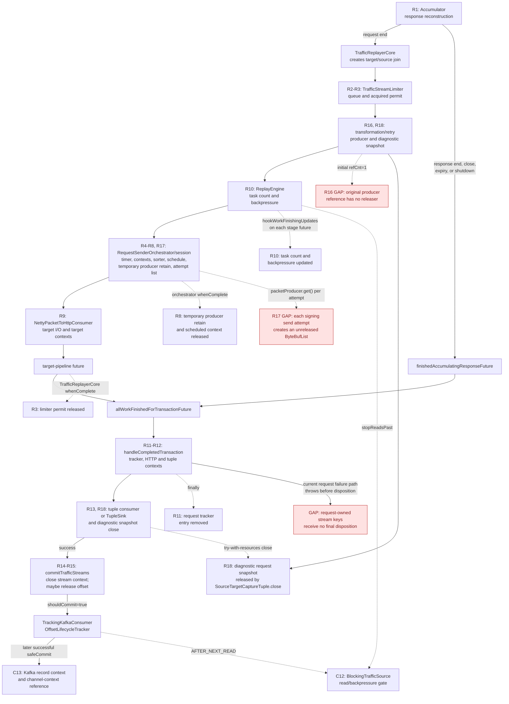
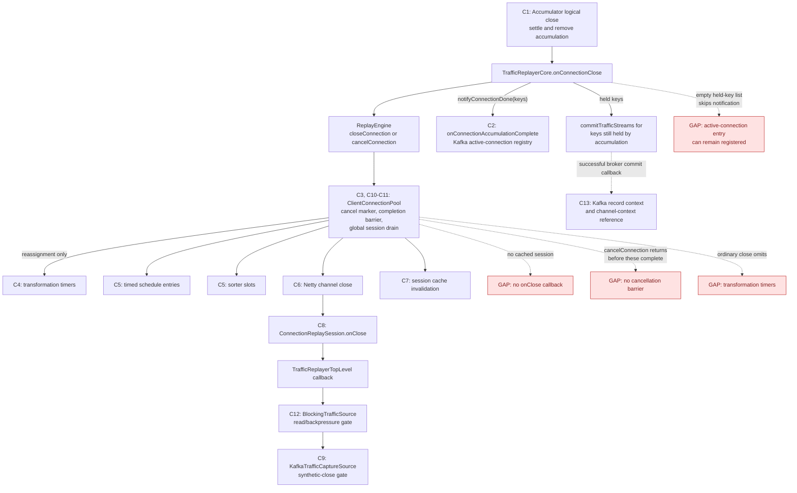
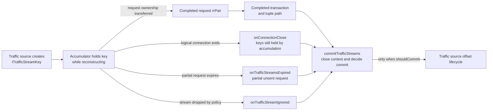

# Replayer Work Lifecycle Responsibility Audit

Date: 2026-09-03

Branch baseline: `integrating3231` at `bf696819d058c1c091f4cdcbeece478b01ffba0f`

## Executive Summary

On this branch, clearing a connection no longer removes pending schedule entries while leaving
their futures unfinished. Instead, each pending operation's future is completed unsuccessfully
with a `CancellationException`.

Here, "cancelled" means that the operation will not run because the connection is being torn
down. It does not mean that the target work completed successfully, and it does not decide
whether the associated traffic stream offset should be committed.

Completing the futures wakes their dependent callbacks. Cleanup callbacks can then release
limiter permits, request resources, sequencer slots, and request-tracker entries. Before this
branch's change, removing the schedule entries left those callbacks waiting indefinitely.

They do **not** yet provide a correct final disposition for every traffic stream whose request
callback chain is cancelled.

The central problem is that a failed or cancelled target request is rethrown during tuple
packaging before the callback reaches `commitTrafficStreams`. That behavior has two materially
different effects:

* For partition-reassignment cancellation, not committing is correct, but traffic-stream
  contexts still need to be closed explicitly.
* For ordinary connection close, the request tracker can now look drained while the Kafka
  offset remains pinned in the lifecycle tracker.

Before the cancellation-drain change, these requests remained visibly stuck in pending futures.
After it, most local work bookkeeping drains, but the offset decision is still bypassed. That is
an improvement in resource cleanup, but not yet a complete fix for the PR 3231 final-commit issue.

There is also a separate likely drain-gate bug when a synthetic reassignment close is generated
for a connection that never created a replay session. In that case no network-close callback is
generated to release the Kafka source's outstanding-close counter.

The responsibility inventory also exposes pre-existing transformed-request buffer ownership
gaps. The producer's original reference and signing-mode per-attempt `ByteBufList` objects have
no terminal-action owner. The diagnostic request snapshot is released only if tuple packaging is
reached. These are not caused by the cancellation-drain change, but cancellation can make the
snapshot leak path easier to reach.

## Required Invariants

Every terminal callback path that owns traffic stream keys should make all of these decisions
explicitly:

1. Settle all queued target work exactly once.
2. Release local resources, limiter permits, sequencer slots, and request-tracker entries.
3. Close every `TrafficStreamsContext`, regardless of whether its offset is committed.
4. Commit an offset only after the associated replay/drop policy and tuple-output requirements
   have been satisfied.
5. Never interpret cancellation as successful replay.
6. Never leave the Kafka source waiting for a connection-close acknowledgement that cannot
   arrive.

Source reconstruction status alone is insufficient for the offset decision. The decision also
needs the target work outcome and, for cancellation, the reason for cancellation.

## Responsibility Map

This section is the finite checklist for the audit. Its boundary starts when a traffic-stream key
is accepted by the accumulator and includes independently tracked state through target replay,
tuple output, target-session teardown, and the source-side gates and contexts affected by final
disposition. It does not enumerate source polling before that handoff, or every internal Netty
handler or child `ByteBuf` when its lifecycle is fully encapsulated by one of the listed owners.
Ref-counted objects that cross ownership boundaries are included.

The columns distinguish three different roles:

* **State holder:** where the pending state or resource lives.
* **Terminal-action owner:** the code responsible for settling, releasing, closing, removing, or
  dispositioning it. A future's completion is only the signal; this owner installs or runs the
  callback that performs the action.
* **Cancellation coverage:** whether the current close/cancel paths reliably reach that terminal
  owner.

Status meanings:

| Status | Meaning |
| --- | --- |
| Covered | The audited cancellation path has an explicit terminal action for this concern. |
| Partial | Coverage depends on the stage having started, the kind of close, or another future eventually settling. |
| Missing | A relevant cancellation/shutdown path has no reliable terminal owner or bypasses it. |

### Terminal-Action Owner Index

This is the shortest answer to "who is responsible?" It names the actor that must perform the
terminal action, not merely the actor whose future happens to complete. For a `Missing` row, the
named actor is the boundary where ownership must be assigned; it is not a claim that the current
implementation already performs the action.

| Terminal-action actor | Responsibilities it owns | IDs | Important limit |
| --- | --- | --- | --- |
| `CapturedTrafficToHttpTransactionAccumulator` | Complete source reconstruction continuations and remove logical accumulations | R1, C1 | It does not decide target outcome or final offset disposition. |
| `TrafficStreamLimiter` | Dequeue/start pre-permit work | R2 | It has no queued-work drain on close. |
| `TrafficReplayerCore` | Release acquired limiter permits; remove request-tracker entries; close transaction/tuple contexts; choose tuple and stream disposition | R3, R11-R15 | Final stream disposition is bypassed by current failed/cancelled target handling. |
| `RequestSenderOrchestrator` plus `ConnectionReplaySession` | Settle transformation timers, ordering slots, timed work, and the orchestrator's temporary producer retain/scheduled context | R4-R8 | These owners do not own the producer's original reference or every list returned by `get()`. |
| `NettyPacketToHttpConsumer` plus Netty | Finish active target I/O and close target request contexts/channel state | R9, C6 | Connection cancellation does not provide a barrier that joins all active I/O cleanup. |
| `ReplayEngine` | Decrement scheduled-task counts and advance content-time/read backpressure | R10, part of C12 | It observes child futures; it does not itself settle abandoned child work. |
| Transformation/retry/tuple packaging code | Release transformed producer/list ownership and the diagnostic request snapshot | R16-R18 | R16 and R17 currently have no terminal owner; R18 has one only after tuple packaging starts. |
| `ClientConnectionPool` plus `ConnectionReplaySession` | Mark cancellation; drain session queues; close channel; invalidate cache; invoke session close callback; drain all sessions at shutdown | C3-C8, C10-C11 | No-session acknowledgement, cancellation barrier, and global drain are missing. |
| `KafkaTrafficCaptureSource` plus `TrackingKafkaConsumer` | Remove active-connection registrations; release synthetic-close gate; close record contexts after commit | C2, C9, C13 | Empty-key close, no-session close, partition cleanup, and no-commit paths have gaps. |
| `BlockingTrafficSource` | Release the buffered read/backpressure gate when allowed | C12 | Progress depends on the replay futures and offset policy reaching their terminal owners. |

### Per-Request Responsibilities



The graph shows control and responsibility boundaries, not Java call-stack nesting. For example,
`TrafficReplayerCore` acquires neither the semaphore permit nor the packet reference, but it
installs the callback that releases the permit; `RequestSenderOrchestrator` owns the packet
release callback. Every R ID appears at the actor expected to terminate that responsibility;
R18 appears twice because ownership transfers from retry collection to tuple packaging.

| ID | Concern that must terminate | State holder | Terminal-action owner and action | Cancellation coverage |
| --- | --- | --- | --- | --- |
| R1 | Captured response reconstruction | `Accumulation.RequestResponsePacketPairWithCallback` holds the continuation; `TrafficReplayerCore` holds `finishedAccumulatingResponseFuture` | `CapturedTrafficToHttpTransactionAccumulator.handleEndOfResponse` invokes the continuation with the completed `rrPair` | **Covered** when a signaled request reaches response end, captured close, expiry, or accumulator shutdown. Target cancellation alone does not complete this source-side responsibility. |
| R2 | Limiter queue entry before a permit is acquired | `TrafficStreamLimiter.workQueue` | `TrafficStreamLimiter.consumeFromQueue` is the only normal remover and starter | **Missing** for connection cancellation and terminal shutdown; `close()` stops the consumer without draining queued entries or settling their dequeue futures. |
| R3 | Acquired limiter permit | `TrafficStreamLimiter.liveTrafficStreamCostGate`, associated with a `WorkItem` | `TrafficReplayerCore.sendRequestAfterGoingThroughWorkQueue` installs `whenComplete(... doneProcessing(workItem))` on the target-pipeline future | **Covered** after the item has been dequeued, provided the target-pipeline future settles. |
| R4 | Transformation timer | `ConnectionReplaySession.pendingTransformationTimers` | Normal timer completion is handled by `RequestSenderOrchestrator.scheduleWork`; reassignment uses `ClientConnectionPool.cancelConnection -> drainTransformationTimers` | **Partial**: reassignment drains it, but ordinary close and pool shutdown do not. Exceptional timer completion outside that drain is not self-removed. |
| R5 | Transformation scheduled tracing context | Local `scheduledContext` in `RequestSenderOrchestrator.scheduleWork` | The timer's deferred handler closes it before starting transformation or propagating scheduling failure | **Partial** because it depends on R4 settling. |
| R6 | Per-connection ordering slot | `ConnectionReplaySession.scheduleSequencer` (`OnlineRadixSorter`) | `OnlineRadixSorter` removes a slot when `workSettledFuture` completes; `ClientConnectionPool` calls `cancelAllWork` during session drain | **Covered** for queued slots on ordinary close and reassignment. Active work that already escaped the sorter remains another owner's responsibility. |
| R7 | Time-shifted send/close work point | `ConnectionReplaySession.schedule` (`TimeToResponseFulfillmentFutureMap`) | `RequestSenderOrchestrator.scheduleOnConnectionReplaySession` removes/reschedules on work completion; `ClientConnectionPool` calls `drainWithCancellation` on close/cancel | **Covered** by the audited close paths. The still-public raw `clear()` remains unsafe. |
| R8 | Orchestrator's temporary packet-producer retain and send scheduled context | `RequestSenderOrchestrator.scheduleSendRequestOnConnectionReplaySession` | Its `whenComplete` releases the producer retain acquired by that method and closes the scheduled context if the send callback did not | **Covered** once this callback has started and its returned future settles. This does not release the producer's original reference; see R16. |
| R9 | Active target send, response wait, and target request contexts | `NettyPacketToHttpConsumer` and Netty channel pipeline | `NettyPacketToHttpConsumer.finalizeRequest().whenComplete` deactivates the pipeline and closes target contexts; channel close is expected to settle active I/O | **Partial**: queued work is drained, but active work is not explicitly joined by the current cancellation future. |
| R10 | Replay-engine task count and content-time backpressure frontier | `ReplayEngine.totalCountOfScheduledTasksOutstanding` and `contentTimeController` | `ReplayEngine.hookWorkFinishingUpdates` installs `whenComplete` callbacks on transformation, request, close, and cancel futures | **Partial**: underlying request work drains, but `cancelConnection` returns a completed future before its asynchronous drain and channel close finish. |
| R11 | Per-request finalization registry entry | `OrderedWorkerTracker` through `requestWorkTracker` | `TrafficReplayerCore.handleCompletedTransaction` removes the request in `finally` | **Covered as bookkeeping** once both target and source futures settle. Removal does not prove tuple durability, context closure, or offset disposition. |
| R12 | HTTP transaction and tuple tracing contexts | `RequestResponsePacketPair` / `TrafficReplayerCore` | `handleCompletedTransaction` closes the HTTP context; `processCompletedTransaction` closes the tuple context with try-with-resources | **Partial**: covered only if the target/source join reaches final handling. |
| R13 | Tuple output completion | Synchronous tuple consumer or the `CompletableFuture` returned by `ThreadLocalTupleWriter` / `TupleSink` | Synchronous return, or `TrafficReplayerCore.handleTupleWriteCompletion` for asynchronous output | **Missing for failed/cancelled target work**: current packaging throws before the asynchronous completion callback is retained as the final-disposition chain. |
| R14 | Every `TrafficStreamsContext` | Each `ITrafficStreamKey` until final disposition | `TrafficReplayerCore.commitTrafficStreams(true/false, keys)` or `failReplayForTupleWrite` closes it | **Missing** for request-owned keys when target work fails or is cancelled before disposition. |
| R15 | Kafka offset lifecycle entry and eventual broker commit | `OffsetLifecycleTracker`, then `TrackingKafkaConsumer` commit staging | `TrafficReplayerCore` chooses `shouldCommit`; `TrackingKafkaConsumer.commitKafkaKey` removes the lifecycle entry and a later `safeCommit` commits the contiguous offset | **Missing as a decision** for failed/cancelled request-owned keys. Reassignment intentionally chooses no commit, but still requires R14 context closure. |
| R16 | Original transformed packet-producer reference | `TransformedOutputAndResult.transformedOutput`, returned with reference count one | **No terminal-action owner found.** `RequestSenderOrchestrator` retains and releases only its additional temporary share | **Missing** on success, failure, and cancellation. For `SigningByteBufListProducer`, the original reference keeps retained body buffers alive. |
| R17 | `ByteBufList` returned for each target send attempt | Local `byteBufList` in `RequestSenderOrchestrator.sendRequestWithRetries`; signing mode creates a fresh list on every `get()` | **No terminal-action owner found.** Packet consumers receive retained duplicates, but the attempt-level list itself is not released | **Missing**, most visibly for signing and retry paths. The trivial producer returns its shared list, so its lifetime is entangled with R16/R18 rather than being a fresh per-attempt allocation. |
| R18 | Diagnostic target-request snapshot retained in the retry summary | `RetryCollectingVisitorFactory` stores `packetProducer.get()` in `TransformedTargetRequestAndResponseList`, later exposed as `SourceTargetCaptureTuple.targetRequestData` | `SourceTargetCaptureTuple.close()` releases it through try-with-resources in tuple packaging | **Partial**: covered when tuple packaging is reached; if target scheduling/send fails or is cancelled before the summary reaches final handling, the collector and snapshot have no cleanup callback. |

### Per-Connection and Source Responsibilities



Every C ID appears at the actor expected to terminate it. C5 appears twice because one owner must
drain both independently stored queues.

| ID | Concern that must terminate | State holder | Terminal-action owner and action | Cancellation/close coverage |
| --- | --- | --- | --- | --- |
| C1 | Accumulator entry and any source-response continuation | `CapturedTrafficToHttpTransactionAccumulator.liveStreams` / `Accumulation` | `fireAccumulationsCallbacksAndClose` assigns a reconstruction status and invokes the appropriate request/connection callbacks before removal | **Covered structurally**, subject to request final-disposition gaps R13-R15. |
| C2 | Kafka active-connection registration | `KafkaTrafficCaptureSource.partitionToActiveConnections` | `TrafficReplayerCore.notifyConnectionDone -> onConnectionAccumulationComplete` removes it | **Partial**: notification is skipped when `onConnectionClose` receives no held key, including normal cases where ownership already moved into an `rrPair`. |
| C3 | Session cancellation marker preventing reconnect | `ConnectionReplaySession.cancelled` | `ClientConnectionPool.cancelConnection` sets it before draining work | **Covered only when a cached session exists**. |
| C4 | Transformation timers for the session | `ConnectionReplaySession.pendingTransformationTimers` | `ClientConnectionPool.cancelConnection` drains them for reassignment | **Partial**: ordinary close and global shutdown omit them. Same concern as R4. |
| C5 | Timed schedule and sorter queues | `ConnectionReplaySession.schedule` and `scheduleSequencer` | `ClientConnectionPool.cancelPendingWork` or the reassignment event-loop task drains both with one cancellation cause | **Covered for an existing session**, with no completion barrier. |
| C6 | Netty channel | `ConnectionReplaySession.cachedChannel` / Netty | `ClientConnectionPool.closeClientConnectionChannel` closes it; null-channel path still drains pending work | **Partial**: close is started, but callers discard or do not await the full result. |
| C7 | Session cache entry | `ClientConnectionPool.connectionId2ChannelCache` | `ClientConnectionPool.closeConnection` invalidates it after starting channel close | **Covered for an existing session**; the cache can be invalidated before channel close and callbacks finish. |
| C8 | Session-close callback delivery | `ConnectionReplaySession.onClose` | `ClientConnectionPool.closeClientConnectionChannel` invokes it after real-channel close or in the null-channel branch | **Missing when no cached session exists**; no callback object is available. |
| C9 | Synthetic-close read gate | `KafkaTrafficCaptureSource.pendingTrafficSourceReaderInterruptedCloses` and outstanding counter | `KafkaTrafficCaptureSource.onNetworkConnectionClosed`, reached through session `onClose`, top-level callback, and `BlockingTrafficSource` | **Missing for no-session synthetic closes**; the counter can remain nonzero and block real Kafka reads. |
| C10 | Cancellation completion barrier | No object currently represents the whole operation | It would need to join timer drain, schedule drain, sorter drain, channel close, cache invalidation, and source acknowledgement | **Missing**: `ClientConnectionPool.cancelConnection` immediately returns an already-completed future. |
| C11 | Global pool shutdown of every child session | Netty event-loop group and session cache | `ClientConnectionPool.shutdownNow` shuts down the group and invalidates the cache | **Missing as an explicit drain**: it does not enumerate sessions and apply C4-C10 terminal actions. |
| C12 | Buffered source read/backpressure gate | `BlockingTrafficSource.readGate`, `stopReadingAtRef`, and `lastTimestampSecondsRef` | `ReplayEngine.hookWorkFinishingUpdates` calls `stopReadsPast` as task futures settle; `BlockingTrafficSource.commitTrafficStream` also releases the gate for `AFTER_NEXT_READ` | **Partial**: settling formerly orphaned request futures restores this progress path, but limiter-queued work and terminal shutdown can still bypass it. |
| C13 | Kafka record tracing context and retained channel-context reference after a commit is staged | `TrackingKafkaConsumer.nextSetOfKeysContextsBeingCommitted`, `KafkaRecordContext`, and `ChannelContextManager` | Successful `safeCommit -> callbackUpTo -> KafkaTrafficCaptureSource.onKeyFinishedCommitting` closes the record context and releases the channel reference | **Partial**: partition cleanup removes staged key queues without invoking this callback; explicit no-commit paths have no broker-commit callback and rely on separate terminal/generation cleanup. |

The matrices are exhaustive for the stated audit boundary and are the checklist of record. The
later findings expand the highest-risk gaps; the required-test list should eventually contain at
least one direct test for every `Partial` or `Missing` row.

For the ownership question, this section is self-contained. The remainder of the document traces
the code paths and evidence behind these classifications.

Current snapshot:

| Total concerns | Covered | Partial | Missing |
| ---: | ---: | ---: | ---: |
| 31 | 10 | 11 | 10 |

The covered set is R1, R3, R6-R8, R11, C1, C3, C5, and C7.

The partial set is R4-R5, R9-R10, R12, R18, C2, C4, C6, and C12-C13.

The missing set is R2 (limiter-queued work), R13-R15 (tuple/final stream disposition), R16-R17
(transformed producer and attempt-buffer ownership), and C8-C11 (no-session acknowledgement,
synthetic-close gate, cancellation barrier, and global session drain).

## Final Commit Trigger

There is one replay-policy method that initiates the traffic source's commit operation:

[`TrafficReplayerCore.TrafficReplayerAccumulationCallbacks.commitTrafficStreams`](../TrafficCapture/trafficReplayer/src/main/java/org/opensearch/migrations/replay/TrafficReplayerCore.java)

For each traffic stream key, it:

1. Closes the `TrafficStreamsContext`.
2. Calls `trafficCaptureSource.commitTrafficStream(key)` only when `shouldCommit` is true.

For Kafka, this is not necessarily an immediate broker commit:

```text
TrafficReplayerCore.commitTrafficStreams
  -> BlockingTrafficSource.commitTrafficStream
    -> KafkaTrafficCaptureSource.commitTrafficStream
      -> TrackingKafkaConsumer.commitKafkaKey
        -> OffsetLifecycleTracker.remove(...)
        -> possibly stage a new contiguous offset
        -> safeCommit on a later read/touch operation
```

The "final commit trigger" therefore means that the record no longer blocks lifecycle offset
progress. The actual Kafka consumer commit may occur later.

## Close Vocabulary

Several layers use the word "close," but they are different events:

| Layer | Event/API | Meaning |
| --- | --- | --- |
| Captured source traffic | A `TrafficObservation` containing `close` | The captured client/source TCP connection ended. This is input data being reconstructed, not a target socket event. |
| Accumulator lifecycle | `AccumulationCallbacks.onConnectionClose` | The accumulator has decided that this logical captured connection is finished and reports its reconstruction status and any traffic-stream keys it still owns. This is the "connection close" entry in the offset-disposition tables below. |
| Replay scheduling | `ReplayEngine.closeConnection` / `RequestSenderOrchestrator.scheduleClose` | A target-side close operation is inserted into the connection's ordered work sequence and time-shifted to the captured close timestamp. |
| Target networking | `ClientConnectionPool.closeClientConnectionChannel` | The Netty channel is actually closed, pending schedule/sorter work is drained, the session cache entry is invalidated, and the session's `onClose` callback runs. |
| Kafka drain acknowledgement | `ITrafficCaptureSource.onNetworkConnectionClosed` | The target session is gone. Kafka may use this acknowledgement to decrement its synthetic-close drain gate. This is not an offset commit. |

The accumulator callback is therefore a policy boundary between source reconstruction and target
network cleanup. A target channel can fail or close for networking reasons without that event
being a captured logical connection close.

The request graph in the responsibility map uses **target-pipeline future** rather than "Netty
response future." On the normal unfiltered path, successful completion includes Netty
request/response and retry handling. Transformation, event-loop submission, sorter, scheduling,
connection, send, or response failure can settle it earlier and exceptionally.

The optional `--request-filter-config` path is the exception to reaching Netty: predicate rejection
produces `RequestFilteredException`, `SKIPPED` status, and null transformed output, so the target
pipeline completes successfully without a send.

`allWorkFinishedForTransactionFuture` joins that target outcome with
`finishedAccumulatingResponseFuture`. No worker thread blocks. In code, the target future is the
outer future; after it settles, its handler waits for the accumulator's response continuation.
This join gates final transaction handling, but it does not gate target channel close or
asynchronous tuple durability.

## What Triggers the Accumulator's Logical Connection Close

| Trigger | Reconstruction status | Accumulator path | Target-side action | Offset action for keys passed directly to `onConnectionClose` |
| --- | --- | --- | --- | --- |
| Captured `close` observation | `COMPLETE` | `handleCloseObservationThatAffectEveryState` | Schedule an ordered, time-shifted target close | Close contexts and commit before asking the replay engine to schedule the target close |
| Source-time accumulation expiry | `EXPIRED_PREMATURELY` | `ExpiringTrafficStreamMap` calls the accumulator expiry policy, which calls `fireAccumulationsCallbacksAndClose` | Usually schedule an ordered target close if the accumulation has signaled request activity | Commit-eligible, but the owner and timing depend on accumulator state; see the expiration table below |
| Top-level accumulator shutdown | `CLOSED_PREMATURELY` | `CapturedTrafficToHttpTransactionAccumulator.close()` visits each live accumulation | Schedule an ordered target close when the accumulation reports one | Close contexts without committing |
| Kafka partition-loss synthetic close | `TRAFFIC_SOURCE_READER_INTERRUPTED` | A `TrafficSourceReaderInterruptedClose` is fed into `accept()` | Bypass time shifting and the sorter; mark the session cancelled and close it immediately | Close contexts without committing |
| Higher-generation record arrives before its synthetic close | `TRAFFIC_SOURCE_READER_INTERRUPTED` | Defensive stale-generation branch in `accept()` | Same immediate cancellation path as a synthetic close | Close contexts without committing |

The callback is conditional in `fireAccumulationsCallbacksAndClose`: it calls
`onConnectionClose` only when `Accumulation.hasSignaledRequests()` is true. That condition, and
the state transitions performed before the check, are part of the no-session/no-acknowledgement
risk discussed in Finding 4.

### Captured Close Ownership by Accumulator State

A captured `close` observation always ends the logical connection, but the accumulator state
determines which callback owns the close record and any other held keys:

| State when captured `close` arrives | What happens to request state | Who owns the held traffic-stream keys | Offset consequence under current policy |
| --- | --- | --- | --- |
| `ACCUMULATING_WRITES` | The current response is completed with `COMPLETE` before the logical close callback runs | The request's `rrPair`, including the close record; direct `onConnectionClose` is passed an empty key list | The completed-request path decides after target completion and tuple handling |
| `ACCUMULATING_READS` | The request is partial and has never been sent to the target | Direct `onConnectionClose` receives the partial request's keys plus the close record | `COMPLETE` is commit-eligible, so these keys are currently closed/committed despite no target replay |
| `WAITING_FOR_NEXT_READ_CHUNK` | There is no current request | A temporary `rrPair` holds the close record for direct `onConnectionClose` | The close record is closed/committed |
| `IGNORING_LAST_REQUEST` | Remnants of an earlier request are being skipped | A temporary `rrPair` holds the close record for direct `onConnectionClose` | The close record is closed/committed |

The `ACCUMULATING_READS` row is another example of why `COMPLETE` describes source-connection
reconstruction, not necessarily successful target replay. Whether committing an unterminated
request on a confirmed source close is the desired discard policy should be reviewed separately
from channel-close mechanics.

Events that do **not** directly mean "logical connection close" include:

* A captured `connectionException` observation. The accumulator drops/resets the affected
  request, but currently keeps the logical connection alive.
* A target request failure or target channel failure. Those complete request work
  exceptionally and may cause reconnection; they are not captured source-close observations.
* `ClientConnectionPool.shutdownNow()`. It terminates target networking globally without first
  producing an accumulator close/disposition callback for every request.

## Traffic-Stream Key Provenance and Final Disposition

Here, a **final-disposition owner/path** is the replayer callback or method that has terminal
responsibility for a set of `ITrafficStreamKey` objects. It must close each key's
`TrafficStreamsContext` and decide whether to call
`trafficCaptureSource.commitTrafficStream(key)`. It is not an entry into Kafka and it is not
necessarily the code that first read or accumulated the key.

The normal provenance chain is:



The important provenance invariant is that every key moves to exactly one final-disposition owner.
The central cancellation bug in this audit is a broken last link: request-owned keys reach the
completed-transaction path, but tuple packaging can throw before `commitTrafficStreams`, so no
final disposition occurs even though `requestWorkTracker` removes the request.

The first two columns below describe provenance and ownership. The last two describe timing:
**when does that owner close the context and decide the offset relative to target replay, tuple
output, and target channel closure?** This timing is relevant to cancellation and final-commit
hardening, but it is not part of the key's identity or source provenance. It also does not mean
Kafka record order or `OnlineRadixSorter` order.

| Final-disposition owner/path | Which keys it owns | When context close/commit decision occurs | Relationship to target channel close |
| --- | --- | --- | --- |
| `processCompletedTransaction` / `handleTupleWriteCompletion` | Keys transferred into the request's `rrPair` | After target request completion and source response reconstruction; after synchronous tuple output, or after successful asynchronous tuple write | Target request work is ordered before a later target-close slot, but asynchronous tuple writing and disposition are outside that channel sequence and may finish after target close has been scheduled or completed |
| `onConnectionClose` | Keys still held by the connection accumulation and not already transferred to a request `rrPair` | Synchronously inside `TrafficReplayerCore.onConnectionClose`, before calling `ReplayEngine.closeConnection` or `cancelConnection` | It does not wait for target channel closure; network cleanup is deliberately not the commit gate |
| `onTrafficStreamsExpired` | Keys in an `rrPair` whose request was never completed or sent | Synchronously before the expiration callback returns | A separate logical-close callback may subsequently schedule or cancel the target session |
| `onTrafficStreamIgnored` | The ignored key | Immediately when the accumulator declares the stream ignored | No asynchronous target request remains for that key |
| `failReplayForTupleWrite` | Request-owned keys whose tuple could not be durably written | Closes contexts without committing, then initiates fatal shutdown | Target/process cleanup follows; the offset is deliberately retained |

For `TRAFFIC_SOURCE_READER_INTERRUP TED`, the logical-close row uses an explicit no-commit
decision and then calls the immediate target cancellation path. For ordinary statuses, it makes
the status-based decision and then schedules the target close.

The status-based rule currently is:

| Reconstruction status | Commit |
| --- | --- |
| `COMPLETE` | Yes |
| `EXPIRED_PREMATURELY` | Yes |
| `CLOSED_PREMATURELY` | No |
| `TRAFFIC_SOURCE_READER_INTERRUPTED` | No |

That rule is valid only when the target work reached the point expected by the callback. It does
not answer what to do when target work fails or is cancelled first.

## What Expiration Actually Does

Current accumulation expiry is based on **captured source timestamps**, not elapsed wall-clock
time. While processing an observation, `ExpiringTrafficStreamMap.expireOldEntries` advances a
global source-time expiry window. Advancing that window can expire older connections, including
connections other than the one whose new observation caused the sweep.

There is no retained background wall-clock expiration callback from PR 3231. The proposed
heartbeat-driven wall-clock expiry is the separate change this review recommends rejecting.

When the expiry policy calls `fireAccumulationsCallbacksAndClose`, behavior depends on the
accumulation state:

| State at expiry | Request/response situation | Direct offset-disposition path | Logical target-close path |
| --- | --- | --- | --- |
| `ACCUMULATING_READS` with an `rrPair` | A request was only partially reconstructed and was never sent | `onTrafficStreamsExpired(EXPIRED_PREMATURELY, keys)` immediately closes/commits the held keys under current policy, then resets the request | The `finally` block may also call `onConnectionClose` with no remaining keys to arrange target/session cleanup |
| `ACCUMULATING_WRITES` | The target request may be running or complete, but captured response reconstruction is unfinished | `handleEndOfResponse` completes the `rrPair` with `EXPIRED_PREMATURELY`; the normal completed-request callback owns the eventual tuple/offset decision | The `finally` block calls `onConnectionClose`, generally with keys already owned by the request callback |
| `WAITING_FOR_NEXT_READ_CHUNK` | No current request body is being accumulated | No request-owned key disposition is created here | `onConnectionClose` runs only if `hasSignaledRequests()` is true |
| `IGNORING_LAST_REQUEST` | The accumulator is intentionally skipping remnants of an earlier request | No request-owned key disposition is created here | `onConnectionClose` runs only if `hasSignaledRequests()` is true |

Thus, the former phrase "during expiration callback" was too vague. Only the
`ACCUMULATING_READS` branch directly calls `onTrafficStreamsExpired`; the
`ACCUMULATING_WRITES` branch feeds the expiration status into the ordinary request-completion
chain, where target and tuple outcomes still matter.

## `requestWorkTracker` Detail

Despite its name, `requestWorkTracker` is not a scheduler and does not own or execute request
work. It is a live registry keyed by `UniqueReplayerRequestKey`. For each request,
`TrafficReplayerCore.onRequestReceived` stores the `allWorkFinishedForTransactionFuture` shown
above, not the raw Netty future.

The production implementation is `OrderedWorkerTracker<Void>`. The tracker is used to:

* Count and age outstanding requests for heartbeat and `ActiveContextMonitor` diagnostics.
* Let `waitForRemainingWork` snapshot the remaining finalization futures and wait for all of them.
* Warn or assert when replay wrap-up reaches shutdown with requests still registered.

`handleCompletedTransaction` removes the entry in a `finally` block. Consequently, removal means
that final transaction handling was invoked and exited; it does **not** prove that replay
succeeded, tuple output completed successfully, traffic-stream contexts closed, or Kafka offsets
were released. In asynchronous tuple-writer mode, removal happens after the tuple write is
submitted and its completion callback is installed, not after the write or later offset
disposition completes. In the failure identified below, the entry is removed even though tuple
packaging throws before `commitTrafficStreams` is reached.

## What the Cancellation Change Does

Before this branch, `closeClientConnectionChannel` called `schedule.clear()`. That removed
schedule entries without completing their `scheduleFuture` objects. Any work waiting on those
futures remained pending forever.

The new behavior has four separate pieces:

| Change | Meaning |
| --- | --- |
| Schedule drain | `drainWithCancellation` completes every pending schedule trigger exceptionally with one `CancellationException`, rather than dropping it. |
| Sorter drain | `cancelAllWork` settles every sorter slot as `WorkOutcome.Cancelled` and removes it from the sorter. |
| No queued business callback | A cancelled sorter outcome makes the next slot's start signal fail, so that next request/close callback is not invoked. |
| Stable cause for late work | Once a sorter is cancelled, `addFutureForWork` immediately returns a failed future with the original cancellation cause rather than creating a new generic exception. |

The ordinary no-channel close path now uses the same schedule/sorter drain as the normal
channel-close path.

The sequence behavior is intentionally asymmetric:

| Prior slot outcome | Does the next queued business callback start? | Why |
| --- | --- | --- |
| Success | Yes | The sorter advances normally. |
| Ordinary failure | Yes | The sorter treats failure as terminal for that slot, but continues sequencing later slots. |
| `CancellationException` | No | The sorter treats cancellation as connection/session teardown, and propagates that cancellation to later slots. |

This is appropriate for the current producers of `CancellationException`: partition
reassignment, connection teardown, and event-loop shutdown. It would be too strong if a future
caller used `CancellationException` for a retryable per-request condition.

## Why Future Settlement Reaches Some Owners but Not Others

The cancellation drain does **not** run every callback in the graph. It settles the futures that
were previously orphaned. That activates error/finally cleanup callbacks, while skipping
success-only callbacks and ordinary statements after an exception. Responsibility rows R1-R18 and
C1-C13 identify the concrete owner for each action; this section only explains the callback
mechanics.

| Callback form | Runs after success | Runs after failure/cancellation |
| --- | --- | --- |
| `whenComplete` | Yes | Yes |
| `finally` around invoked completion handling | Yes | Yes |
| `thenApply` / `thenCompose` body | Yes | No |
| Ordinary statement after a throwing call | Yes | No |

For a scheduled request, clearing follows this path:

```text
schedule trigger completed with CancellationException
  -> target request future completes exceptionally
    -> whenComplete/finally cleanup handlers run
    -> final transaction handler receives requestFailure
      -> tuple packaging throws CompletionException(requestFailure)
        -> later commitTrafficStreams statement is not reached
```

This is why resource cleanup and final offset disposition diverge. The former is mostly attached
as terminal cleanup; the latter is ordinary business logic that follows successful tuple
packaging.

The direct test evidence is partial:

* `CancelledSessionPermitLeakTest` schedules real request futures, attaches the same
  `whenComplete` permit-release pattern used by `TrafficReplayerCore`, and verifies the handler
  runs after cancellation. It also verifies that reassignment drains standalone transformation
  timers.
* `CancelConnectionDrainTest` verifies schedule/sorter drain, exceptional queued request futures,
  and that cancelled queued send callbacks do not begin.
* `OnlineRadixSorterTest` verifies cancellation does not invoke queued business callbacks and
  drains placeholders.

We do **not** yet have one end-to-end test with real traffic-stream keys proving, together, that
the expected resources release, contexts close exactly once, and the offset follows the chosen
no-commit/commit policy. That test remains required.

### Incident Scope

This cancellation work can fix a real stall mechanism: a dropped schedule trigger left the
dependent future chain incomplete, so its permit-release and work-tracker cleanup could remain
pending indefinitely. That can starve new work and contribute to a blocked rebalance/drain.

Together with the already-retained `BlockingTrafficSource` lifecycle-callback forwarding fix
(PR 3231's 6b), it addresses two independent ways the Kafka source could stop making progress:

1. A local request chain could be permanently orphaned after its schedule entry was cleared.
2. A synthetic-close acknowledgement could be swallowed before it reached the Kafka source.

This audit does **not** establish that those two fixes resolve the entire reported incident.
Findings 1 through 8 document remaining ways final disposition, source acknowledgement,
transformation timing, buffer ownership, and terminal shutdown can still leave work incomplete,
resources retained, or offsets pinned.

## Terminal-Trigger Coverage Matrix

This table checks terminal events against the responsibility IDs above. The ID column names the
independently tracked concerns that the event must either settle itself or deliberately leave with
another live owner.

| Trigger/path | Responsibility IDs affected | How callbacks settle | Current final offset behavior | Verdict |
| --- | --- | --- | --- | --- |
| Partition reassignment through `cancelConnection` | R1, R3-R18; C1-C13 | Transformation timers, send schedule, and sorter receive cancellation; channel-close callback runs only when a session exists | Connection-held keys use explicit no-commit; request-owned keys can bypass R14-R15 | Incomplete |
| Ordinary scheduled connection close with a channel | R1, R3, R6-R18; C1-C9, C12-C13 | Schedule and sorter are drained after channel close; transformation timer R4 is omitted | Connection-held keys are already status-disposed; unexpected request-owned keys can bypass R14-R15 | Incomplete invariant handling |
| Ordinary close with a null channel inside an existing session | R1, R3, R6-R18; C1-C9, C12-C13 | Schedule and sorter drain immediately and session `onClose` runs; transformation timer R4 is omitted | Same as ordinary channel close | Locally drained, final request policy incomplete |
| Accumulator `close()` | R1, R11-R18; C1-C2, C12-C13 and any resulting C5-C9 | Every live accumulation receives `CLOSED_PREMATURELY` before the map is cleared | Explicit no-commit for keys that reach R14; failed request handling can still bypass it | Correct structure; inherits R13-R18 gaps |
| Accumulation expiration | R1, R11-R18; C1-C2, C12-C13 and any resulting C5-C9 | `EXPIRED_PREMATURELY` either directly dispositions a partial request or completes the request's `rrPair` | Commit-eligible by policy; request-owned keys wait for target and tuple completion | Correct structure; inherits R13-R18 gaps |
| Synthetic reassignment close | R1, R3-R18; C1-C10, C12-C13 | Source status is `TRAFFIC_SOURCE_READER_INTERRUPTED`; target work is cancelled only if a session exists | Explicit no-commit for callback-owned keys | Missing C8-C10 no-session handling and R14 request-owned cleanup |
| `TrafficStreamLimiter.close()` | R2 | Consumer thread stops; queued dequeue futures are not completed | No final-disposition callback is reached for queued requests | Missing drain |
| `ClientConnectionPool.shutdownNow()` | R4, R6-R10, R16-R18; C3-C13 | Event loops shut down and cache is invalidated without an explicit per-session terminal policy | No guaranteed final-disposition callback | Terminal-only abandonment |
| `waitForRemainingWork` timeout/shutdown | Potentially R1-R18 and C1-C13 remain live | Aggregate wait future is cancelled; child work is not | No offset decision because represented requests were not cleared | Must not be treated as a drain |
| Raw `TimeToResponseFulfillmentFutureMap.clear()` | R7 and downstream R3, R10-R18 | Schedule futures are dropped without completion | No final-disposition callback | Unsafe API; currently unused |

Standalone transformation timers are included only in the partition-reassignment path. They are
not included by ordinary connection close, session work-size checks, or pool shutdown.

## Finding 1: Cancellation Bypasses Offset Disposition

Severity: **High**

Both tuple-output modes rethrow a target request exception before reaching the final commit:

* The legacy tuple path writes/logs the tuple and then throws `CompletionException` when the
  target request has a failure.
* The asynchronous tuple-writer path starts `writeTuple`, then throws when the target request has
  a failure instead of returning the write future and installing its commit callback.
* `tryPackageAndWriteTuple` deliberately rethrows a request failure rather than treating it as a
  tuple-writer failure.

Consequently, a `CancellationException` produced while clearing scheduled work follows this
path:

```text
schedule/sorter settled as Cancelled
  -> deferred target future completes exceptionally
    -> requestFailure is passed to processCompletedTransaction
      -> tuple packaging rethrows
        -> commitTrafficStreams is skipped
          -> requestWorkTracker entry is removed in finally
```

This is not equivalent to a deliberate `commitTrafficStreams(false, keys)` operation:

* The traffic-stream contexts are not explicitly closed by this request callback.
* In the current Kafka generation, the offset remains in `OffsetLifecycleTracker`.
* Local work counters can report that the request drained even though offset progress is pinned.

PR 3231's proposed unconditional `finally` commit identifies the bypass, but that remedy is not
safe. It would make teardown and partition-reassignment cancellation look like successful replay.

### Required Direction

The final transaction handler needs an explicit outcome-aware disposition step that runs even
when target work fails or is cancelled. It must decide independently:

1. Whether tuple evidence should be written and awaited.
2. Whether the traffic-stream contexts should be closed.
3. Whether the offsets should be committed.
4. Whether replay should continue, retry, or halt.

`WorkOutcome` currently ends at the sorter boundary. Reducing it back to a `Throwable` before
the final transaction callback loses the distinction the final commit policy needs.

## Finding 2: Reassignment Cancellation Has Correct Commit Intent but Incomplete Cleanup

Severity: **High**

For `TRAFFIC_SOURCE_READER_INTERRUPTED`, `onConnectionClose`:

1. Calls `commitTrafficStreams(false, heldKeys)`.
2. Calls `ReplayEngine.cancelConnection`.
3. `ClientConnectionPool.cancelConnection` cancels transformation timers, scheduled work, and
   sorter work.

Not committing is correct because the new partition owner must be able to replay the records.
The new cancellation drain also correctly prevents queued send callbacks from appearing to have
completed successfully.

However, keys already moved into a request's `rrPair` are normally no longer in the
connection-close callback's `heldKeys` collection. When their target work is cancelled, Finding 1
causes their final callback to throw without calling `commitTrafficStreams(false, rrPairKeys)`.
Those contexts are therefore not explicitly closed by either path.

The reassignment generation change prevents these stale keys from being committed later, but it
does not make the local lifecycle cleanup complete.

The returned cancellation future also does not represent completion of this cleanup.
`ClientConnectionPool.cancelConnection` may enqueue its schedule/sorter drain on the event loop,
starts channel close through a separate discarded future, and then immediately returns a
completed future. The replay engine's outstanding "cancel" work count therefore reaches zero
before the drain, channel close, and source acknowledgement necessarily finish. The Kafka
source's network-close gate currently prevents early record delivery, but generic
`waitForRemainingWork` and shutdown accounting cannot rely on this cancellation future as a
drain barrier.

## Finding 3: Ordinary Close Can Hide a Pinned Offset

Severity: **High**

`closeClientConnectionChannel` now drains the session schedule and sorter as cancellation in both
the no-channel and real-channel branches.

The connection-close callback commits its own currently held keys before target channel close.
That does not cover keys already associated with in-flight request callback chains. If those
chains are cancelled by the close drain, Finding 1 removes them from local request work tracking
without committing or explicitly closing their traffic-stream contexts.

For a correctly ordered `COMPLETE` connection, there ideally should be no queued request callback
left to cancel when the connection close is processed. If one exists, it is an ordering or
resource-pressure invariant violation. It must not silently commit, but it also must not silently
leave the current Kafka generation pinned.

The safest current policy is:

* Do not treat the cancelled work as successful.
* Close the traffic-stream contexts without committing.
* Surface the condition as a fatal/invariant failure so the partition is not advanced past
  un-replayed data.

If retry/redelivery within the same process is desired instead, that needs a separate explicit
mechanism.

## Finding 4: Synthetic Close Without a Replay Session May Stall the Source

Severity: **High, targeted test required**

The Kafka source can synthesize a `TRAFFIC_SOURCE_READER_INTERRUPTED` close for every active
connection observed in a revoked partition. A connection can be active before it has produced
enough request data to create a `ConnectionReplaySession`.

There are two ways that such a close can fail to produce the required acknowledgement:

* An accumulation with no signaled request can finish without an `onConnectionClose` callback.
* When `onConnectionClose` does run, the current cancellation path uses
  `sessionCache.getIfPresent`; if there is no session, it returns without a network-close
  callback.

In the second case:

* No scheduled work needs cancellation.
* No channel exists to close.
* No session `onClose` callback runs.
* `onNetworkConnectionClosed` is never emitted.

The Kafka source waits for all synthetic connection closes before allowing further reads. A
missing acknowledgement can therefore leave its outstanding-close count permanently nonzero.

The recent `BlockingTrafficSource` callback forwarding fix is necessary, but it does not address
the no-session case.

Synthetic-close acknowledgement therefore cannot depend exclusively on closing a target replay
session. The accumulator/source boundary needs to acknowledge a synthetic close that produced no
session, while preserving enough identity/generation information to avoid acknowledging the
wrong session.

### Stale Active-Connection Registration Can Manufacture This Case

Responsibility C2 has a separate ownership problem. `KafkaTrafficCaptureSource` registers every
observed connection in `partitionToActiveConnections`. Removal is driven by
`TrafficReplayerCore.notifyConnectionDone(keys)`, but that helper does nothing when the close
callback receives an empty key list.

An empty list is normal when a captured close finishes an `ACCUMULATING_WRITES` request: ownership
of the close record and prior keys moves into the completed request's `rrPair`, and
`onConnectionClose` receives no keys. The request path may disposition those keys correctly while
the source's active-connection registration remains stale.

On a later partition loss, the stale registration can generate a synthetic close for a connection
that is already logically finished and may no longer have a replay session. That unnecessarily
enters the no-session C8-C9 gap above. Connection-accumulation completion should carry stable
connection/partition identity directly rather than depending on whichever final-disposition path
still happens to hold a traffic-stream key.

### Duplicate Context Closure in the Same Path

The accumulator's no-existing-accumulation branch closes the synthetic traffic-stream context
before calling `onConnectionClose`. `TrafficReplayerCore.onConnectionClose` then calls
`commitTrafficStreams(false, keys)`, which closes the same context a second time.

Context close is not idempotent: it ends the span, notifies the context tracker, and emits
end-of-scope metrics on every call. The backtracing test tracker explicitly reports duplicate
closure. The pre-callback close should be removed and the final disposition callback should be
the sole owner of context closure.

## Finding 5: Normal Close Does Not Drain Standalone Transformation Timers

Severity: **Medium**

Transformation timers are tracked separately from the connection schedule:

* `cancelConnection` drains them during partition-reassignment cancellation.
* `closeClientConnectionChannel` does not drain them during an ordinary connection close.
* `ConnectionReplaySession.hasWorkRemaining()` does not include them.

A transformation delayed behind a limiter or timer may therefore run after the channel/session
has been closed or invalidated. It can then attempt to schedule target work against a newly
created session for the same connection ID.

Source ordering may make this uncommon, but resource-pressure delays mean it should not be
assumed impossible. Normal close should either await these timers or cancel them with the same
outcome policy as other queued request work.

## Finding 6: Terminal Shutdown Abandons Some Child Work

Severity: **Medium for reusable shutdown, lower if process termination is guaranteed**

`TrafficStreamLimiter.close` stops the consumer thread but does not drain `workQueue` or complete
the queued `workDequeuedByLimiterFuture` objects.

`ClientConnectionPool.shutdownNow` shuts down the Netty event loop and invalidates the cache, but
does not explicitly enumerate every session and apply the schedule/sorter/transformation
cancellation policy.

`waitForRemainingWork` timeout and shutdown paths cancel aggregate futures, not their child work.
Cancelling the aggregate must not be interpreted as clearing the requests represented by it.

For a fatal process shutdown, not committing abandoned work is correct. The implementation still
depends on process exit for cleanup. If shutdown is expected to be testable, reusable, or
embeddable, every child future should settle and every traffic-stream context should receive an
explicit no-commit disposition.

### Kafka Record and Channel Contexts Also Need a Non-Commit Owner

Responsibility C13 normally finishes only after a successful broker commit:
`safeCommit -> callbackUpTo -> onKeyFinishedCommitting` closes the `KafkaRecordContext` and
releases its reference-counted channel context.

`TrackingKafkaConsumer.cleanupRevokedPartitions` removes
`nextSetOfKeysContextsBeingCommitted` for a revoked/lost partition without invoking those
callbacks. Explicit no-commit dispositions also cannot receive a later broker-commit callback.
`ChannelContextManager` force-closes an old-generation channel context when a newer generation
arrives, but that is not an explicit per-record context completion path.

For process-fatal no-commit outcomes this may be acceptable only because the process exits. For
reassignment or reusable shutdown, the non-commit policy needs a separate owner that closes the
record context and releases the channel reference without advancing the Kafka offset.

## Finding 7: Raw Schedule `clear()` Remains an Unsafe API

Severity: **Low, regression risk**

There are no remaining production callers of `TimeToResponseFulfillmentFutureMap.clear()` after
the current changes. The method itself still drops futures without settling them.

It should be removed, made inaccessible, or replaced with an outcome-bearing drain API so a
future caller cannot reintroduce the original orphaned-work behavior.

## Finding 8: Transformed Request Buffers Do Not Have a Complete Ownership Contract

Severity: **Medium-High for long-running replay, especially with signing or retries**

Three reference-counted lifetimes are currently conflated:

1. A transformer returns a `ByteBufListProducer` with its original reference count of one.
2. `scheduleSendRequestOnConnectionReplaySession` retains that producer for scheduled target
   work and releases only that additional retain in its `whenComplete`.
3. `packetProducer.get()` returns a `ByteBufList`. The trivial producer returns its shared list;
   `SigningByteBufListProducer` creates a fresh list for every call.

No code releases the producer's original reference. For the signing producer, that leaves its
retained body buffers alive. In addition, `sendRequestWithRetries` does not release the
attempt-level list returned by `get()`, so every signed send/retry can retain another list.

The retry collector creates a separate diagnostic snapshot with another `packetProducer.get()`.
`SourceTargetCaptureTuple.close()` releases that snapshot if final tuple packaging is reached.
If target scheduling, sending, or cancellation prevents the collector from becoming the final
summary, no callback owns the snapshot.

The trivial producer makes the ownership ambiguity less visible because the producer, each send
attempt, and the tuple summary all reference the same list. The tuple currently releases that
list directly while the producer still has its unreleased original reference. A repair therefore
cannot just add releases independently; it must define whether the producer owns every returned
list, whether callers own them, and whether a summary takes a retained share or an independent
copy.

The required contract should make these transitions explicit:

* The transformation result transfers exactly one producer reference to a named owner.
* Each `get()` documents whether it returns a borrowed, retained, or caller-owned list.
* Every target attempt releases its caller-owned list after all retained packet duplicates have
  been handed off.
* The diagnostic summary retains or copies its own request evidence and releases it on success,
  failure, or cancellation.
* Producer release is independent from tuple success and occurs exactly once on every terminal
  path.

## Accumulator Clearing Paths

The accumulator's own map clearing is structurally safer than the schedule's former `clear()`:
it first sends every live accumulation through a close callback with
`CLOSED_PREMATURELY`, then clears the map.

| Accumulation state | Close behavior | Offset intent |
| --- | --- | --- |
| Accumulating request reads | Expiration-style callback with closed status | No commit |
| Waiting for response writes | Completes `rrPair` with closed status | No commit |
| Waiting/ignoring | Connection-close callback | No commit for held keys |

This correctly attaches a status to each removed accumulation. It is still affected by Finding 1
if the associated target request itself completes with failure or cancellation.

## Expiration, Ignored Traffic, and Tuple Failure

### Expiration

`EXPIRED_PREMATURELY` is intentionally commit-eligible.

* If expiry occurs while request reads are incomplete, no target request was scheduled; the
  expiration callback directly commits the held traffic streams.
* If expiry occurs while waiting for response writes, it completes the `rrPair`; the request's
  normal final callback commits only after target work and tuple output complete.

If target work is cancelled after the second case, Finding 1 bypasses that commit. Expiry policy
and target-work outcome therefore must remain separate inputs to the final decision.

### Ignored Traffic

Explicitly ignored/dropped traffic calls `onTrafficStreamIgnored`, which commits every held key
before resetting the accumulation. This is a deliberate data-discard policy, not successful
target replay. It is outcome-complete because no asynchronous target callback remains.

### Tuple-Writer Failure

A tuple-writer failure closes traffic-stream contexts without committing and shuts down replay.
That is a safe fail-closed policy: data is not advanced when its configured output evidence
cannot be persisted.

Target request failures currently do not consistently enter this path because they are rethrown
separately.

## Desired Outcome Matrix

This matrix records the safe baseline. The retry policy for ordinary target failures still needs
an explicit product decision.

| Reconstruction status | Target outcome | Offset disposition | Additional behavior |
| --- | --- | --- | --- |
| `COMPLETE` | Success | Commit after tuple durability | Continue |
| `EXPIRED_PREMATURELY` | Success | Commit after tuple durability | Continue with expiry evidence |
| `CLOSED_PREMATURELY` | Any | Do not commit | Close contexts |
| `TRAFFIC_SOURCE_READER_INTERRUPTED` | Cancelled | Do not commit | Close contexts; acknowledge source close |
| `COMPLETE` or `EXPIRED_PREMATURELY` | Cancelled by ordinary close | Do not commit | Treat as invariant/fatal failure |
| Any | Tuple output failure | Do not commit | Close contexts; halt |
| Any | Deterministic target failure | Policy unresolved | Likely evidence plus explicit discard or halt |
| Any | Exhausted transient target failure | Do not commit by default | Halt or implement explicit redelivery |
| Explicitly ignored | No target work | Commit | Record deliberate discard evidence |

The important rule is that cancellation never selects the success row merely because the source
reconstruction status is commit-eligible.

## Required Tests

1. **R11-R18:** Cancel scheduled request work after its traffic stream keys have moved into
   `rrPair`; assert
   no successful replay callback, explicit context closure, intended offset disposition, and no
   retained transformed-request resources.
2. **R1, R3-R18, C3-C10, C12-C13:** Exercise `TRAFFIC_SOURCE_READER_INTERRUPTED` while waiting for
   response reconstruction; assert
   no commit, all request work drained, all contexts closed, and source close acknowledged.
3. **C8-C9, C13:** Generate synthetic reassignment closes for both a pre-request accumulation and a connection
   with no replay session; assert the Kafka source's outstanding-close gate reaches zero and the
   synthetic traffic-stream context closes exactly once.
4. **R4-R5, C4:** Close a connection while transformation work is timer-delayed; assert it cannot create or use
   a replacement session after close.
5. **R13-R18:** Cover cancellation in both legacy tuple output and asynchronous tuple-writer modes.
6. **R13-R18:** Assert ordinary `COMPLETE` close with queued target work fails loudly rather than silently
   committing or pinning the offset.
7. **R7:** Remove or prohibit raw schedule clearing with a test or API-level compile constraint.
8. **R2-R18, C4-C13:** Verify terminal shutdown settles limiter-queued, transformation-queued, sorter-queued, and
   channel-queued work without committing any unfinished request.
9. **R4, R6-R10, C4-C10:** Assert the future returned by reassignment cancellation does not complete until schedule
   drain, sorter drain, channel close, cache invalidation, and source acknowledgement are complete.
10. **R1, R12-R18, C1-C2, C5-C9:** Feed a captured `close` observation into each accumulator state and assert which callback owns
    each traffic-stream key, when the target close runs, and whether the offset commits. Include
    the `ACCUMULATING_READS` case where a partial request was never sent.
11. **C2:** Complete a normal `ACCUMULATING_WRITES` connection whose keys move into the request `rrPair`;
    assert `partitionToActiveConnections` is still cleared exactly once even though
    `onConnectionClose` receives an empty key list.
12. **R10, C12:** Hold `BlockingTrafficSource` behind its read gate, cancel each request stage, and assert that
    R10/C12 progress callbacks either release or deliberately retain the gate according to live
    outstanding work.
13. **C13:** Cover normal broker commit, partition loss with staged commits, explicit no-commit, and
    reusable shutdown; assert every `KafkaRecordContext` and `ChannelContextManager` reference has
    exactly one terminal owner without advancing offsets on no-commit paths.
14. **R16-R18:** Instrument producer and `ByteBufList` reference counts for trivial and signing
    producers across success, pre-send cancellation, active-send cancellation, and multiple
    retries; assert one owner releases each reference exactly once and tuple diagnostics remain
    valid until their consumer returns.

## Recommended Implementation Boundary

The next change should not add an unconditional commit in a `finally` block. It should move the
final offset disposition into one exhaustive operation that receives:

* reconstruction status,
* `WorkOutcome` for target execution,
* tuple-output outcome,
* cancellation reason/category,
* traffic stream keys and contexts.

Every branch must close the contexts. Only an explicitly successful or explicitly discarded
branch may commit. Cancellation and unclassified failure should fail closed.

This preserves the resource-cleanup improvement from the current cancellation work while
preventing cancelled callbacks from masquerading as success or disappearing without an offset
decision.
