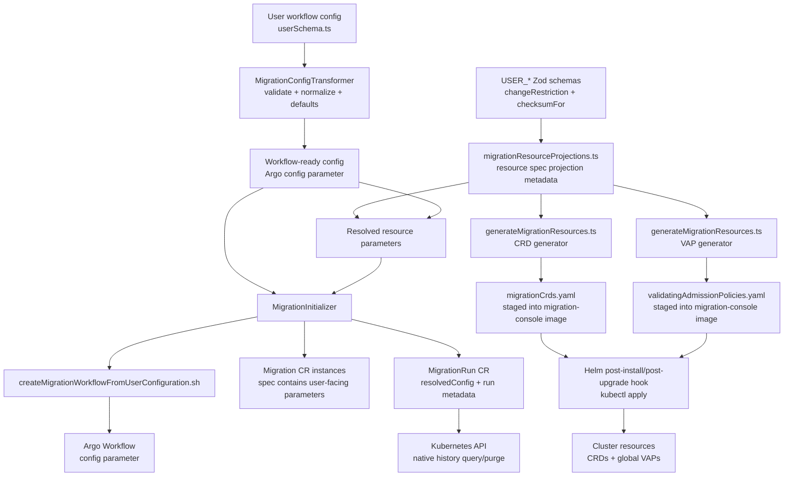

# Resolved Migration Resources, Migration CRDs, and VAPs

This document describes how workflow user configuration becomes:

- the Argo workflow input used by the migration workflow
- migration custom resources used to track and gate resource-level work
- generated CRD and ValidatingAdmissionPolicy manifests installed by Helm
- a `MigrationRun` custom resource that records the effective resource parameters for a workflow run

It is written for readers who are new to this repository.

## Repository Areas

- `orchestrationSpecs/packages/schemas`: TypeScript/Zod schemas for user workflow config, transformed Argo workflow config, and migration resource projection metadata.
- `orchestrationSpecs/packages/config-processor`: Converts user config into workflow-ready config, creates Kubernetes resource manifests, and emits resolved migration resources.
- `orchestrationSpecs/packages/migration-workflow-templates`: Builds Argo `WorkflowTemplate` YAML from TypeScript template definitions.
- `migrationConsole`: Builds the migration-console image. The image includes generated workflow templates, the config processor bundle, and generated migration CRD/VAP manifests.
- `deployment/k8s/charts/aggregates/migrationAssistantWithArgo`: Helm chart that installs Migration Assistant and runs hook jobs from the migration-console image.

Related docs:

- [ConfigValidationFlow.md](../orchestrationSpecs/ConfigValidationFlow.md): validation and transformation from raw user config to workflow-ready config.
- [reconfiguringWorkflows.md](reconfiguringWorkflows.md): state-aware reconfiguration model, VAP approval behavior, and checksum semantics.
- [WorkflowCrdDesign.md](WorkflowCrdDesign.md): migration CR lifecycle, ownership, and teardown behavior.

## Architecture



## User Config And Workflow Config

Users write workflow configuration that matches `packages/schemas/src/userSchemas.ts`.

The config processor validates that input and transforms it into the workflow-ready Argo config shape. That transformed config is the value passed to the Argo workflow as the `config` parameter.

The Argo layer should not be the source of user-facing parameter meaning. User-facing resource parameters are recovered from the schema and transformed config through the config processor.

## Resource Projection Metadata

`packages/schemas/src/migrationResourceProjections.ts` maps schema fields into migration resource specs.

Examples:

- `USER_PROXY_OPTIONS` projects into `CaptureProxy.spec`.
- `USER_REPLAYER_OPTIONS` projects into `TrafficReplay.spec`.
- `USER_CREATE_SNAPSHOT_OPTIONS` projects into `DataSnapshot.spec`.
- `USER_METADATA_OPTIONS` projects into prefixed `SnapshotMigration.spec.metadataMigration*` fields.
- `USER_RFS_OPTIONS` projects into prefixed `SnapshotMigration.spec.documentBackfill*` fields.

The projection metadata carries:

- target resource kind
- CRD `.spec` path
- source schema and source path
- `changeRestriction`: `safe`, `gated`, or `impossible`
- optional `checksumFor`
- optional invariant, such as `nonDecreasing`

This gives one shared source of truth for generated CRD fields, VAP rules, resolved migration resources output, and dry-run policy logic.

## Generated CRDs

`packages/schemas/src/generateMigrationResources.ts` generates `migrationCrds.yaml`.

The generated CRDs define these migration resources under `migrations.opensearch.org/v1alpha1`:

- `ApprovalGate`
- `CapturedTraffic`
- `CaptureProxy`
- `DataSnapshot`
- `KafkaCluster`
- `MigrationRun`
- `SnapshotMigration`
- `TrafficReplay`

Generated CRD `.spec` fields come from the projection metadata. Any projected field that is `gated` or `impossible` must be present in the CRD spec so Kubernetes admission can evaluate it.

CRDs are cluster-global. Multiple Migration Assistant installs in one cluster share the same CRD definitions.

## Generated VAPs

The same generator emits `validatingAdmissionPolicies.yaml`.

VAPs are global, matching the cluster-global CRDs. They use stable names such as:

- `migrations-trafficreplay-policy`
- `migrations-lock-on-complete-policy`
- `migrations-managed-deployment-policy`

Generated VAP bindings do not use namespace selectors. The current compatibility stance is that separate Migration Assistant installs in one cluster cannot run independently versioned CRD/VAP definitions.

Field-level rules are derived from projection metadata:

- `safe`: no field-level VAP comparison
- `gated`: update is allowed if the value is unchanged, or if the resource carries the migration-run approval annotation
- `impossible`: update is allowed only if the value is unchanged
- `nonDecreasing`: decreases are blocked

Additional lifecycle rules are generated:

- completed terminal resources have their spec sealed
- resources in `Deleting` phase reject updates
- managed deployments reject direct edits unless explicitly annotated

## Image Staging

The root npm target stages generated migration resources:

```bash
npm run stage-migration-resources -- --outputDirectory <dir>
```

The `../migrationConsole/build.gradle` task `buildAndStageMigrationResources` runs that target and writes:

```text
../migrationConsole/build/dockerContext/nodeStaging/migrationResources/migrationCrds.yaml
../migrationConsole/build/dockerContext/nodeStaging/migrationResources/validatingAdmissionPolicies.yaml
```

The migration-console Dockerfile copies that staged directory into the image:

```text
/root/migrationResources
```

The same image also carries:

- `/root/configProcessor`
- `/root/workflows`

## Helm Installation

The Helm chart does not render generated migration CRDs/VAPs as static template files.

Instead, `templates/installWorkflows.yaml` runs a post-install/post-upgrade hook job using the migration-console image. That hook:

1. Applies `/root/migrationResources/migrationCrds.yaml`.
2. Waits for each generated CRD to be `Established`.
3. Deletes generated VAP bindings by label.
4. Deletes generated VAP policies by label.
5. Applies `/root/migrationResources/validatingAdmissionPolicies.yaml`.
6. Installs generated Argo `WorkflowTemplate` resources from `/root/workflows`.

CRDs are applied in place. VAPs are replaced as generated policy artifacts.

Uninstall does not delete generated CRDs or VAPs by default. Deleting CRDs would also delete all corresponding custom resources, so destructive cleanup should be an explicit purge flow if it is added later.

## Migration Custom Resources

`MigrationInitializer` creates root migration CR instances from the transformed workflow config.

These CRs are not just dependency shells. Their `.spec` includes the projected user-facing parameters that VAPs can validate and users can inspect.

Examples:

- `TrafficReplay.spec.speedupFactor`
- `TrafficReplay.spec.tupleMaxFileSizeMb`
- `CapturedTraffic.spec.partitions`
- `SnapshotMigration.spec.documentBackfillMaxConnections`

Operational migration CRs and approval gates also carry correlation labels:

- `migrations.opensearch.org/workflow-name`
- `migrations.opensearch.org/run-number`

Gated VAP approval checks compare the approval annotation to the run-number label.

## MigrationRun History

`MigrationInitializer` also creates one immutable `MigrationRun` resource for each initialized run.
The workflow submission shell script allocates the run number once, using a
millisecond timestamp, and passes it into both the initializer and the Argo
workflow parameters. The initializer stamps that value; it does not allocate or
override run numbers itself.

The resource name includes the run number, for example:

```text
migration-workflow-run-52
```

The resource spec contains:

- `runNumber`: integer millisecond run number
- `timestamp`: UTC creation timestamp supplied by the initializer
- `workflowName`: stable workflow grouping name
- `resolvedConfig`: object-valued resolved migration resource output

`workflowName` identifies the migration workflow across repeated attempts.
`runNumber` identifies one specific initialized run of that workflow. The same
`workflowName` can have many `runNumber` values.

`MigrationRun` metadata labels include the workflow name, run number, and date
buckets:

- `migrations.opensearch.org/workflow-name`
- `migrations.opensearch.org/run-number`
- `migrations.opensearch.org/year`
- `migrations.opensearch.org/month`
- `migrations.opensearch.org/week`

The date-bucket labels are only applied to `MigrationRun` resources. Operators
can use native Kubernetes selectors to purge old histories, for example:

```bash
kubectl delete migrationruns.migrations.opensearch.org -l migrations.opensearch.org/year=2026,migrations.opensearch.org/month=05
```

The submitted Argo Workflow is labeled with the workflow name and run number,
and annotated with the MigrationRun name, at creation time. Those metadata
values give operators a recoverable link even if the submitter process exits
immediately after creating the Workflow.

At workflow startup, the `initializeRunMetadata` step patches the corresponding
`MigrationRun` with the server-assigned Workflow UID:

- `metadata.labels["migrations.opensearch.org/workflow-uid"]`
- `status.workflowUid`
- `status.workflowCreationTimestamp`

The workflow UID label is set once so users can query history records by the
Kubernetes execution ID. The status fields preserve the durable link between
the externally generated run number and the Workflow object that actually ran.

`MigrationRun.spec` is immutable through inline CRD CEL validation. The
generated VAP also blocks updates to the history spec, annotations, and labels,
except for the one-time addition of the workflow UID label. A separate status
CRD rule and generated VAP allow `workflowUid` and
`workflowCreationTimestamp` to transition from unset to set once and reject
later changes.

## Resolved Migration Resources

`resolvedMigrationResources` is the object model that records the effective resource parameters for a workflow.

It is produced by `packages/config-processor/src/resolvedMigrationResources.ts` and can be emitted through the config-processor CLI command:

```bash
index.js resolveMigrationResources --transformed-config <workflow-config-file> --output resolvedMigrationResources.json
```

The object includes:

- `formatVersion`
- optional `workflowName`
- transformed `workflowConfig`
- `resources`, each with:
  - `apiVersion`
  - `kind`
  - `name`
  - effective `parameters`

By default, the object omits field policy metadata and shows only the effective
resource parameters. For debugging, pass `--include-parameter-policies` to also
include `parameterPolicies` for each resource. Those policies are derived from
the same projection metadata used by the CRD/VAP generator.

The initializer embeds this object directly in `MigrationRun.spec.resolvedConfig`.
The `resolveMigrationResources` command remains available for local inspection
and tests, but the workflow does not run an artifact archival step.

## Dry-Run Policy Evaluation

`packages/config-processor/src/resolvedMigrationResources.ts` also exposes `dryRunResourcePolicy`.

Given an old resolved resource and a new resolved resource, it reports whether changed parameters are:

- allowed
- approval-required
- blocked

This uses the same projection metadata that generates VAPs, so it can be used to preview admission behavior before a user waits for a workflow run.

## Test Coverage

Current tests cover:

- projected schema fields and restrictions
- generated CRD/VAP content
- staged global VAP output without Helm template syntax or namespace selectors
- resolved migration resource extraction
- VAP-style dry-run decisions
- CR instance specs generated by `MigrationInitializer`
- rendered workflow template snapshots without workflow artifact archival

Useful future integration tests:

- apply generated CRDs/VAPs in a kind cluster
- verify Helm hook ordering against a real chart install
- verify initialized `MigrationRun` resources can be queried and purged through Kubernetes selectors
