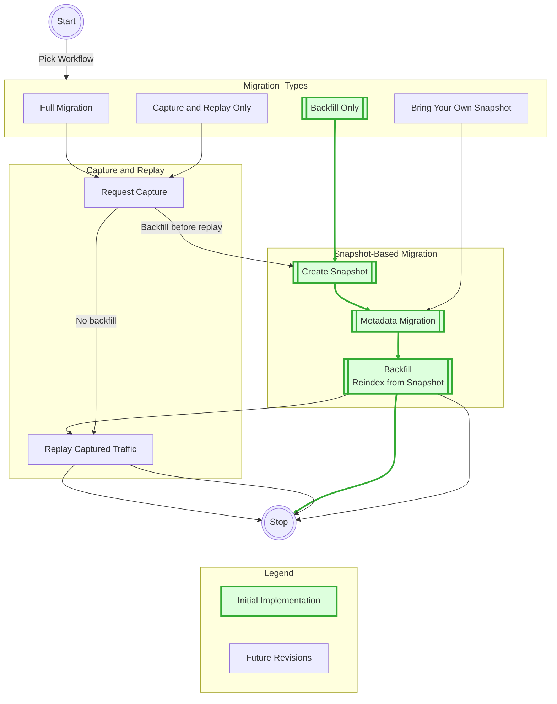

# OpenSearch Migrations Frontend

This is the frontend application for the OpenSearch Migrations project. It's built using Next.js and TypeScript, and integrated into the Gradle build system.

## Initial Release

To scope this project, we will be working on a subset of the many Migration Assistant scenarios - in this case by working with Snapshot, Metadata, and Backfill it provides a mix of asynchronous activity and synchronous work.  The complexity of the Metadata migration output is also a well suited challenge for this initial draft.  Once this scenario is available we can get this into customer's hands for feedback while iterating on additional scenarios.



## Development

### Prerequisites

- Node.js 20.x or later
- npm

### Local Development

Run the development server:

```bash
cd frontend
npm run dev
```

Open [http://localhost:3000](http://localhost:3000) in your browser to see the application.

### Container

This site is distributed via a small foot-print container running nginx.  To build and website on local port 8080 use run the following script.

```bash
./gradlew :frontend:buildDockerImage && \
    docker run -p 8080:80  migrations/website
```

### Gradle Integration

This Next.js project is integrated with Gradle through a custom plugin. You can use the following Gradle tasks:

- `./gradlew :frontend:buildFrontend` - Build the Next.js application
- `./gradlew :frontend:buildDockerImage` - Build the container that includes the website
- `./gradlew :frontend:lintFrontend` - Run linters
- `./gradlew :frontend:testFrontend` - Run test cases with coverage
- `./gradlew :frontend:helpFrontend` - Show all of the scripts available for local development with npm

### Project Structure

- `src/app/` - Next.js app router files, React components, utility functions, and TypeScript types
- `public/` - Static assets

## Integration with the Main Build

This frontend project is integrated with the main OpenSearch Migrations build system. Running `./gradlew build` at the root level will also build the frontend application.

## Connect to the Website

The website is deployed across all environments, but it is not directly accessible without additional steps to manage access control. The following sections describe how to connect to the website after a deployment.

### Local Kubernetes

Once the deployment has completed, run the following command. Then open [http://localhost:8080](http://localhost:8080) in your browser to access the website:

```bash
kubectl -n ma port-forward deploy/ma-migration-console 8080:80
```
