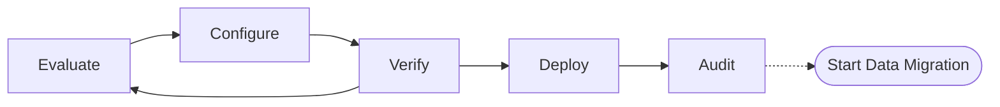

# Metadata Migration
In OpenSearch metadata is the details about cluster that go beyond the ingestion and searching documents.  Clusters are tuned for performance on specific hardware, data organization based on storage access speed/cost, and components built on OpenSearch such as OpenSearch Dashboards.

## Migration Lifecycle

To handle moving more than data OpenSearch Migration includes we are tooling to inspect an existing cluster, generate a recommended configuration, and apply the migration onto a target cluster.

Lets look into the 

### Evaluate
The metadata tooling will collection information from the source cluster to determine what items can be processed and what items need more detail to migration successfully.

### Configure

### Verfiy

### Deploy

### Audit

## Relationship to historical and live migrations

### Migration Console

### Transformations

### 