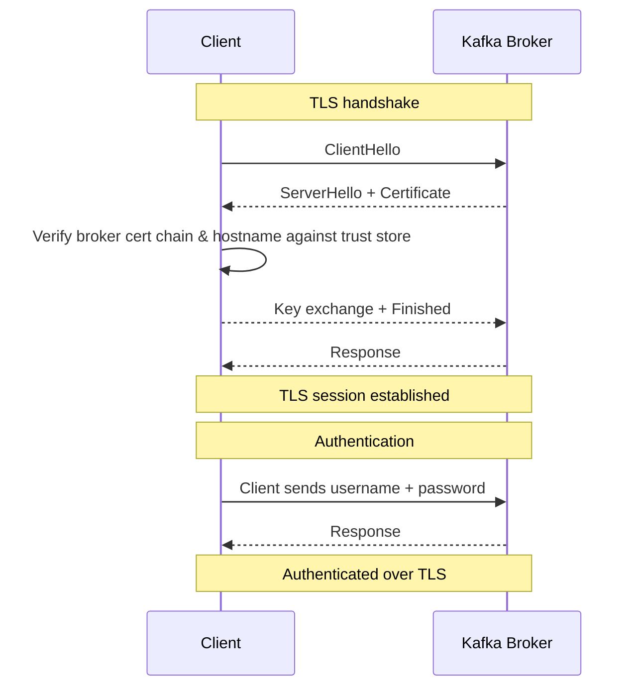

## Kafka Authentication

Previously Migration Assistant used Kafka deployed through AWS' managed kafka service - MSK.  When switching to a kubernetes deployment we are switching to a kafka operator [Strimzi](http://strimzi.io/).  This provisions the kafka cluster and provides many management features.  One of the most notable changes in the process is that MSK was authenticated with Sigv4 signed requests, this is no longer an option.  In order to keep the security posture of the kafka cluster high we need a new authentication pattern.

## Simple Authentication Security Layer (SASL_SSL)

Ensure secure authentication with the Kafka cluster we are only exposing TLS enabled listeners and for authentication we are choosing `scram-sha-512` [link](https://docs.confluent.io/platform/current/security/authentication/sasl/scram/overview.html), this allows a username / password pairing to be sent by the client to authenticate communications.

```yaml
    listeners:
    - name: tls
        port: 9093
        type: internal
        tls: true
        authentication:
        type: scram-sha-512
```

Here is a simplified graph showing the moving pieces during the TLS handshake and authentication process.



### Client auth components

To perform this handshake each client needs the following:
1. Broker Certificate Authority Certificate
1. Client specific Username
2. Client specific Password

#### CA Cert

Strimzi creates the ca cert in the cluster, located in `{kafkaName}--cluster-ca-cert` it includes both the ca.crt and ca.p12. The ca.password is needed to read the cert.   

#### User generation through Strimzi

The Strimzi operator supports creating users. After creation, Strimzi stores the user credentials in a Kubernetes secret named `${USERNAME}`. The workflow then creates an additional bundle secret named `${USERNAME}-kafka-client-config` containing the complete client configuration.

```yaml
    apiVersion: kafka.strimzi.io/v1beta2
    kind: KafkaUser
    metadata:
      name: "${USERNAME}"
      labels:
        strimzi.io/cluster: "${KAFKA_NAME}"
    spec:
      authentication:
        type: scram-sha-512
      authorization:
        type: simple
        acls:
          - operation: Describe
            resource: { type: topic, name: "*", patternType: literal }
          - operation: Describe
            resource: { type: group, name: "*", patternType: literal }
```

### Client configuration

Kafka has a convention for connect configs [link](https://kafka.apache.org/documentation/#connectconfigs) passed as file to an application such as [kcat](https://github.com/edenhill/kcat). The workflow generates a complete `kafka.properties` file with the following format:

```
security.protocol=SASL_SSL
sasl.mechanism=SCRAM-SHA-512
sasl.jaas.config=org.apache.kafka.common.security.scram.ScramLoginModule required username="..." password="...";
ssl.truststore.type=PKCS12
ssl.truststore.location=/opt/kafka-config/ca.p12
ssl.truststore.password="..."
bootstrap.servers={kafkaName}-kafka-bootstrap.{namespace}.svc:9093
client.id={username}
```

Note: The `ssl.truststore.location` uses the absolute path `/opt/kafka-config` where the secret bundle is mounted in the application container.

Applications can reference the configuration file when connecting to Kafka brokers:

```shell
--command-config /opt/kafka-config/kafka.properties
```

The complete client configuration bundle (`${USERNAME}-kafka-client-config` secret) contains:
- `kafka.properties` - Complete Kafka client configuration
- `ca.p12` - Cluster CA certificate in PKCS12 format
- `ca.password` - Password for the CA certificate