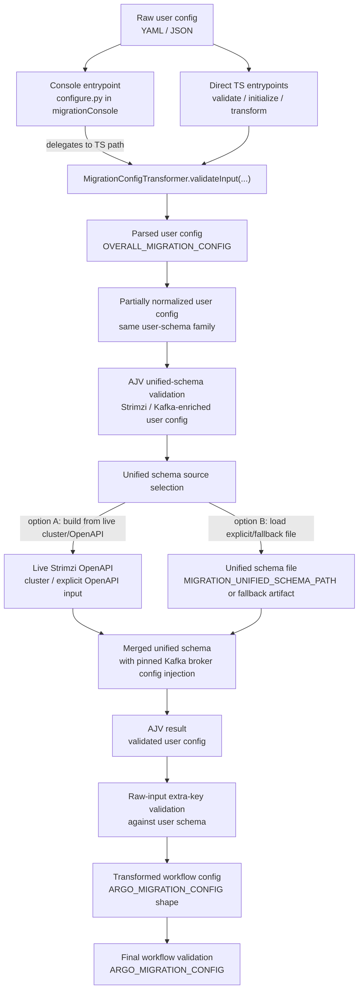

# Config Validation Flow

This document describes the end-to-end validation and transformation path for
user-provided migration configuration.

## Entry Points

Users can reach the validation pipeline from two directions:

1. Direct `config-processor` CLI entrypoints in this repo
2. The console-side `configure.py` command in `migrationConsole`, which
   delegates back into `config-processor`

The important point is that there is one TypeScript validation pipeline. Python
is a caller, not a second validator.

## Direct `config-processor` Entry Points

- `packages/config-processor/src/validateConfig.ts`
  - validates a user config and reports whether it is valid
- `packages/config-processor/src/runMigrationInitializer.ts`
  - validates and transforms a user config, then writes workflow artifacts
- `packages/config-processor/src/runMigrationConfigTransformer.ts`
  - validates and transforms a user config, then prints the transformed output

All of these flow into `MigrationConfigTransformer`.

## Console Entry Point

The console-side flow starts in:

- `migrationConsole/.../workflow/commands/configure.py`

That code calls `_validate_and_find_secrets(raw_yaml)`, which delegates to the
TypeScript `config-processor` path. That means the schema and transform logic
still lives here in `orchestrationSpecs`.

## Current Runtime Pipeline

Today the effective user-config pipeline is:

```text
raw user input
-> Zod parse against OVERALL_MIGRATION_CONFIG
-> small user-config normalization
-> AJV validation against the unified schema
-> extra-key validation against raw user input
-> transform to ARGO_MIGRATION_CONFIG
-> Zod parse against ARGO_MIGRATION_CONFIG
```

The central implementation is:

- `packages/config-processor/src/migrationConfigTransformer.ts`

## Current Pipeline Graph



## What Each Validation Layer Is Responsible For

### 1. Zod User Schema

Source:

- `packages/schemas/src/userSchemas.ts`

Used by:

- `OVERALL_MIGRATION_CONFIG`

Purpose:

- validate the user-facing migration config model
- apply Zod defaults/refinements
- establish the basic config shape before deeper Strimzi/Kafka validation

### 2. Unified Schema Validation

Source:

- `packages/config-processor/src/unifiedSchemaValidator.ts`
- `packages/schemas/src/unifiedSchemaBuilder.ts`

Purpose:

- validate Strimzi/Kafka passthrough sections with stronger typing than the
  base Zod user schema alone provides
- validate:
  - `clusterSpecOverrides`
  - `nodePoolSpecOverrides`
  - `topicSpecOverrides`
- replace the loose Strimzi `Kafka.spec.kafka.config` map with the pinned Kafka
  broker config schema

### 3. Extra-Key Validation

Source:

- `packages/config-processor/src/migrationConfigTransformer.ts`

Purpose:

- detect unknown keys in the raw user config that Zod alone may not make
  obvious enough for users

### 4. Argo/Workflow Output Validation

Source:

- `packages/schemas/src/argoSchemas.ts`

Used by:

- `ARGO_MIGRATION_CONFIG`

Purpose:

- ensure the transformed workflow config still conforms to the workflow schema

## Where The Unified Schema Comes From

The unified schema is built from two layers:

1. Strimzi structure
2. Kafka broker config strengthening

### Strimzi Structure

`packages/schemas/src/unifiedSchemaBuilder.ts` starts with the base user schema
and then injects selected Strimzi spec fragments:

- `Kafka.spec`
- `KafkaNodePool.spec`
- `KafkaTopic.spec`

These drive:

- `clusterSpecOverrides`
- `nodePoolSpecOverrides`
- `topicSpecOverrides`

### Kafka Broker Config Strengthening

Strimzi leaves `Kafka.spec.kafka.config` open-ended in the CRD, so that part is
strengthened separately.

The pinned Kafka broker config schema comes from:

- `packages/schemas/src/generateKafkaBrokerConfigSchema.ts`

It generates:

- `packages/schemas/generated/kafkaBrokerConfigSchema.v4.2.0.schema.json`
- `packages/schemas/generated/kafkaBrokerConfigSchema.v4.2.0.metadata.json`

Those generated files are then injected into the unified schema so workflow
managed Kafka broker config keys are strongly typed.

## Unified Schema Sources At Runtime

`loadUnifiedSchema()` in `packages/schemas/src/unifiedSchemaBuilder.ts`
supports these sources:

1. explicit schema file via `MIGRATION_UNIFIED_SCHEMA_PATH`
2. fallback generated artifact when
   `MIGRATION_ALLOW_FALLBACK_UNIFIED_SCHEMA=true`
3. live Strimzi/OpenAPI source when the unified schema is built from a cluster

The current repo also supports building a unified schema file explicitly with:

```shell
npm run -w @opensearch-migrations/schemas build-unified-schema -- \
  --strimzi-openapi /path/to/kafka.strimzi.io-v1-schema.json \
  --output /path/to/workflowMigration.schema.json
```

The intended checked-in fallback location is:

- `packages/schemas/generated/workflowMigration.schema.json`

## Important Distinction: Normalization vs Transformation

The current code does a small amount of user-config normalization before AJV
validation. Right now that is implemented by validating a mostly-raw object and
patching in a few normalized subtrees.

That works, but it is harder to reason about than an explicit intermediate
schema stage.

The intended architectural direction is:

```text
UserSchema
-> UserNormalizedSchema
-> ArgoSchema
```

With the following rule:

- normalization keeps the config in the same user-schema family
- transformation moves it into a different schema family

Under that model:

- `OVERALL_MIGRATION_CONFIG` = authoring schema
- `UserNormalizedSchema` = canonical user config after normalization/defaulting
- `ARGO_MIGRATION_CONFIG` = workflow/runtime schema

That future shape should replace the current "raw object plus patched subtrees"
approach.

## Practical Reading Order

If you need to understand the code quickly, read in this order:

1. `packages/config-processor/src/migrationConfigTransformer.ts`
2. `packages/config-processor/src/unifiedSchemaValidator.ts`
3. `packages/schemas/src/unifiedSchemaBuilder.ts`
4. `packages/schemas/src/kafkaBrokerConfigSchema.ts`
5. `packages/schemas/src/generateKafkaBrokerConfigSchema.ts`

If you need the user-facing schema definitions:

1. `packages/schemas/src/userSchemas.ts`
2. `packages/schemas/src/argoSchemas.ts`
