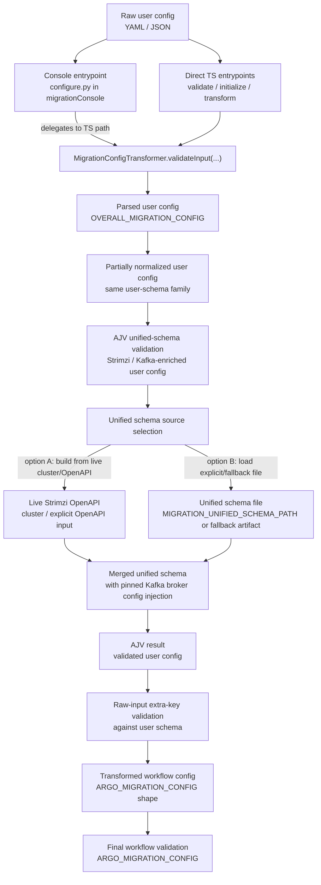

# Config Validation Flow

This document describes the end-to-end validation and transformation path for
user-provided migration configuration.

## Entry Points

Users can reach the validation pipeline from two directions:

1. Direct `config-processor` CLI entrypoints in this repo
2. The console-side `configure.py` command in `migrationConsole`, which
   delegates back into `config-processor`

The important point is that there is one TypeScript validation pipeline. Python
is a caller, not a second validator.

That rule also applies to manage/edit partial rendering. A partially authored
workflow config should not be parsed once by `editConfig`, again by
`resolveMigrationResources`, and a third time by Python. The intended shape is a
single TypeScript-owned parser/projection pipeline with two validation modes:

- `strict`: require the complete config to pass all validation layers before
  producing workflow/runtime resources. This is the submit path.
- `loose`: parse syntactically valid YAML, walk known schema scopes,
  best-effort project interior structures that have enough identity, and return
  diagnostics for missing/invalid pieces. This is the manage rendering path.

Loose mode is allowed to return partial resources and `valid: false`; it is not
allowed to submit workflows or generate final CR manifests.

## Submission Admission Preflight

Strict validation is followed by a package-owned submission preflight. The
initializer generates one submission bundle, including final desired root CR
specs. The submission path then:

1. runs Kubernetes server dry-run against that exact bundle;
2. classifies projected-field restrictions with the metadata that generates
   the VAP rules;
3. writes the versioned `submissionPreflight.json` report;
4. stops before every mutating command when the report is blocked; and
5. commits the prepared bundle without rerunning initialization.

| Classification | Blocks submit | Meaning |
| --- | --- | --- |
| `recreate-required` | yes | A proven impossible or sealed update requires reset and a replacement workflow. |
| `invalid` | yes | The candidate is definitely invalid against the live CRD/schema. |
| `approval-required` | no | The workflow may converge after its normal approval gate. |
| `warning` | no | Admission is unavailable, state-dependent, or not proven permanent. |

Only proven permanent failures block. Deleting resources, transient API
failures, generic state-dependent VAP failures, and approval-gated changes do
not block because a later workflow step may still converge.

### Why Admission Is Checked Again

Strict config validation and Kubernetes admission answer different questions.
Strict validation proves that the user config and generated workflow artifacts
match the schemas known to this repository. Admission preflight asks the live
cluster whether it would accept each final generated resource now.

The live check is required for safety because local validation cannot fully
account for:

- the CRDs, ValidatingAdmissionPolicies, bindings, and admission webhooks
  currently installed in the target cluster;
- immutable, sealed, or approval-gated changes that depend on the existing
  resource's spec and status;
- cluster or resource changes made after an earlier edit-time preflight; or
- run-specific values added while generating the exact submission bundle.

The UI or CLI may run an earlier preflight to give the user prompt feedback,
but submit must check again. Reusing an earlier result would create a
time-of-check/time-of-use gap in which the cluster or generated candidate could
change. The repeated check is non-mutating and runs before the existing Argo
Workflow is replaced or any generated resource is applied.

After the submit-time preflight succeeds, the submission path commits the same
prepared bundle. It does not regenerate resources between the check and the
write. This limits the remaining gap and ensures that admission evaluated the
objects the submit path intends to apply.

### How The Live Check Works

For each generated resource, preflight:

1. reads the live object to determine whether the candidate is a create or an
   update and to obtain required server metadata such as `resourceVersion`;
2. combines that live metadata with the final desired manifest while removing
   stale generated server fields;
3. sends a Kubernetes `create` or `replace` request with `dryRun=All`, causing
   the API server to execute normal schema and admission checks without
   persisting the object; and
4. classifies any response and adds it to the report.

The read and dry-run must remain ordered for an individual resource because the
second operation depends on the first. Independent resources are checked
concurrently through one reusable Kubernetes client. The default concurrency
is eight and does not affect deterministic report ordering. The low-level
`preflightSubmission` command accepts `--concurrency` when a different bound is
needed.

### Report Contract

The versioned report is deliberately small and shared unchanged by direct CLI,
Python, FastAPI, and web callers. A report containing one permanent blocker and
one normal approval requirement looks like:

```json
{
  "formatVersion": 1,
  "allowed": false,
  "checkedResources": 3,
  "issues": [
    {
      "kind": "CapturedTraffic",
      "name": "p2-topic",
      "plural": "capturedtraffics",
      "classification": "recreate-required",
      "blocking": true,
      "message": "Impossible: sourceLabel cannot be changed. Delete and recreate.",
      "source": "kubernetes",
      "resourceId": "resource:capturedtraffics:p2-topic",
      "resetTargetId": "reset:capturedtraffics:p2-topic"
    },
    {
      "kind": "TrafficReplay",
      "name": "replay",
      "plural": "trafficreplays",
      "classification": "approval-required",
      "blocking": false,
      "message": "Gated changes detected. Create an ApprovalGate to approve this update.",
      "source": "kubernetes",
      "resourceId": "resource:trafficreplays:replay"
    }
  ]
}
```

`allowed` is false when any issue has `blocking: true`.
`checkedResources` counts every generated resource, including resources with no
issue; successful checks do not produce entries. `resourceId` lets a caller
associate an issue with its workflow resource, while `resetTargetId` identifies
the reset action for recreate-required resources. `source` distinguishes a
direct Kubernetes result from a projected-policy fallback or a failure to
initialize preflight itself.

For users, a blocked report prevents submission before mutation and provides a
specific reset target or validation message. Approval requirements and
uncertain warnings remain visible but do not create an impossible submission
loop. If the Kubernetes client or API server is unavailable, preflight returns
non-blocking warnings rather than claiming that the candidate is invalid.

### Performance Impact

Preflight performs up to two API operations per generated resource: one read
and one server-side dry-run. Reusing a Kubernetes client avoids starting two
`kubectl` processes for every resource, and bounded concurrency keeps latency
from growing linearly while avoiding an unbounded burst against the API server.
Measured against a local kind cluster:

| Generated resources | Sequential `kubectl` | Reused client, concurrency 8 |
| ---: | ---: | ---: |
| 16 | 1.77 s | 0.28 s |
| 36 | 3.78 s | 0.33 s |
| 61 | 6.29 s | 0.41 s |
| 111 | 11.37 s | 0.66 s |

These measurements cover admission preflight, not initialization or mutation.
The safety check remains part of every submit even though its cost is now a
small fraction of the complete submission preparation path.

`packages/config-processor/src/submissionPreflight.ts` owns the report contract,
Kubernetes classification, and projected-policy fallback. The submission shell
script owns prepare/commit. Python Click, FastAPI, and Textual code adapts the
report and coordinates replacement of the existing Argo Workflow; it does not
reimplement policy semantics.

`workflow submit --dry-run --output json` exposes the same report and exits
nonzero when `allowed` is false. Normal direct script submission and every
Python submission path always run the preflight.

## Direct `config-processor` Entry Points

- `packages/config-processor/src/validateConfig.ts`
  - validates a user config and reports whether it is valid
- `packages/config-processor/src/runMigrationInitializer.ts`
  - validates and transforms a user config, then writes workflow artifacts
- `packages/config-processor/src/runMigrationConfigTransformer.ts`
  - validates and transforms a user config, then prints the transformed output
- `packages/config-processor/src/resolveMigrationResources.ts`
  - builds the resolved migration resources artifact from either user config or
    transformed workflow config

All of these flow into `MigrationConfigTransformer`.

## Console Entry Point

The console-side flow starts in:

- `migrationConsole/.../workflow/commands/configure.py`

That code calls `_validate_and_find_secrets(raw_yaml)`, which delegates to the
TypeScript `config-processor` path. That means the schema and transform logic
still lives here in `orchestrationSpecs`.

## Current Runtime Pipeline

Today the effective user-config pipeline is:

```text
raw user input
-> Zod parse against OVERALL_MIGRATION_CONFIG
-> small user-config normalization
-> AJV validation against the unified schema
-> extra-key validation against raw user input
-> transform to ARGO_MIGRATION_CONFIG
-> Zod parse against ARGO_MIGRATION_CONFIG
```

The central implementation is:

- `packages/config-processor/src/migrationConfigTransformer.ts`

Current strict callers use `MigrationConfigTransformer.processFromObject(...)`.
`processFromObject` always validates before transforming, so a missing interior
object such as `traffic.proxies.<name>.proxyConfig` prevents the resource
projection from returning any pending resources. That behavior is correct for
submit and strict validation, but manage needs a loose sibling path in TS that
shares the same schema/projection metadata and returns partial projections plus
diagnostics.

After transformation, resource parameter projection, CRD/VAP generation, and
resolved migration resources generation are described in
[resolvingMigrationParametersFromConfigs.md](../docs/resolvingMigrationParametersFromConfigs.md).

## Current Pipeline Graph


```mermaid
flowchart TD
    User["Raw user config\nYAML / JSON"]

    Console["Console entrypoint\nconfigure.py in migrationConsole"]
    CLI["Direct TS entrypoints\nvalidate / initialize / transform"]

    MCT["MigrationConfigTransformer.validateInput(...)"]
    ZodUser["Parsed user config\nOVERALL_MIGRATION_CONFIG"]
    Normalize["Partially normalized user config\nsame user-schema family"]
    Unified["AJV unified-schema validation\nStrimzi / Kafka-enriched user config"]
    LoadSchema["Unified schema source selection"]

    LiveStrimzi["Live Strimzi OpenAPI\ncluster / explicit OpenAPI input"]
    FileFallback["Unified schema file\nMIGRATION_UNIFIED_SCHEMA_PATH or fallback artifact"]
    InjectKafka["Merged unified schema\nwith pinned Kafka broker config injection"]
    Ajv["AJV result\nvalidated user config"]
    ExtraKeys["Raw-input extra-key validation\nagainst user schema"]
    Transform["Transformed workflow config\nARGO_MIGRATION_CONFIG shape"]
    ZodArgo["Final workflow validation\nARGO_MIGRATION_CONFIG"]

    User --> Console
    User --> CLI
    Console -->|"delegates to TS path"| MCT
    CLI --> MCT

    MCT --> ZodUser
    ZodUser --> Normalize
    Normalize --> Unified
    Unified --> LoadSchema

    LoadSchema -->|"option A: build from live cluster/OpenAPI"| LiveStrimzi
    LoadSchema -->|"option B: load explicit/fallback file"| FileFallback
    LiveStrimzi --> InjectKafka
    FileFallback --> InjectKafka
    InjectKafka --> Ajv
    Ajv --> ExtraKeys
    ExtraKeys --> Transform
    Transform --> ZodArgo
```

## What Each Validation Layer Is Responsible For

### 1. Zod User Schema

Source:

- `packages/schemas/src/userSchemas.ts`

Used by:

- `OVERALL_MIGRATION_CONFIG`

Purpose:

- validate the user-facing migration config model
- apply Zod defaults/refinements
- establish the basic config shape before deeper Strimzi/Kafka validation

### 2. Unified Schema Validation

Source:

- `packages/config-processor/src/unifiedSchemaValidator.ts`
- `packages/schemas/src/unifiedSchemaBuilder.ts`

Purpose:

- validate Strimzi/Kafka passthrough sections with stronger typing than the
  base Zod user schema alone provides
- validate:
  - `clusterSpecOverrides`
  - `nodePoolSpecOverrides`
  - `topicSpecOverrides`
- replace the loose Strimzi `Kafka.spec.kafka.config` map with the pinned Kafka
  broker config schema

### 3. Extra-Key Validation

Source:

- `packages/config-processor/src/migrationConfigTransformer.ts`

Purpose:

- detect unknown keys in the raw user config that Zod alone may not make
  obvious enough for users

### 4. Argo/Workflow Output Validation

Source:

- `packages/schemas/src/argoSchemas.ts`

Used by:

- `ARGO_MIGRATION_CONFIG`

Purpose:

- ensure the transformed workflow config still conforms to the workflow schema

## Where The Unified Schema Comes From

The unified schema is built from two layers:

1. Strimzi structure
2. Kafka broker config strengthening

### Strimzi Structure

`packages/schemas/src/unifiedSchemaBuilder.ts` starts with the base user schema
and then injects selected Strimzi spec fragments:

- `Kafka.spec`
- `KafkaNodePool.spec`
- `KafkaTopic.spec`

These drive:

- `clusterSpecOverrides`
- `nodePoolSpecOverrides`
- `topicSpecOverrides`

### Kafka Broker Config Strengthening

Strimzi leaves `Kafka.spec.kafka.config` open-ended in the CRD, so that part is
strengthened separately.

The pinned Kafka broker config schema comes from:

- `packages/schemas/src/generateKafkaBrokerConfigSchema.ts`

It generates:

- `packages/schemas/generated/kafkaBrokerConfigSchema.v4.2.0.schema.json`
- `packages/schemas/generated/kafkaBrokerConfigSchema.v4.2.0.metadata.json`

Those generated files are then injected into the unified schema so workflow
managed Kafka broker config keys are strongly typed.

## Unified Schema Sources At Runtime

`loadUnifiedSchema()` in `packages/schemas/src/unifiedSchemaBuilder.ts`
supports these sources:

1. explicit schema file via `MIGRATION_UNIFIED_SCHEMA_PATH`
2. fallback generated artifact when
   `MIGRATION_ALLOW_FALLBACK_UNIFIED_SCHEMA=true`
3. live Strimzi/OpenAPI source when the unified schema is built from a cluster

The current repo also supports building a unified schema file explicitly with:

```shell
npm run -w @opensearch-migrations/schemas build-unified-schema -- \
  --strimzi-openapi /path/to/kafka.strimzi.io-v1-schema.json \
  --output /path/to/workflowMigration.schema.json
```

The intended checked-in fallback location is:

- `packages/schemas/generated/workflowMigration.schema.json`

## Important Distinction: Normalization vs Transformation

The current code does a small amount of user-config normalization before AJV
validation. Right now that is implemented by validating a mostly-raw object and
patching in a few normalized subtrees.

That works, but it is harder to reason about than an explicit intermediate
schema stage.

The intended architectural direction is:

```text
UserSchema
-> UserNormalizedSchema
-> ArgoSchema
```

With the following rule:

- normalization keeps the config in the same user-schema family
- transformation moves it into a different schema family

Under that model:

- `OVERALL_MIGRATION_CONFIG` = authoring schema
- `UserNormalizedSchema` = canonical user config after normalization/defaulting
- `ARGO_MIGRATION_CONFIG` = workflow/runtime schema

That future shape should replace the current "raw object plus patched subtrees"
approach.

## Practical Reading Order

If you need to understand the code quickly, read in this order:

1. `packages/config-processor/src/migrationConfigTransformer.ts`
2. `packages/config-processor/src/unifiedSchemaValidator.ts`
3. `packages/schemas/src/unifiedSchemaBuilder.ts`
4. `packages/schemas/src/kafkaBrokerConfigSchema.ts`
5. `packages/schemas/src/generateKafkaBrokerConfigSchema.ts`

If you need the user-facing schema definitions:

1. `packages/schemas/src/userSchemas.ts`
2. `packages/schemas/src/argoSchemas.ts`
