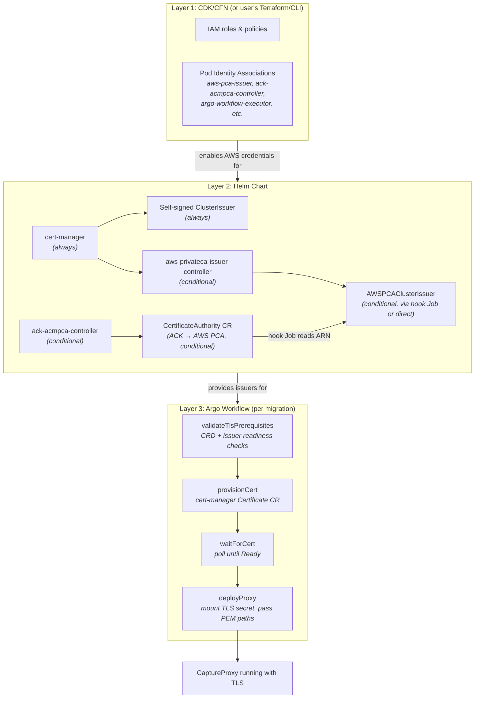
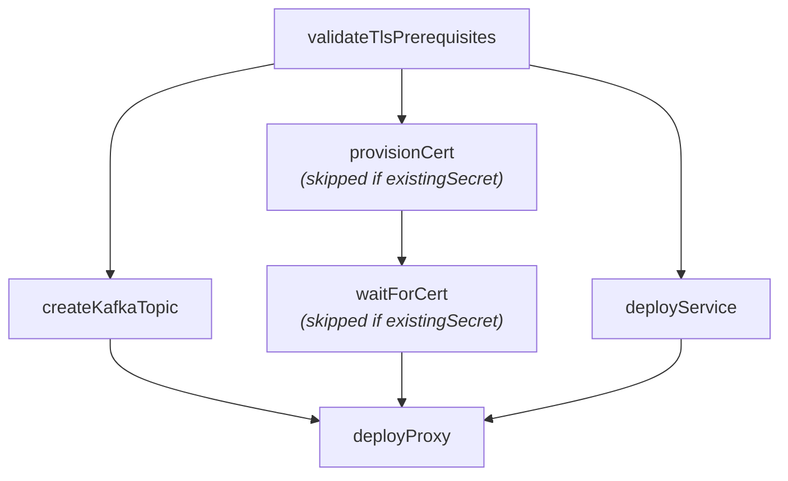

# Plan: CaptureProxy TLS Certificate Management for K8s

## Problem

The CaptureProxy currently loads TLS certificates via OpenSearch's `DefaultSecurityKeyStore`
(`org.opensearch.plugin:opensearch-security`). This is anachronistic for K8s deployments — it
pulls in a massive dependency just to read certs. For the EKS/K8s solution, we want certificate
issuance and mounting integrated into the migration workflow using cert-manager, with the proxy
consuming standard PEM files directly via Netty.

## Current State

- `CaptureProxy.java` uses `--sslConfigFile` (YAML with `plugins.security.ssl.http.*` keys) →
  `DefaultSecurityKeyStore` → `SSLEngine`. This requires the full OpenSearch security plugin.
- `ProxyChannelInitializer` takes a `Supplier<SSLEngine>` — the pipeline itself is agnostic to
  how the engine is created.
- The workflow (`setupCapture.ts`) deploys a K8s Deployment + Service with no TLS provisioning.
- cert-manager is already installed in the helm chart (`conditionalPackageInstalls.cert-manager: true`)
  but only used by the otel operator.
- No AWS PCA integration exists.

## Supported TLS Modes — Status

| Mode | `--tls-mode` | Status | Notes |
|---|---|---|---|
| **Self-signed** | `self-signed` | ✅ **Fully supported** | Works on minikube and EKS. Zero-config default. |
| **AWS Private CA** | `pca-existing`, `pca-create` | 🚧 **In progress** | Blocked on cert-manager approval. See [PCA remaining work](#pca-remaining-work). |
| **ACME / Let's Encrypt** | `lets-encrypt` *(not yet implemented)* | 📋 **Planned** | Requires public DNS. See [ACME remaining work](#acme-remaining-work). |
| **ACM Exportable Public Certs** | `acm-exportable` *(not yet implemented)* | 📋 **Planned** | New AWS feature (2025). No cert-manager issuer exists yet. See [ACM Exportable remaining work](#acm-exportable-remaining-work). |
| **Pre-existing secret** | N/A (schema `mode: existingSecret`) | ✅ **Fully supported** | User provides their own K8s TLS secret. |
| **No TLS** | `none` | ✅ **Fully supported** | Omit `tls` from migration config. |

---

## Design Decisions

- **Helm over CFN** for all K8s-side resources. CFN locks out Terraform users.
- **PCA can be created via ACK in helm** (opt-in) or user brings their own ARN.
- **Pod Identity** (not IRSA) for controller AWS credentials. Associations are created in the
  CDK/CFN stack for AWS users, or manually by Terraform/CLI users.
- **Self-signed ClusterIssuer** as the default for non-AWS / minikube / dev environments.
- **No Bouncy Castle needed** — Netty's `SslContextBuilder` reads PEM natively.
- **Validation before provisioning** — check CRDs and issuer readiness before creating Certificates.

---

## Deployment Phases & Responsibilities

There are three distinct deployment layers, each with clear ownership boundaries. Understanding
which layer owns what is critical to this design.

### Layer 1: CDK/CFN Stack (`deployment/migration-assistant-solution/lib/eks-infra.ts`)

**Runs once per EKS cluster. Manages AWS-side resources that cannot be created from inside K8s.**

Responsible for:
- EKS cluster creation
- IAM roles and policies
- **Pod Identity Associations** for all service accounts that need AWS credentials, including:
  - `aws-pca-issuer` — needs `acm-pca:IssueCertificate`, `acm-pca:GetCertificate`, `acm-pca:DescribeCertificateAuthority`
  - `ack-acmpca-controller` — needs `acm-pca:*` (if user opts into ACK-managed PCA creation)
  - (All existing associations: argo-workflow-executor, build-images, migrations, etc.)
- **ACM PCA permissions** added to the existing `podIdentityRole` policy (or a dedicated role)

NOT responsible for:
- Installing any K8s controllers or CRDs
- Creating K8s secrets, issuers, or certificates
- Anything that non-CFN users (Terraform, CLI) would need to replicate

**For non-CFN users (Terraform, CLI):** They create the Pod Identity Associations themselves
via `aws eks create-pod-identity-association` or their own IaC. This is the only manual
prerequisite — everything else flows from the helm chart.

### Layer 2: Helm Chart (`deployment/k8s/charts/aggregates/migrationAssistantWithArgo/`)

**Runs once per cluster namespace. Manages K8s-side infrastructure that controllers and
workflows depend on.**

Responsible for:
- **cert-manager** (always installed, already exists today)
- **Self-signed ClusterIssuer** `migrations-ca` (always created, zero-config default)
- **`aws-privateca-issuer` controller** (conditional: `conditionalPackageInstalls.aws-privateca-issuer`)
  - Bridges cert-manager ↔ AWS PCA
  - Service account `aws-pca-issuer` (Pod Identity Association created in Layer 1)
- **`ack-acmpca-controller`** (conditional: `conditionalPackageInstalls.ack-acmpca-controller`)
  - Manages AWS PCA resources as K8s CRs
  - Service account `ack-acmpca-controller` (Pod Identity Association created in Layer 1)
- **`CertificateAuthority` CR** (conditional: `awsPrivateCA.create: true`)
  - ACK reconciles this into an actual AWS PCA
  - `helm uninstall` deletes the CR → ACK deletes the PCA (configurable via `deletionPolicy`)
- **`AWSPCAClusterIssuer`** (conditional, created via post-install hook Job)
  - If `awsPrivateCA.create: true`: hook Job waits for ACK to sync the PCA, reads the ARN
    from `.status.ackResourceMetadata.arn`, then creates the issuer
  - If `awsPrivateCA.create: false` and `awsPrivateCA.arn` is set: created directly from
    the user-provided ARN
- **ECR image mirroring manifests** for new controller images (for air-gapped environments)

**`valuesEks.yaml` defaults** — the EKS overlay will enable PCA support out of the box:
```yaml
conditionalPackageInstalls:
  aws-privateca-issuer: true     # enable PCA issuer controller on EKS
  ack-acmpca-controller: false   # opt-in only — user must explicitly want PCA creation

awsPrivateCA:
  create: false                  # default: user brings their own PCA
  arn: ""                        # user fills in if they have an existing PCA
  region: ""                     # auto-populated from aws.region if empty
```
The `aws-privateca-issuer` controller is enabled by default on EKS because it's lightweight
and harmless without a PCA ARN — it just sits idle. The ACK controller and PCA creation
remain opt-in since they have real cost implications.

NOT responsible for:
- Per-migration Certificate resources (that's the workflow's job)
- Proxy deployments
- Any AWS API calls directly (ACK and PCA issuer controllers handle that)

### Layer 3: Argo Workflow (`orchestrationSpecs/packages/migration-workflow-templates/`)

**Runs per migration. Manages resources scoped to a specific migration run.**

Responsible for:
- **Validating TLS prerequisites** (CRDs exist, issuer is Ready, existing secrets are valid)
- **Creating cert-manager `Certificate` resources** per proxy instance
- **Waiting for certificates** to be issued and ready
- **Deploying the proxy** with the TLS secret mounted as a volume
- **Passing PEM file paths** (`--sslCertChainFile`, `--sslKeyFile`) to the proxy container

NOT responsible for:
- Installing controllers or CRDs
- Creating issuers or CAs
- Managing AWS resources

### How the layers connect



---

## Phase 1: Java — PEM-based SSL in CaptureProxy ✅ Done

**Goal:** Add a new TLS loading path that reads PEM files directly via Netty, without OpenSearch.

**Files changed:**
- `TrafficCapture/trafficCaptureProxyServer/src/main/java/org/opensearch/migrations/trafficcapture/proxyserver/CaptureProxy.java`

**New CLI parameters:**
- `--sslCertChainFile` — path to PEM certificate chain (maps to `tls.crt` from cert-manager)
- `--sslKeyFile` — path to PEM private key (maps to `tls.key`)
- `--sslTrustCertFile` — (optional) path to CA cert for mutual TLS

**New method:**
```java
protected static Supplier<SSLEngine> loadSslEngineFromPem(
    String certChainPath, String keyPath, String trustCertPath, List<String> protocols
) throws SSLException {
    SslContextBuilder builder = SslContextBuilder.forServer(new File(certChainPath), new File(keyPath));
    if (trustCertPath != null) {
        builder.trustManager(new File(trustCertPath));
    }
    builder.protocols(protocols.toArray(new String[0]));
    SslContext ctx = builder.build();
    return () -> ctx.newEngine(ByteBufAllocator.DEFAULT);
}
```

**SSL engine supplier selection in `main()`:**
- `--sslCertChainFile` + `--sslKeyFile` set → new PEM path
- `--sslConfigFile` set → legacy `DefaultSecurityKeyStore` path (non-K8s users)
- Neither → no TLS
- Both → error

**What does NOT change:**
- The `opensearch-security` dependency stays for now (non-K8s users still need it)
- `ProxyChannelInitializer` is untouched — it already accepts `Supplier<SSLEngine>`
- No new dependencies required

---

## Phase 2: Schema — User-facing TLS Configuration ✅ Done

**Goal:** Let users specify how TLS certs should be provisioned for the proxy.

**Files changed:**
- `orchestrationSpecs/packages/schemas/src/userSchemas.ts`
- `orchestrationSpecs/packages/schemas/src/argoSchemas.ts`

**New schema types:**
```typescript
const CERT_MANAGER_ISSUER_REF = z.object({
    name: z.string(),
    kind: z.enum(["Issuer", "ClusterIssuer"]).default("ClusterIssuer"),
    group: z.string().default("cert-manager.io"),
    // Use "awspca.cert-manager.io" for AWS PCA issuers
});

const PROXY_TLS_CONFIG = z.discriminatedUnion("mode", [
    z.object({
        mode: z.literal("certManager"),
        issuerRef: CERT_MANAGER_ISSUER_REF,
        commonName: z.string().optional(),
        dnsNames: z.array(z.string()).min(1),
        duration: z.string().default("2160h").optional(),     // 90 days
        renewBefore: z.string().default("360h").optional(),   // 15 days
    }),
    z.object({
        mode: z.literal("existingSecret"),
        secretName: z.string(),  // user pre-created K8s TLS secret
    }),
]);
```

**User-facing config examples:**

```jsonc
// Non-AWS / minikube (self-signed) — FULLY SUPPORTED
"tls": {
  "mode": "certManager",
  "issuerRef": { "name": "migrations-ca" },
  "dnsNames": ["proxy-source.migrations.svc.cluster.local"]
}

// AWS with PCA (created by ACK via helm, or user-provided) — IN PROGRESS
"tls": {
  "mode": "certManager",
  "issuerRef": { "name": "aws-pca-issuer", "group": "awspca.cert-manager.io" },
  "dnsNames": ["proxy-source.migrations.svc.cluster.local"]
}

// Pre-existing secret (any environment) — FULLY SUPPORTED
"tls": {
  "mode": "existingSecret",
  "secretName": "my-proxy-tls-cert"
}

// No TLS (omit tls entirely) — FULLY SUPPORTED
```

---

## Phase 3: Workflow — Cert Provisioning in setupCapture ✅ Done

**Goal:** Integrate cert creation, validation, and mounting into the proxy deployment workflow.

**Files changed:**
- `orchestrationSpecs/k8sResources/setup-capture.yaml` (generated from `setupCapture.ts`)

The workflow already implements:
- `provisionproxycert` — creates cert-manager Certificate CR
- `waitforcertready` — polls until Certificate `Ready` condition is `True`
- `deployproxydeploymentwithtls` — mounts TLS secret, passes `--sslCertChainFile` / `--sslKeyFile`
- Conditional branching in `setupproxy` based on `tls.mode`

**Step sequence in `setupProxy`:**



---

## Phase 4: Infrastructure — Issuers, Controllers, and IAM

### 4a–4b: Self-signed ClusterIssuer + Helm scaffolding ✅ Done

The helm chart already creates the `migrations-ca` ClusterIssuer (a CA-backed self-signed issuer)
via a post-install hook Job. This is the zero-config default for all environments.

### 4c–4g: AWS PCA support 🚧 In progress

The helm chart, bootstrap script, and values files have been wired up. The remaining blocker
is the cert-manager approval problem described below.

---

## PCA Remaining Work

### The approval blocker

cert-manager 1.17 requires `CertificateRequest` objects to be approved before any issuer
processes them. The built-in approver only auto-approves for `cert-manager.io` group issuers.
For `awspca.cert-manager.io`, the request sits unapproved indefinitely.

**Fix: install `cert-manager-approver-policy`** (the officially supported path).

This requires two things together:

1. **Disable cert-manager's built-in approver** by adding to the cert-manager chart values:
   ```yaml
   charts:
     cert-manager:
       values:
         extraArgs:
           - --controllers=*,-certificaterequests-approver
   ```
   This flag is not currently set in `values.yaml`.

2. **Install `cert-manager-approver-policy`** as a conditional chart and create a
   `CertificateRequestPolicy` that approves for the PCA issuer group:
   ```yaml
   # values.yaml addition
   conditionalPackageInstalls:
     cert-manager-approver-policy: false  # enabled automatically when aws-privateca-issuer is enabled

   charts:
     cert-manager-approver-policy:
       version: "0.13.0"
       repository: "https://charts.jetstack.io"
       dependsOn: cert-manager
   ```

   ```yaml
   # new helm template: templates/resources/pcaApproverPolicy.yaml
   {{- if index .Values.conditionalPackageInstalls "aws-privateca-issuer" }}
   apiVersion: policy.cert-manager.io/v1alpha1
   kind: CertificateRequestPolicy
   metadata:
     name: allow-pca-issuer
   spec:
     allowed:
       issuers:
         - group: "awspca.cert-manager.io"
           kind: "AWSPCAClusterIssuer"
           name: "*"
     selector:
       issuerRef:
         group: "awspca.cert-manager.io"
   {{- end }}
   ```

3. **RBAC**: `argo-workflow-executor` needs `certificaterequests` approval permissions
   if manual approval is ever needed as a fallback. Add to `workflowRbac.yaml`:
   ```yaml
   - apiGroups: ["cert-manager.io"]
     resources: ["certificaterequests", "certificaterequests/status"]
     verbs: ["get", "list", "watch", "update", "patch"]
   ```

### CDK/CFN changes not yet done

The CDK stack (`deployment/migration-assistant-solution/lib/eks-infra.ts`) does not yet have:
- ACM PCA IAM permissions on the `podIdentityRole`
- `CfnPodIdentityAssociation` for `aws-pca-issuer` and `ack-acmpca-controller`

The bootstrap script currently creates these Pod Identity Associations imperatively at deploy
time as a workaround. The CDK changes would make this declarative and remove the workaround.

---

## ACME Remaining Work

ACME (Let's Encrypt or any ACME-compatible CA) is not yet implemented. It would be a new
`--tls-mode lets-encrypt` option in the bootstrap script.

**Key constraints:**
- Requires a **publicly resolvable domain name** — internal cluster DNS names
  (e.g., `proxy-source.migrations.svc.cluster.local`) are not valid for ACME validation.
- DNS-01 challenge is required (HTTP-01 is impractical for K8s services). This means
  Route53 access for cert-manager's controller service account.
- The approval problem **does not apply** — ACME uses cert-manager's built-in issuer
  (`cert-manager.io` group), which the built-in approver handles automatically.

**What would need to be added:**

1. **Layer 1 (CDK)**: Route53 permissions + Pod Identity Association for the `cert-manager`
   controller service account (not the PCA issuer — cert-manager itself needs to create DNS records).

2. **Layer 2 (Helm)**: A new conditional `ClusterIssuer` of type ACME:
   ```yaml
   apiVersion: cert-manager.io/v1
   kind: ClusterIssuer
   metadata:
     name: lets-encrypt
   spec:
     acme:
       server: https://acme-v02.api.letsencrypt.org/directory
       email: <admin-email>
       privateKeySecretRef:
         name: lets-encrypt-account-key
       solvers:
       - dns01:
           route53:
             region: <region>
   ```
   New helm values needed: `acme.email`, `acme.server` (to support staging vs production).

3. **Layer 3 (Workflow/Schema)**: No changes needed — the existing `certManager` mode with
   `issuerRef: { name: "lets-encrypt" }` works as-is. The user must supply real public
   `dnsNames` in their migration config.

4. **Bootstrap script**: New `--tls-mode lets-encrypt` with `--lets-encrypt-email` and
   `--lets-encrypt-domain` parameters.

**Tradeoffs vs PCA:**

| | ACME / Let's Encrypt | AWS PCA |
|---|---|---|
| Publicly trusted | Yes | No (private CA) |
| Domain requirement | Public DNS required | Works for internal cluster names |
| Approval problem | None | Needs approver-policy |
| Cost | Free | ~$400/mo per CA |
| Renewal | Automatic via cert-manager | Automatic via cert-manager |
| AWS dependency | Route53 (for DNS-01) | ACM PCA |

---

## ACM Exportable Remaining Work

AWS Certificate Manager added support for exportable public certificates in 2025, allowing
the cert, private key, and chain to be exported as PEM files and deployed anywhere (EC2,
containers, on-premises). This is a new option for publicly trusted certs without running
your own CA.

**Key constraints:**
- Requires a **publicly resolvable domain name** (same as ACME).
- **No cert-manager issuer exists yet** for ACM exportable certs. The ecosystem has not
  caught up to this new feature. This is the primary blocker.
- Renewal is not automatic — ACM renews the cert and sends an EventBridge notification,
  but re-exporting and updating the K8s Secret must be handled separately (no cert-manager
  integration means no automatic Secret rotation).
- There is a per-cert cost (unlike free ACM certs for ALB/NLB).

**What would need to be added (once a cert-manager issuer exists):**

1. **Layer 1 (CDK)**: ACM permissions (`acm:RequestCertificate`, `acm:ExportCertificate`,
   `acm:DescribeCertificate`) + Route53 permissions for DNS validation + Pod Identity
   Association for the cert-manager controller service account.

2. **Layer 2 (Helm)**: A new conditional `ClusterIssuer` using the ACM external issuer
   (once one is published). Until then, a workflow-level approach is possible:
   - `requestAcmCert` — create ACM certificate via ACK or AWS CLI
   - `createValidationRecord` — write the CNAME validation record to Route53
   - `waitForAcmIssuance` — poll `aws acm describe-certificate` until `ISSUED`
   - `exportAndCreateSecret` — call `aws acm export-certificate`, create K8s Secret

3. **Layer 3 (Workflow)**: If going the workflow-level route (bypassing cert-manager),
   the `provisionCert` / `waitForCert` steps would be replaced with the ACM-specific
   steps above. The `deployProxyWithTls` step is unchanged.

4. **Renewal gap**: Until a cert-manager issuer exists, renewal requires an EventBridge
   rule → Lambda → re-export → update K8s Secret → restart proxy pods. This is significant
   operational overhead compared to cert-manager's automatic rotation.

**Recommendation**: Wait for a cert-manager external issuer for ACM exportable certs before
implementing this mode. Once that exists, the integration will be as clean as the PCA path.

**Tradeoffs vs PCA and ACME:**

| | ACM Exportable | ACME / Let's Encrypt | AWS PCA |
|---|---|---|---|
| Publicly trusted | Yes | Yes | No |
| Domain requirement | Public DNS required | Public DNS required | Works for internal names |
| cert-manager integration | None yet | Built-in | aws-privateca-issuer |
| Renewal automation | Manual (EventBridge) | Automatic | Automatic |
| Approval problem | None (no cert-manager) | None | Needs approver-policy |
| Cost | Per cert | Free | ~$400/mo per CA |

---

## User Experience by Environment

| Environment | Layer 1 (CDK/CFN) | Layer 2 (Helm values) | Layer 3 (Migration config) | Status |
|---|---|---|---|---|
| **Minikube / non-AWS** | N/A | Defaults (cert-manager + self-signed) | `issuerRef: { name: "migrations-ca" }` | ✅ Supported |
| **EKS, self-signed** | Default stack | Defaults | `issuerRef: { name: "migrations-ca" }` | ✅ Supported |
| **Any env, pre-existing cert** | N/A | Defaults | `mode: "existingSecret", secretName: "..."` | ✅ Supported |
| **No TLS** | N/A | Defaults | Omit `tls` | ✅ Supported |
| **EKS, existing PCA** | PCA permissions + Pod Identity for `aws-pca-issuer` | Enable `aws-privateca-issuer`, set `awsPrivateCA.arn` | `issuerRef: { name: "aws-pca-issuer", group: "awspca.cert-manager.io" }` | 🚧 In progress |
| **EKS, new PCA via ACK** | PCA permissions + Pod Identity for both SAs | Enable both controllers, `awsPrivateCA.create: true` | Same as above | 🚧 In progress |
| **EKS, Let's Encrypt** | Route53 permissions + Pod Identity for cert-manager | ACME ClusterIssuer (not yet implemented) | `issuerRef: { name: "lets-encrypt" }` + public dnsNames | 📋 Planned |
| **EKS, ACM Exportable** | ACM + Route53 permissions | ACM issuer (not yet implemented) | TBD | 📋 Planned |

## What is NOT needed

- Bouncy Castle — Netty handles PEM natively
- PKCS12/JKS conversion — cert-manager secrets are PEM, Netty reads PEM
- New Java dependencies — everything is already in Netty
- Changes to `ProxyChannelInitializer` — already accepts `Supplier<SSLEngine>`
- PCA creation in the workflow — that's helm/ACK's job (Layer 2)
- PCA creation in CFN — ACK handles it from K8s (unless user prefers their own IaC)
