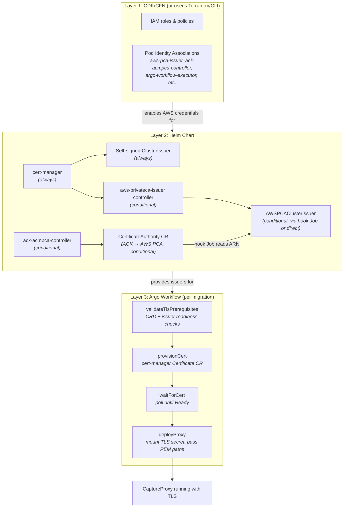
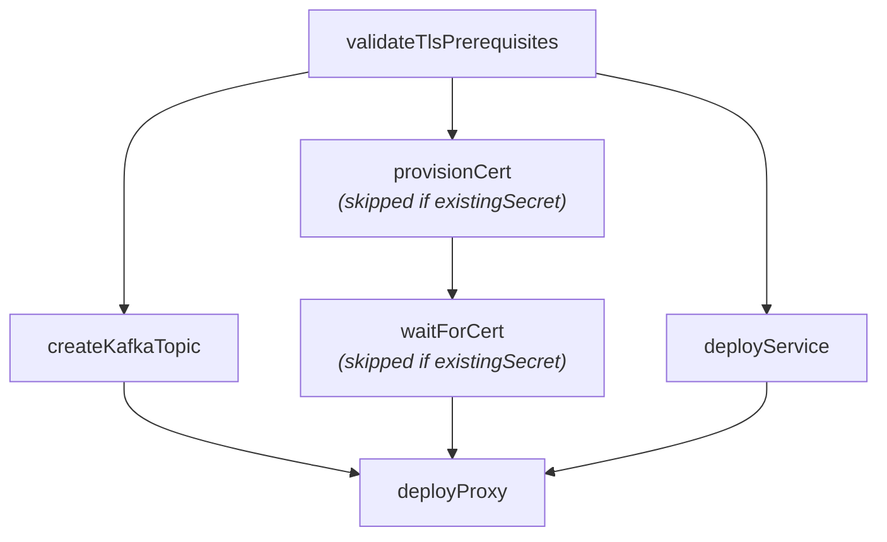

# Plan: CaptureProxy TLS Certificate Management for K8s

## Problem

The CaptureProxy currently loads TLS certificates via OpenSearch's `DefaultSecurityKeyStore`
(`org.opensearch.plugin:opensearch-security`). This is anachronistic for K8s deployments — it
pulls in a massive dependency just to read certs. For the EKS/K8s solution, we want certificate
issuance and mounting integrated into the migration workflow using cert-manager, with the proxy
consuming standard PEM files directly via Netty.

## Current State

- `CaptureProxy.java` uses `--sslConfigFile` (YAML with `plugins.security.ssl.http.*` keys) →
  `DefaultSecurityKeyStore` → `SSLEngine`. This requires the full OpenSearch security plugin.
- `ProxyChannelInitializer` takes a `Supplier<SSLEngine>` — the pipeline itself is agnostic to
  how the engine is created.
- The workflow (`setupCapture.ts`) deploys a K8s Deployment + Service with no TLS provisioning.
- cert-manager is already installed in the helm chart (`conditionalPackageInstalls.cert-manager: true`)
  but only used by the otel operator.
- No AWS PCA integration exists.

## Design Decisions

- **Helm over CFN** for all K8s-side resources. CFN locks out Terraform users.
- **PCA can be created via ACK in helm** (opt-in) or user brings their own ARN.
- **Pod Identity** (not IRSA) for controller AWS credentials. Associations are created in the
  CDK/CFN stack for AWS users, or manually by Terraform/CLI users.
- **Self-signed ClusterIssuer** as the default for non-AWS / minikube / dev environments.
- **No Bouncy Castle needed** — Netty's `SslContextBuilder` reads PEM natively.
- **Validation before provisioning** — check CRDs and issuer readiness before creating Certificates.

---

## Deployment Phases & Responsibilities

There are three distinct deployment layers, each with clear ownership boundaries. Understanding
which layer owns what is critical to this design.

### Layer 1: CDK/CFN Stack (`deployment/migration-assistant-solution/lib/eks-infra.ts`)

**Runs once per EKS cluster. Manages AWS-side resources that cannot be created from inside K8s.**

Responsible for:
- EKS cluster creation
- IAM roles and policies
- **Pod Identity Associations** for all service accounts that need AWS credentials, including:
  - `aws-pca-issuer` — needs `acm-pca:IssueCertificate`, `acm-pca:GetCertificate`, `acm-pca:DescribeCertificateAuthority`
  - `ack-acmpca-controller` — needs `acm-pca:*` (if user opts into ACK-managed PCA creation)
  - (All existing associations: argo-workflow-executor, build-images, migrations, etc.)
- **ACM PCA permissions** added to the existing `podIdentityRole` policy (or a dedicated role)

NOT responsible for:
- Installing any K8s controllers or CRDs
- Creating K8s secrets, issuers, or certificates
- Anything that non-CFN users (Terraform, CLI) would need to replicate

**For non-CFN users (Terraform, CLI):** They create the Pod Identity Associations themselves
via `aws eks create-pod-identity-association` or their own IaC. This is the only manual
prerequisite — everything else flows from the helm chart.

### Layer 2: Helm Chart (`deployment/k8s/charts/aggregates/migrationAssistantWithArgo/`)

**Runs once per cluster namespace. Manages K8s-side infrastructure that controllers and
workflows depend on.**

Responsible for:
- **cert-manager** (always installed, already exists today)
- **Self-signed ClusterIssuer** `migrations-selfsigned` (always created, zero-config default)
- **`aws-privateca-issuer` controller** (conditional: `conditionalPackageInstalls.aws-privateca-issuer`)
  - Bridges cert-manager ↔ AWS PCA
  - Service account `aws-pca-issuer` (Pod Identity Association created in Layer 1)
- **`ack-acmpca-controller`** (conditional: `conditionalPackageInstalls.ack-acmpca-controller`)
  - Manages AWS PCA resources as K8s CRs
  - Service account `ack-acmpca-controller` (Pod Identity Association created in Layer 1)
- **`CertificateAuthority` CR** (conditional: `awsPrivateCA.create: true`)
  - ACK reconciles this into an actual AWS PCA
  - `helm uninstall` deletes the CR → ACK deletes the PCA (configurable via `deletionPolicy`)
- **`AWSPCAClusterIssuer`** (conditional, created via post-install hook Job)
  - If `awsPrivateCA.create: true`: hook Job waits for ACK to sync the PCA, reads the ARN
    from `.status.ackResourceMetadata.arn`, then creates the issuer
  - If `awsPrivateCA.create: false` and `awsPrivateCA.arn` is set: created directly from
    the user-provided ARN
- **ECR image mirroring manifests** for new controller images (for air-gapped environments)

**`valuesEks.yaml` defaults** — the EKS overlay will enable PCA support out of the box:
```yaml
conditionalPackageInstalls:
  aws-privateca-issuer: true     # enable PCA issuer controller on EKS
  ack-acmpca-controller: false   # opt-in only — user must explicitly want PCA creation

awsPrivateCA:
  create: false                  # default: user brings their own PCA
  arn: ""                        # user fills in if they have an existing PCA
  region: ""                     # auto-populated from aws.region if empty
```
The `aws-privateca-issuer` controller is enabled by default on EKS because it's lightweight
and harmless without a PCA ARN — it just sits idle. The ACK controller and PCA creation
remain opt-in since they have real cost implications.

NOT responsible for:
- Per-migration Certificate resources (that's the workflow's job)
- Proxy deployments
- Any AWS API calls directly (ACK and PCA issuer controllers handle that)

### Layer 3: Argo Workflow (`orchestrationSpecs/packages/migration-workflow-templates/`)

**Runs per migration. Manages resources scoped to a specific migration run.**

Responsible for:
- **Validating TLS prerequisites** (CRDs exist, issuer is Ready, existing secrets are valid)
- **Creating cert-manager `Certificate` resources** per proxy instance
- **Waiting for certificates** to be issued and ready
- **Deploying the proxy** with the TLS secret mounted as a volume
- **Passing PEM file paths** (`--sslCertChainFile`, `--sslKeyFile`) to the proxy container

NOT responsible for:
- Installing controllers or CRDs
- Creating issuers or CAs
- Managing AWS resources

### How the layers connect



---

## Phase 1: Java — PEM-based SSL in CaptureProxy

**Goal:** Add a new TLS loading path that reads PEM files directly via Netty, without OpenSearch.

**Files changed:**
- `TrafficCapture/trafficCaptureProxyServer/src/main/java/org/opensearch/migrations/trafficcapture/proxyserver/CaptureProxy.java`

**New CLI parameters:**
- `--sslCertChainFile` — path to PEM certificate chain (maps to `tls.crt` from cert-manager)
- `--sslKeyFile` — path to PEM private key (maps to `tls.key`)
- `--sslTrustCertFile` — (optional) path to CA cert for mutual TLS

**New method:**
```java
protected static Supplier<SSLEngine> loadSslEngineFromPem(
    String certChainPath, String keyPath, String trustCertPath, List<String> protocols
) throws SSLException {
    SslContextBuilder builder = SslContextBuilder.forServer(new File(certChainPath), new File(keyPath));
    if (trustCertPath != null) {
        builder.trustManager(new File(trustCertPath));
    }
    builder.protocols(protocols.toArray(new String[0]));
    SslContext ctx = builder.build();
    return () -> ctx.newEngine(ByteBufAllocator.DEFAULT);
}
```

**SSL engine supplier selection in `main()`:**
- `--sslCertChainFile` + `--sslKeyFile` set → new PEM path
- `--sslConfigFile` set → legacy `DefaultSecurityKeyStore` path (non-K8s users)
- Neither → no TLS
- Both → error

**What does NOT change:**
- The `opensearch-security` dependency stays for now (non-K8s users still need it)
- `ProxyChannelInitializer` is untouched — it already accepts `Supplier<SSLEngine>`
- No new dependencies required

**Shippable independently.** New flags are unused until the workflow catches up.

---

## Phase 2: Schema — User-facing TLS Configuration

**Goal:** Let users specify how TLS certs should be provisioned for the proxy.

**Files changed:**
- `orchestrationSpecs/packages/schemas/src/userSchemas.ts`
- `orchestrationSpecs/packages/schemas/src/argoSchemas.ts`

**New schema types:**
```typescript
const CERT_MANAGER_ISSUER_REF = z.object({
    name: z.string(),
    kind: z.enum(["Issuer", "ClusterIssuer"]).default("ClusterIssuer"),
    group: z.string().default("cert-manager.io"),
    // Use "awspca.cert-manager.io" for AWS PCA issuers
});

const PROXY_TLS_CONFIG = z.discriminatedUnion("mode", [
    z.object({
        mode: z.literal("certManager"),
        issuerRef: CERT_MANAGER_ISSUER_REF,
        commonName: z.string().optional(),
        dnsNames: z.array(z.string()).min(1),
        duration: z.string().default("2160h").optional(),     // 90 days
        renewBefore: z.string().default("360h").optional(),   // 15 days
    }),
    z.object({
        mode: z.literal("existingSecret"),
        secretName: z.string(),  // user pre-created K8s TLS secret
    }),
]);
```

**Add to `PROXY_OPTIONS`:**
```typescript
tls: PROXY_TLS_CONFIG.optional(),
```

Deprecate `sslConfigFile` in the K8s-facing schema. It remains only for the legacy non-K8s path.

**User-facing config examples:**

```jsonc
// Non-AWS / minikube (self-signed)
"tls": {
  "mode": "certManager",
  "issuerRef": { "name": "migrations-selfsigned" },
  "dnsNames": ["proxy-source.migrations.svc.cluster.local"]
}

// AWS with PCA (created by ACK via helm, or user-provided)
"tls": {
  "mode": "certManager",
  "issuerRef": { "name": "aws-pca-issuer", "group": "awspca.cert-manager.io" },
  "dnsNames": ["proxy-source.migrations.svc.cluster.local"]
}

// Pre-existing secret (any environment)
"tls": {
  "mode": "existingSecret",
  "secretName": "my-proxy-tls-cert"
}

// No TLS (omit tls entirely)
```

---

## Phase 3: Workflow — Cert Provisioning in setupCapture

**Goal:** Integrate cert creation, validation, and mounting into the proxy deployment workflow.

**Files changed:**
- `orchestrationSpecs/packages/migration-workflow-templates/src/workflowTemplates/setupCapture.ts`

### 3a. Validation step: `validateTlsPrerequisites`

Runs before any cert or proxy creation. A lightweight container step using `kubectl`:

1. If `issuerRef.group == "awspca.cert-manager.io"`:
   - Check CRD exists: `kubectl get crd awspcaclusterissuers.awspca.cert-manager.io`
   - Fail with: "AWS PCA issuer controller is not installed. Enable `aws-privateca-issuer` in helm values."
2. Check CRD exists: `kubectl get crd certificates.cert-manager.io`
   - Fail with: "cert-manager is not installed."
3. Check issuer is ready:
   ```bash
   kubectl get <kind> <name> -o jsonpath='{.status.conditions[?(@.type=="Ready")].status}'
   ```
   - Fail with: "Issuer '<name>' is not ready — check Pod Identity Association and PCA ARN."

For `mode: "existingSecret"`, validate the secret exists and has `tls.crt` and `tls.key` keys.

### 3b. Certificate creation: `provisionProxyCert`

For `mode: "certManager"`, create a cert-manager Certificate resource:

```yaml
apiVersion: cert-manager.io/v1
kind: Certificate
metadata:
  name: <proxyName>-tls
spec:
  secretName: <proxyName>-tls
  issuerRef:
    name: <from user config>
    kind: <from user config>
    group: <from user config>
  commonName: <from user config>
  dnsNames: <from user config>
  duration: <from user config>
  renewBefore: <from user config>
```

### 3c. Wait for cert: `waitForCert`

Use `waitForResourceBuilder` to poll until the Certificate's `Ready` condition is `True`.
This handles both fully-automated issuance (self-signed, PCA with auto-approve) and any
scenario requiring external approval.

### 3d. Modified proxy deployment

Update `makeProxyDeploymentManifest` to conditionally:
- Mount the TLS secret (either `<proxyName>-tls` or user-provided `secretName`) as a volume
  at `/etc/proxy-tls/`
- Add `--sslCertChainFile /etc/proxy-tls/tls.crt --sslKeyFile /etc/proxy-tls/tls.key` to
  the container args

### 3e. Updated step sequence in `setupProxy`



---

## Phase 4: Infrastructure — Issuers, Controllers, and IAM

This phase spans two layers (CDK and Helm) because the AWS-side and K8s-side resources
must be coordinated.

### 4a. CDK/CFN: IAM and Pod Identity (`deployment/migration-assistant-solution/lib/eks-infra.ts`)

Add ACM PCA permissions to the existing `podIdentityRole` policy:

```typescript
new PolicyStatement({
    effect: Effect.ALLOW,
    actions: [
        'acm-pca:IssueCertificate',
        'acm-pca:GetCertificate',
        'acm-pca:DescribeCertificateAuthority',
        'acm-pca:ListCertificateAuthorities',
        'acm-pca:CreateCertificateAuthority',    // only if ACK PCA creation is supported
        'acm-pca:DeleteCertificateAuthority',
        'acm-pca:UpdateCertificateAuthority',
        'acm-pca:TagCertificateAuthority',
    ],
    resources: ['*'],
})
```

Add Pod Identity Associations for the new service accounts:

```typescript
new CfnPodIdentityAssociation(this, 'PcaIssuerPodIdentityAssociation', {
    clusterName: props.clusterName,
    namespace: namespace,
    serviceAccount: 'aws-pca-issuer',
    roleArn: podIdentityRole.roleArn,
});

new CfnPodIdentityAssociation(this, 'AckAcmpcaPodIdentityAssociation', {
    clusterName: props.clusterName,
    namespace: namespace,
    serviceAccount: 'ack-acmpca-controller',
    roleArn: podIdentityRole.roleArn,
});
```

These are conditional — only needed when the user enables PCA. Could be gated behind a
CDK context variable or always created (harmless if the controllers aren't installed).

**For non-CFN users:** Document the equivalent CLI commands:
```bash
aws eks create-pod-identity-association \
  --cluster-name <cluster> --namespace <ns> \
  --service-account aws-pca-issuer --role-arn <role>
aws eks create-pod-identity-association \
  --cluster-name <cluster> --namespace <ns> \
  --service-account ack-acmpca-controller --role-arn <role>
```

### 4b. Helm: Self-signed ClusterIssuer (default, all environments)

**Files:** `deployment/k8s/charts/aggregates/migrationAssistantWithArgo/templates/resources/`

Always created:

```yaml
apiVersion: cert-manager.io/v1
kind: ClusterIssuer
metadata:
  name: migrations-selfsigned
spec:
  selfSigned: {}
```

Zero-config default for minikube / non-AWS K8s.

### 4c. Helm: AWS PCA Issuer controller (conditional)

**Files:** `deployment/k8s/charts/aggregates/migrationAssistantWithArgo/values.yaml`

```yaml
conditionalPackageInstalls:
  aws-privateca-issuer: false  # opt-in for AWS users

charts:
  aws-privateca-issuer:
    version: "1.4.0"
    repository: "https://cert-manager.github.io/aws-privateca-issuer"
    dependsOn: cert-manager
    values:
      serviceAccount:
        name: aws-pca-issuer
        # Pod Identity Association created in CDK (Layer 1)
```

### 4d. Helm: ACK ACM-PCA controller (conditional, for PCA creation)

```yaml
conditionalPackageInstalls:
  ack-acmpca-controller: false  # opt-in, only if user wants helm to create the PCA

charts:
  ack-acmpca-controller:
    version: "1.0.0"
    repository: "oci://public.ecr.aws/aws-controllers-k8s/acmpca-chart"
    dependsOn: cert-manager
    values:
      serviceAccount:
        name: ack-acmpca-controller
        # Pod Identity Association created in CDK (Layer 1)
```

### 4e. Helm: PCA creation and issuer wiring

```yaml
awsPrivateCA:
  create: false          # true = create PCA via ACK, false = bring your own
  arn: ""                # only needed if create: false
  region: ""
  caConfig:              # only used when create: true
    type: SUBORDINATE
    keyAlgorithm: RSA_2048
    signingAlgorithm: SHA256WITHRSA
    subject:
      commonName: "Migration Assistant CA"
    deletionPolicy: delete  # or retain (keeps PCA after helm uninstall)
```

**If `awsPrivateCA.create: true`:**

CertificateAuthority CR (ACK reconciles into real AWS PCA):
```yaml
apiVersion: acmpca.services.k8s.aws/v1alpha1
kind: CertificateAuthority
metadata:
  name: migration-assistant-pca
  annotations:
    services.k8s.aws/deletion-policy: {{ .Values.awsPrivateCA.caConfig.deletionPolicy }}
spec:
  certificateAuthorityConfiguration:
    keyAlgorithm: {{ .Values.awsPrivateCA.caConfig.keyAlgorithm }}
    signingAlgorithm: {{ .Values.awsPrivateCA.caConfig.signingAlgorithm }}
    subject:
      commonName: {{ .Values.awsPrivateCA.caConfig.subject.commonName }}
  type: {{ .Values.awsPrivateCA.caConfig.type }}
```

Post-install hook Job (waits for ACK sync, reads ARN, creates issuer):
```yaml
apiVersion: batch/v1
kind: Job
metadata:
  name: create-pca-issuer
  annotations:
    helm.sh/hook: post-install,post-upgrade
    helm.sh/hook-weight: "10"
    helm.sh/hook-delete-policy: hook-succeeded
spec:
  template:
    spec:
      serviceAccountName: argo-workflow-executor
      containers:
      - name: create-issuer
        image: bitnami/kubectl
        command: ["/bin/sh", "-c"]
        args:
        - |
          echo "Waiting for PCA to be synced..."
          kubectl wait certificateauthority/migration-assistant-pca \
            --for=condition=ACK.ResourceSynced=True --timeout=300s
          ARN=$(kubectl get certificateauthority migration-assistant-pca \
            -o jsonpath='{.status.ackResourceMetadata.arn}')
          cat <<EOF | kubectl apply -f -
          apiVersion: awspca.cert-manager.io/v1beta1
          kind: AWSPCAClusterIssuer
          metadata:
            name: aws-pca-issuer
          spec:
            arn: $ARN
            region: {{ .Values.awsPrivateCA.region }}
          EOF
      restartPolicy: Never
```

**If `awsPrivateCA.create: false` and `awsPrivateCA.arn` is set:**

Direct issuer template (no ACK, no hook):
```yaml
{{- if and (not .Values.awsPrivateCA.create) .Values.awsPrivateCA.arn }}
apiVersion: awspca.cert-manager.io/v1beta1
kind: AWSPCAClusterIssuer
metadata:
  name: aws-pca-issuer
spec:
  arn: {{ .Values.awsPrivateCA.arn }}
  region: {{ .Values.awsPrivateCA.region }}
{{- end }}
```

### 4f. Helm: ECR image mirroring

**Files:** `deployment/k8s/charts/aggregates/migrationAssistantWithArgo/scripts/privateEcrManifest.sh`

Add new images for air-gapped environments:
```
# --- aws-privateca-issuer ---
public.ecr.aws/cert-manager/aws-privateca-issuer:v1.4.0

# --- ack-acmpca-controller ---
public.ecr.aws/aws-controllers-k8s/acmpca-controller:1.0.0
```

### 4g. Bootstrap script: `--tls-mode` flag (`deployment/k8s/aws/aws-bootstrap.sh`)

**Goal:** Single flag that keeps CFN and Helm in sync so the user can't accidentally
enable PCA in helm but forget the Pod Identity in CFN (or vice versa).

**New flags:**
```bash
# new defaults
tls_mode="none"
pca_arn=""

# new argument parsing
--tls-mode) tls_mode="$2"; shift 2 ;;
--pca-arn) pca_arn="$2"; shift 2 ;;
```

**Validation:**
```bash
case "$tls_mode" in
  none|self-signed) ;;
  pca-existing)
    [[ -n "$pca_arn" ]] || { echo "--pca-arn is required with --tls-mode pca-existing"; exit 1; } ;;
  pca-create) ;;
  *) echo "Unknown --tls-mode: $tls_mode (expected: none, self-signed, pca-existing, pca-create)"; exit 1 ;;
esac
```

**What each mode does:**

| `--tls-mode` | CFN parameter | Helm `--set` overrides |
|---|---|---|
| `none` (default) | `EnablePCA=false` | (nothing extra) |
| `self-signed` | `EnablePCA=false` | (nothing extra — self-signed issuer is always created) |
| `pca-existing` | `EnablePCA=true` | `conditionalPackageInstalls.aws-privateca-issuer=true`, `awsPrivateCA.arn=$pca_arn`, `awsPrivateCA.region=$region` |
| `pca-create` | `EnablePCA=true`, `EnableACKPCA=true` | `conditionalPackageInstalls.aws-privateca-issuer=true`, `conditionalPackageInstalls.ack-acmpca-controller=true`, `awsPrivateCA.create=true`, `awsPrivateCA.region=$region` |

The CFN `EnablePCA` parameter gates:
- ACM PCA IAM permissions on the `podIdentityRole`
- Pod Identity Association for `aws-pca-issuer`

The CFN `EnableACKPCA` parameter additionally gates:
- Pod Identity Association for `ack-acmpca-controller`

**Help text addition:**
```
TLS / Certificate options:
  --tls-mode <mode>                       TLS certificate strategy for the capture proxy.
                                          none         - No TLS (default)
                                          self-signed  - Use cert-manager self-signed issuer
                                          pca-existing - Use an existing AWS Private CA
                                          pca-create   - Create a new AWS Private CA via ACK
  --pca-arn <arn>                         ARN of existing AWS Private CA
                                          (required with --tls-mode pca-existing)
```

---

## User Experience by Environment

| Environment | Layer 1 (CDK/CFN) | Layer 2 (Helm values) | Layer 3 (Migration config) |
|---|---|---|---|
| **Minikube / non-AWS** | N/A | Defaults (cert-manager + self-signed) | `issuerRef: { name: "migrations-selfsigned" }` |
| **EKS, self-signed** | Default stack (no PCA changes) | Defaults | `issuerRef: { name: "migrations-selfsigned" }` |
| **EKS, existing PCA** | Add PCA permissions + Pod Identity for `aws-pca-issuer` | Enable `aws-privateca-issuer`, set `awsPrivateCA.arn` | `issuerRef: { name: "aws-pca-issuer", group: "awspca.cert-manager.io" }` |
| **EKS, new PCA via ACK** | Add PCA permissions + Pod Identity for both SAs | Enable both controllers, set `awsPrivateCA.create: true` | Same as above |
| **Any env, pre-existing cert** | N/A | Defaults | `mode: "existingSecret", secretName: "..."` |
| **No TLS** | N/A | Defaults | Omit `tls` |

## Implementation Order

Each phase is independently shippable:

1. **Phase 1 (Java)** — merge first. New PEM flags are unused until workflow catches up.
2. **Phase 2 + 3 (Schema + Workflow)** — ship together. This is the integration point.
3. **Phase 4 (Helm + CDK)** — independent. Users can manually create issuers without this.
   Within Phase 4, the self-signed issuer (4b) should land first since it unblocks all
   non-AWS testing. PCA support (4c-4f) and CDK changes (4a) can follow.

## What is NOT needed

- Bouncy Castle — Netty handles PEM natively
- PKCS12/JKS conversion — cert-manager secrets are PEM, Netty reads PEM
- New Java dependencies — everything is already in Netty
- Changes to `ProxyChannelInitializer` — already accepts `Supplier<SSLEngine>`
- PCA creation in the workflow — that's helm/ACK's job (Layer 2)
- PCA creation in CFN — ACK handles it from K8s (unless user prefers their own IaC)
