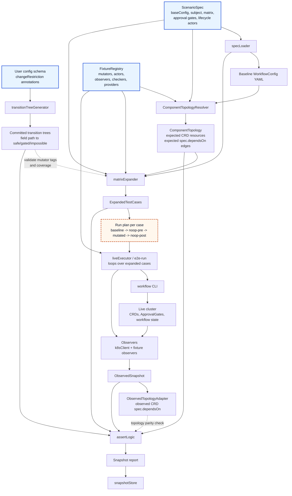

# E2E Orchestration Test Framework

## Audiences

This document serves two roles:

- **Test author** — someone adding a new test scenario: what to provide, how it runs, what the output looks like.
- **Framework implementor** — someone building or extending the framework machinery: how the pieces fit together, what each component is responsible for, what the contracts are.

Both audiences need the examples. The internals sections are primarily for implementors.

---

## What This Tests

The migration workflow system takes a YAML config and deploys Kubernetes infrastructure incrementally — proxies, Kafka, snapshot migrations, traffic replayers. It tracks what changed between submissions and decides per-component whether to skip, rerun, pause for approval, or block. See [reconfiguringWorkflows.md](https://github.com/opensearch-project/opensearch-migrations/blob/main/docs/reconfiguringWorkflows.md) for how the migration framework handles these decisions.

This test framework verifies that orchestration logic against a live cluster:

- Does a component skip when its config hasn't changed?
- Does it rerun — and cascade only to checksum-material dependents — when it has?
- Does the workflow pause at the right approval gates?
- For impossible changes: does the workflow require *both* a resource reset *and* an approval before proceeding — and refuse to advance on either action alone?
- Does it recover correctly after a resource is deleted and resubmitted?
- After any of the above, does resubmitting the same config produce a fully stable, nothing-reruns state?

---

## Generating The Transition Trees

Before writing any tests, run `transitionTreeGenerator` once against the migration framework's user config schema. It reads the `changeRestriction` and checksum materiality annotations on every schema field and produces a per-component map from field path to allowed behavior. Any field without an explicit `changeRestriction` annotation defaults to `safe`, so the generator covers every field in the schema automatically — there is no prerequisite annotation pass before tests can be written.

```
proxy:capture-proxy
  captureConfig.numThreads     → safe      (proxy rerun allowed; downstream skip expected)
  captureConfig.enabled        → gated     (gate must appear before proceeding)
  captureConfig.storageClass   → impossible (resource must be deleted and recreated)

kafka:msk-kafka
  brokerCount                  → gated
  ...
```

Commit these trees to the repo. They are the **single source of ground truth** for every test run — every observed behavior is validated against them. A human reviews them once on initial generation and again whenever the schema changes. CI should block merges that change `changeRestriction` annotations without an accompanying tree regeneration and review.

Regenerate the trees whenever the user config schema changes:

```
npx tsx src/transitionTreeGenerator.ts
```

---

## What You Provide

To define a test you provide three things: a baseline config, fixtures, and a spec.

### 1. A Baseline Config

A workflow YAML describing the migration to test against. This is the starting state for every run in the test.

```yaml
# fullMigrationWithTraffic.wf.yaml
proxy:
  captureConfig:
    numThreads: 4
    maxConnections: 100
kafka: ...
backfill: ...
replay: ...
```

### 2. Fixtures

Fixtures are TypeScript functions registered in the fixture registry. The framework calls them at specific points in the test lifecycle. Each fixture conforms to one of five typed interfaces:

| Kind | Shape | Purpose |
|------|-------|---------|
| **Mutator** | `config → config` | Transforms the baseline config to produce the variant under test. Tagged with `changeClass` and `dependencyPattern` so spec selectors can match them by those attributes without naming them explicitly. |
| **Actor** | `context → ()` | Side effects: gate approval, resource deletion. Also used for lifecycle setup and teardown. |
| **Observer** | `context → observation` | Reads state from the cluster and returns a structured result. |
| **Checker** | `(observations, readCtx) → verdict` | Judges observations. Pure function, no cluster access. |
| **Provider** | `() → state` | Produces initial state with no cluster context needed: seed data, generated configs. |

Most tests reuse existing fixtures. You add new ones only when the registry doesn't cover the behavior you need.

### 3. A Spec

A YAML file that wires it all together. The `subject` is the component the mutators target. The `matrix.select` array narrows which mutators to run — if omitted, the framework runs **all registered mutators** for the subject, which is the default for comprehensive coverage. During development you can add a `select` to narrow to just the case you're working on.

```yaml
# proxy-subjectChange.test.yaml

baseConfig: ../../config-processor/scripts/samples/fullMigrationWithTraffic.wf.yaml

# Per-phase budget for the phase-completion predicate. The framework waits up to
# this long for every component to reach a terminal or held state before calling
# assertNoViolations. Exceeding it produces a phase-timeout failure, distinct
# from a constraint violation.
phaseCompletionTimeoutSeconds: 600

# The matrix finds mutators whose tags match the subject and selectors.
# Each matched mutator + response combination produces one expanded test case.
#
# Every case runs four submissions in sequence — you don't declare these:
#   1. baseline   — establishes starting state
#   2. noop-pre   — verifies nothing reruns before mutation
#   3. <mutator>  — applies the change, verifies behavior
#   4. noop-post  — verifies the system converges after mutation
#
# Omit 'select' to run all registered mutators for this subject.
# Add 'select' to narrow — useful during development.
matrix:
  subject: proxy:capture-proxy
  select:
    # Finds all registered mutators tagged safe + subject-change for proxy:capture-proxy.
    # Currently resolves to: proxy-numThreads
    - changeClass: safe
      patterns: [subject-change]

    # Gated: two cases per mutator — approve (happy path) and leave-blocked (regression guard)
    - changeClass: gated
      patterns: [subject-gated-change]
      response: approve

    - changeClass: gated
      patterns: [subject-gated-change]
      response: leave-blocked

    # Impossible: four cases per mutator — the AND condition requires all four
    - changeClass: impossible
      patterns: [subject-impossible-change]
      response: reset-then-approve   # happy path

    - changeClass: impossible
      patterns: [subject-impossible-change]
      response: approve-only         # approval without reset → must NOT advance

    - changeClass: impossible
      patterns: [subject-impossible-change]
      response: reset-only           # reset without approval → must NOT advance

    - changeClass: impossible
      patterns: [subject-impossible-change]
      response: leave-blocked        # regression guard: blocked state persists

# Actors to run at setup and teardown phases
lifecycle:
  setup:    [delete-target-indices, delete-source-snapshots]
  teardown: [delete-target-indices, delete-source-snapshots]

# Structural gates appear in every run regardless of mutation.
# Listed validators run (as Observers + Checkers) before the framework approves each gate.
approvalGates:
  - approvePattern: "*.evaluatemetadata"
    validations: []
  - approvePattern: "*.migratemetadata"
    validations: [compare-indices]
  - approvePattern: "*.documentbackfill"
    validations: [compare-indices]
```

---

## What Happens Automatically

```
npx tsx src/e2e-run.ts specs/proxy-subjectChange.test.yaml
```

1. **Resolve topology and expand** — the test framework resolves the baseline scenario's `ComponentTopology`, then queries the fixture registry for mutators whose `changeClass` and `dependencyPattern` tags match each selector entry. Each mutator × response combination becomes one expanded test case. For the spec above with one safe mutator, one gated mutator, and one impossible mutator, this produces 7 cases (1 + 2 + 4).

2. **Run each case** — always in this four-run sequence:
   - Actor lifecycle fixtures (setup)
   - Submit baseline config, approve structural gates, observe
   - Resubmit same config (`noop-pre`), verify all components skip
   - Apply mutator, submit modified config, handle gates per `response`, observe
   - Resubmit mutated config (`noop-post`), verify all components skip
   - Actor lifecycle fixtures (teardown)

3. **Capture a behavior snapshot** — component phases, behaviors (ran/reran/skipped/gated/blocked), timing from Argo node status, checker verdicts. Snapshots are diagnostic logs, not oracles.

4. **Compare against the transition trees** — the test passes when every observed behavior is consistent with the `changeRestriction` annotations in the committed trees. It fails when any behavior contradicts them.

---

## Source Of Truth Boundaries

The framework intentionally uses double-entry bookkeeping. The migration framework may generate CRDs, workflow artifacts, approval gates, and live resource state, but those generated artifacts are observed evidence, not the sole oracle.

The test oracle has two independent inputs:

- **Transition trees** — ground truth for field-level change class (`safe`, `gated`, or `impossible`) and checksum materiality, i.e. which downstream components should re-evaluate for a changed path.
- **`ComponentTopology`** — ground truth for the expected Kubernetes resource dependency graph for the scenario: which observed CRD components exist, which CRD components depend on which other CRD components, which are downstream of the subject, and which are independent.

`ComponentTopology` is not the user config tree and not the Argo workflow execution order. It is keyed by observed resource identity (`kind:name`) and should correspond to the CRD resources and `spec.dependsOn` relationships the migration framework is expected to create for a given baseline. If the workflow has sequencing that is not represented as CRD resource dependency, that belongs in a separate execution-order model and must not be smuggled into `ComponentTopology`.

Observed CRDs and live resource state may be adapted into an observed topology and compared to `ComponentTopology`. That comparison can itself fail the test because it catches production naming or dependency-generation defects. The assertion logic should depend on the expected `ComponentTopology`, not on how the migration framework happened to generate resources for that run.

Approval-gate assertions should use the migration framework's public gate/resource state: component phases, approval gate state, and whether the workflow advances after an action. The framework should not depend on Argo implementation details to decide whether an approval gate exists.

Local and unattended execution must share the same semantics. The live runner and any generated outer workflow should execute the same expanded cases, checkpoints, fixture semantics, observations, assertions, and snapshot schema. Any behavioral difference between the two entrypoints is a framework bug.

### Framework Relationship Diagram



The diagram separates the two oracle inputs from observed evidence:

- `TransitionTrees` come from schema annotations and define change-class truth.
- `ComponentTopology` is the expected CRD resource graph for the baseline scenario.
- `ObservedSnapshot` and `ObservedTopologyAdapter` come from generated/live resources and are evidence checked against those expectations.
- `ExpandedTestCase` is the execution plan: one baseline, one mutator, one response path, and the fixtures needed to run it.

---

## What You Get

### The Behavior Snapshot

Each run produces a structured JSON snapshot. The case name encodes the spec path — subject, pattern, mutator — so every segment traces back to the spec.

For the `proxy-numThreads` mutator matched by the `safe + subject-change` selector:

```json
{
  "case": "proxy-subjectChange-numThreads",
  "runs": {
    "baseline": {
      "proxy:capture-proxy":            { "phase": "Ready", "behavior": "ran",     "startedAtSeconds": 0,  "durationSeconds": 42 },
      "kafka:msk-kafka":                { "phase": "Ready", "behavior": "ran",     "startedAtSeconds": 44, "durationSeconds": 38 },
      "replay:traffic-replayer":        { "phase": "Ready", "behavior": "ran",     "startedAtSeconds": 84, "durationSeconds": 12 },
      "metadata:migrate-metadata":      { "phase": "Ready", "behavior": "ran",     "startedAtSeconds": 0,  "durationSeconds": 18 },
      "backfill:reindex-from-snapshot": { "phase": "Ready", "behavior": "ran",     "startedAtSeconds": 20, "durationSeconds": 91 }
    },
    "noop-pre": {
      "proxy:capture-proxy":            { "phase": "Ready", "behavior": "skipped", "startedAtSeconds": 0, "durationSeconds": 1 },
      "kafka:msk-kafka":                { "phase": "Ready", "behavior": "skipped", "startedAtSeconds": 0, "durationSeconds": 1 },
      "replay:traffic-replayer":        { "phase": "Ready", "behavior": "skipped", "startedAtSeconds": 0, "durationSeconds": 1 },
      "metadata:migrate-metadata":      { "phase": "Ready", "behavior": "skipped", "startedAtSeconds": 0, "durationSeconds": 1 },
      "backfill:reindex-from-snapshot": { "phase": "Ready", "behavior": "skipped", "startedAtSeconds": 0, "durationSeconds": 1 }
    },
    "subjectChange-numThreads": {
      "proxy:capture-proxy":            { "phase": "Ready", "behavior": "reran",   "startedAtSeconds": 0,  "durationSeconds": 40 },
      "kafka:msk-kafka":                { "phase": "Ready", "behavior": "skipped", "startedAtSeconds": 0,  "durationSeconds": 1 },
      "replay:traffic-replayer":        { "phase": "Ready", "behavior": "skipped", "startedAtSeconds": 0,  "durationSeconds": 1 },
      "metadata:migrate-metadata":      { "phase": "Ready", "behavior": "skipped", "startedAtSeconds": 0,  "durationSeconds": 1 },
      "backfill:reindex-from-snapshot": { "phase": "Ready", "behavior": "skipped", "startedAtSeconds": 0,  "durationSeconds": 1 }
    },
    "noop-post": {
      "proxy:capture-proxy":            { "phase": "Ready", "behavior": "skipped", "startedAtSeconds": 0, "durationSeconds": 1 },
      "kafka:msk-kafka":                { "phase": "Ready", "behavior": "skipped", "startedAtSeconds": 0, "durationSeconds": 1 },
      "replay:traffic-replayer":        { "phase": "Ready", "behavior": "skipped", "startedAtSeconds": 0, "durationSeconds": 1 },
      "metadata:migrate-metadata":      { "phase": "Ready", "behavior": "skipped", "startedAtSeconds": 0, "durationSeconds": 1 },
      "backfill:reindex-from-snapshot": { "phase": "Ready", "behavior": "skipped", "startedAtSeconds": 0, "durationSeconds": 1 }
    }
  },
  "checkers": [
    {
      "name": "index-parity",
      "at": "subjectChange-numThreads/mutated-complete",
      "pass": true,
      "observations": {
        "target-indices@baseline-complete":                        { "indices": { "my-index": { "docCount": 1000 } } },
        "target-indices@subjectChange-numThreads/mutated-complete": { "indices": { "my-index": { "docCount": 1000 } } }
      }
    }
  ]
}
```

**Timing is informational.** `startedAtSeconds` and `durationSeconds` come from Argo workflow node status and appear in every component entry for human review and trending. They are never used for pass/fail assertions — they're too environment-dependent to be reliable. Noop runs show `startedAtSeconds: 0` since the migration framework evaluates and skips immediately.

**Each run catches a different failure class:**
- `noop-pre` failure → skip logic is broken from a clean state; all other results are unreliable.
- mutator run failure → wrong components reran or skipped, or a checker verdict failed.
- `noop-post` failure → the mutation left residual state (approval IDs, CRD generation counters, stale annotations) causing spurious reruns on the next submission.

### How Tests Pass And Fail

Rather than comparing snapshots directly against ground truth, the framework **walks the observed output against the `ComponentTopology` and transition-tree constraints** and flags any inconsistency. This makes assertions insensitive to timing and parallelism — only final states matter, not when things happened relative to each other.

The walk is triggered once per checkpoint, immediately after the **subject component reaches a terminal or held state** (`Ready`, `Skipped`, `Failed`, `Blocked`, or `Paused`). At that point the framework snapshots CRD state and calls `assertNoViolations`. It does not wait for the full topology to settle — dependents may still be running, but their valid states are already determined by what the subject did.

Before the walk runs, the framework verifies a **phase-completion predicate**: every component in the `ComponentTopology` must be in a terminal state (`Ready`, `Skipped`, `Failed`, `Blocked`, `Paused`, `Deleted`) or a held state waiting for action. If any component is still `Running` or `Pending`, that is itself a test failure — the migration framework left something in a non-terminal state. The predicate has a per-phase budget controlled by `phaseCompletionTimeoutSeconds` in the spec (600 seconds by default); exceeding it produces a `phase-timeout` failure that is distinct from any constraint violation. A `Running` component cannot appear at assertion time if the predicate was correctly enforced; if it does, the predicate was bypassed, not a constraint violation.

**The four constraints checked at each mutation sweep:**

- **Constraint 1 — Change class:** for the subject component, the observed behavior must match what the transition tree says is allowed for the fields that changed. A `safe` field change allows `reran`; a `gated` field change requires `Paused` before approval and `reran` after; an `impossible` field change requires `Blocked` until both reset and approval have occurred.

- **Constraint 2 — Material cascade:** for each component downstream of the subject in the `ComponentTopology`, valid behavior depends on per-dependency checksum materiality for the changed paths. If a changed field is material to a downstream component's waiter, that dependent must `reran`. If it is not material, that dependent must `skipped`; a non-material downstream rerun is a scope leak. If the subject was `Blocked`, dependents must be `Unstarted` or `Blocked`.

- **Constraint 3 — Upstream stability:** for each component upstream of the subject in the `ComponentTopology`, behavior must be `skipped`. A subject mutation should not force its prerequisites to rerun. If an upstream component reruns, that's a reverse-cascade failure.

- **Constraint 4 — Independence:** for each component with no dependency path from the subject in the `ComponentTopology`, behavior must be `skipped`. Because a test case applies exactly one mutation, an independent component has no reason to rerun; if it did, that's a scope isolation failure. Constraint 4 applies universally to noop runs (where no component should have reran), and to all mutation checkpoints **except** the impossible-case `on-blocked` and `after-approve-without-reset` checkpoints: at those checkpoints an independent branch may have already reached `Ready` on its own, and the test deliberately doesn't assert its state. All other checkpoints — including `after-reset` and `after-approve` for impossible cases — apply constraint 4 normally.

**For the baseline run**, the framework records a `baseline-complete` checkpoint as the comparison anchor for later behavior derivation. It does not call mutation constraints because there is no changed subject yet.

**For noop runs**, `assertNoViolations` is called with a `noop` checkpoint and no mutated subject. Every component must be `skipped`. Mutation constraints 1 through 4 don't fire individually.

**Example — safe case:**

For `proxy-numThreads` (changes `captureConfig.numThreads`, a `safe` field): once the proxy reaches `Ready`, the framework sweeps. The tree says `safe` → subject `reran` is consistent. Because `numThreads` is not material to snapshot or replayer checksums, downstream snapshots/replayers must `skipped` — consistent with constraint 2. Kafka and any other prerequisites `skipped` — consistent with constraint 3. `metadata` and `backfill` (independent) `skipped` — consistent with constraint 4. All pass.

If proxy had gated on a `safe` field change:

```
FAIL proxy-subjectChange-numThreads  [checkpoint: mutated-complete]
  proxy:capture-proxy
    constraint: change-class
    field:      captureConfig.numThreads
    tree:       safe (reran expected, no gate)
    observed:   Paused
    → either the schema annotation is wrong, or the migration framework is misbehaving
```

**Example — impossible case, multiple checkpoints:**

For an impossible mutator the walk runs at each checkpoint as actions are taken. At `on-blocked`: proxy must be `Blocked`, dependents `Unstarted`, independents unchecked. At `after-approve-without-reset`: proxy must still be `Blocked` — if it advanced, that's a violation; independents are still unchecked because they may have completed before the block. At `after-reset`: proxy must be `Deleted`, and constraint 3 is in force again so independents must be `skipped` on the next observation. At `after-approve`: proxy and dependents must have `reran`, independents `skipped`.

### Behavior Snapshots Are Diagnostic Logs

Run output is written to `snapshots/<case-name>.json` for debugging and trending. The pass/fail verdict comes entirely from the tree comparison. There is no run-to-run snapshot diffing and no per-run attestation.

### When Human Review Is Required

- **On initial tree generation** — review the generated trees and commit them. This is the only manual step in the normal pipeline.
- **When the schema changes** — any `changeRestriction` change regenerates the affected trees and requires re-review before commit. CI enforces this.
- **When a contradiction is flagged** — decide whether the schema annotation is wrong (fix schema, regenerate) or the migration framework is wrong (fix implementation).

---

## How A Test Case Runs

### Expansion

Before touching the cluster, the test framework expands the spec:

1. Calls `ComponentTopologyResolver` for the baseline scenario to produce a `ComponentTopology` — the expected CRD resources for the scenario and their expected CRD `spec.dependsOn` relationships.
2. Queries the fixture registry for mutators whose `changeClass` and `dependencyPattern` tags match each selector entry. `safe + subject-change` on `proxy:capture-proxy` matches `proxy-numThreads`. `gated + subject-gated-change` matches `proxy-noCaptureToggle`. `impossible + subject-impossible-change` matches `proxy-storageClassChange`.
3. Combines each mutator with its response to produce expanded cases. With one mutator per change class and the response set shown in the spec above: 1 safe case + 2 gated cases + 4 impossible cases = **7 expanded cases**.

When `select` is omitted, all registered mutators for the subject are matched against all their applicable responses. This is the default for CI; narrow with `select` when developing a specific case.

### Execution: Safe Case

For `proxy-subjectChange-numThreads`:

1. Run setup Actor lifecycle fixtures.
2. Submit baseline config. Approve each structural gate after running listed validations.
3. Observe component state.
4. **noop-pre**: resubmit same config. Observe. All components should skip.
5. Apply `proxy-numThreads` mutator. Submit modified config. Approve structural gates.
6. Observe component state.
7. **noop-post**: resubmit mutated config. Observe. All components should skip.
8. Run teardown Actor lifecycle fixtures. Write snapshot.

### Execution: Gated Case (`response: approve`)

Steps 1–4 identical to safe case. Step 5 differs:

5. Apply `proxy-noCaptureToggle` mutator. Submit modified config. The migration framework pauses at a mutation-triggered gate.
   - Observe pre-approval state: proxy is `Paused`, gate is `Pending`, dependents are `Unstarted`.
   - Run pre-approval validations (if configured).
   - Approve the gate. Wait for workflow to resume and complete.
6. Observe post-approval state.
7. **noop-post**: resubmit. Especially important here — the approval action can leave residual state that re-triggers the gate.
8. Teardown. Write snapshot.

With `response: leave-blocked`, step 5 stops after the pre-approval observation — no approval, no noop-post. This is a regression guard verifying the gate still appears correctly.

### Gated Case Snapshot

```json
{
  "case": "proxy-subjectGatedChange-noCaptureToggle/approve",
  "runs": {
    "baseline": { "...": "same structure as safe case" },
    "noop-pre":  { "...": "all skipped with startedAtSeconds: 0" },
    "subjectGatedChange-noCaptureToggle": {
      "gate": {
        "before-approval": {
          "proxy:capture-proxy":     { "phase": "Paused", "gatePending": true,  "startedAtSeconds": 0, "durationSeconds": 3 },
          "replay:traffic-replayer": { "phase": "Unstarted",                        "startedAtSeconds": 0, "durationSeconds": 0 }
        },
        "after-approval": {
          "proxy:capture-proxy":      { "phase": "Ready", "behavior": "reran",   "startedAtSeconds": 0,  "durationSeconds": 41 },
          "kafka:msk-kafka":          { "phase": "Ready", "behavior": "reran",   "startedAtSeconds": 42, "durationSeconds": 38 },
          "replay:traffic-replayer":  { "phase": "Ready", "behavior": "reran",   "startedAtSeconds": 82, "durationSeconds": 12 },
          "metadata:migrate-metadata":{ "phase": "Ready", "behavior": "skipped", "startedAtSeconds": 0,  "durationSeconds": 1 }
        }
      }
    },
    "noop-post": { "...": "all skipped with startedAtSeconds: 0" }
  }
}
```

### Execution: Impossible Cases

Impossible cases require four separate runs of the same mutator to fully verify the AND condition. All four share steps 1–4 with the safe case:

**`response: reset-then-approve`** — happy path.

5. Apply impossible mutator. Submit. Migration framework blocks — resource cannot be updated in place. Observe blocked state.
   - Call `workflow reset` (deletes the resource). Observe: resource gone, gate still `Pending`.
   - Approve the gate. Wait for workflow to resume, redeploy the resource, and complete.
6. Observe recovery state.
7. **noop-post**: resubmit. All components should skip.
8. Teardown. Write snapshot.

**`response: approve-only`** — approval without reset.

5. Apply impossible mutator. Submit. Observe blocked state.
   - Attempt to approve the gate **without** calling `workflow reset`.
   - Observe. The blocked component must remain `Blocked`. Its dependents must not advance.
   - Peer components on independent branches are unaffected by the block and may have already completed — they should be `Ready` and are not part of this assertion.
6. Teardown. Write snapshot. (No noop-post — the mutation was never applied.)

**`response: reset-only`** — reset without approval.

5. Apply impossible mutator. Submit. Observe blocked state.
   - Call `workflow reset`. Observe: resource gone, gate still `Pending`.
   - Do not approve.
   - Observe. The workflow must remain paused — reset alone is not sufficient to advance.
6. Teardown. Write snapshot. (No noop-post.)

**`response: leave-blocked`** — regression guard.

5. Apply impossible mutator. Submit. Observe blocked state only. No further action.
6. Teardown. Write snapshot.

### Impossible Case Snapshots

The `approve-only` and `reset-only` snapshots record that the blocked component and its dependents did not advance. The `advanced: false` field is an explicit assertion — not just re-observation of the same phase, but confirmation the workflow did not transition after the action:

```json
{
  "case": "proxy-subjectImpossibleChange-storageClass/approve-only",
  "runs": {
    "baseline": { "...": "same" },
    "noop-pre":  { "...": "all skipped" },
    "subjectImpossibleChange-storageClass": {
      "gate": {
        "on-blocked": {
          "proxy:capture-proxy":     { "phase": "Blocked", "gatePending": true,  "startedAtSeconds": 0, "durationSeconds": 3 },
          "kafka:msk-kafka":         { "phase": "Unstarted",                      "startedAtSeconds": 0, "durationSeconds": 0 },
          "metadata:migrate-metadata":{ "phase": "Ready", "behavior": "ran",     "startedAtSeconds": 0, "durationSeconds": 18 }
        },
        "after-approve-without-reset": {
          "proxy:capture-proxy":     { "phase": "Blocked", "gatePending": true, "advanced": false },
          "kafka:msk-kafka":         { "phase": "Unstarted",                     "advanced": false }
        }
      }
    }
  }
}
```

Note that `metadata:migrate-metadata` is on an independent branch and proceeded normally — it is `Ready` in `on-blocked`. The `advanced: false` assertion applies only to the blocked component (`proxy`) and its direct dependents (`kafka`, `replayer`).

> **Limitation:** Because each test case applies only one mutation at a time, it is not possible to simultaneously verify that an independent branch proceeds while the blocked branch holds. The two branches are observed sequentially, not concurrently. To test true parallelism would require submitting two changes at once — one blocked and one safe — which multiplies case complexity. This is a known gap; a future patch could introduce multi-mutation specs targeting this scenario specifically.

The `reset-then-approve` snapshot records the full recovery:

```json
{
  "case": "proxy-subjectImpossibleChange-storageClass/reset-then-approve",
  "runs": {
    "baseline": { "...": "same" },
    "noop-pre":  { "...": "all skipped" },
    "subjectImpossibleChange-storageClass": {
      "gate": {
        "on-blocked": {
          "proxy:capture-proxy": { "phase": "Blocked",  "gatePending": true,  "startedAtSeconds": 0, "durationSeconds": 3 }
        },
        "after-reset": {
          "proxy:capture-proxy": { "phase": "Deleted",  "gatePending": true,  "startedAtSeconds": 0, "durationSeconds": 1 }
        },
        "after-approve": {
          "proxy:capture-proxy":     { "phase": "Ready", "behavior": "reran",   "startedAtSeconds": 0,  "durationSeconds": 44 },
          "kafka:msk-kafka":         { "phase": "Ready", "behavior": "reran",   "startedAtSeconds": 45, "durationSeconds": 38 },
          "replay:traffic-replayer": { "phase": "Ready", "behavior": "reran",   "startedAtSeconds": 85, "durationSeconds": 12 }
        }
      }
    },
    "noop-post": { "...": "all skipped" }
  }
}
```

---

## Scenario Model

### What Changes: The Mutator

Each mutator is registered with two required tags:

- **`changeClass`** — what the migration framework does when it sees this config change: `safe` (apply in place), `gated` (pause for approval), `impossible` (block, must delete and recreate).
- **`dependencyPattern`** — where the change lands relative to the subject component: `subject-change`, `immediate-dependent-change`, `transitive-dependent-change`.

A spec selector matches all mutators in the registry where both tags match. `{ changeClass: safe, patterns: [subject-change] }` finds every registered mutator tagged `safe` + `subject-change` for a proxy component — currently just `proxy-numThreads`, but any new mutator added with those tags would be picked up automatically in future runs.

### What The Test Does: The Response

For `safe` mutations the test proceeds automatically — there's nothing to gate on. For `gated` and `impossible` mutations the spec declares a `response`.

**Gated responses:**
- `approve` — observe pre-approval state, run validations, approve, observe post-approval progression, run noop-post.
- `leave-blocked` — observe paused state only. Regression guard.

**Impossible responses:**

The workflow must require *both* a resource reset *and* an approval before advancing. Neither alone is sufficient. Four cases verify this:

- `reset-then-approve` — reset then approve. Workflow must advance. Happy path.
- `approve-only` — approve without reset. Blocked component and its dependents must not advance.
- `reset-only` — reset without approval. Workflow must remain paused.
- `leave-blocked` — no action. Blocked state must persist. Regression guard.

### Gate Types

**Structural gates** appear in every run regardless of mutation (metadata evaluation, document backfill). Declared in `approvalGates`. The test always approves them to let the workflow reach the point where the mutation's effect becomes visible.

**Mutation-triggered gated gates** appear when a `gated` mutator is applied. Approval alone advances the workflow.

**Mutation-triggered impossible gates** appear when an `impossible` mutator is applied. Both reset and approval are required. The `approve-only` and `reset-only` response cases verify each precondition is independently enforced.

---

## Fixture Model

All authored code follows the same convention: a TypeScript object with `kind`, `name`, `tags`, and an implementing method. The framework uses the tags to determine when and how to call each fixture.

### Contracts And Strong Typing

Types are defined using Zod schemas so the config shape is validated at parse time and TypeScript infers precise types. `WorkflowConfig` is derived from the Zod schema for the migration framework's user config, ensuring mutators that produce invalid configs are caught immediately.

```typescript
import { z } from 'zod';

// Enumerations — all values are Zod-validated, TypeScript-inferred
const ChangeClass        = z.enum(['safe', 'gated', 'impossible']);
const DependencyPattern  = z.enum(['subject-change', 'immediate-dependent-change', 'transitive-dependent-change']);
const LifecyclePhase     = z.enum([
  'setup', 'baseline-complete',
  'noop-pre-complete', 'mutated-complete',
  'mutation-gated', 'mutation-gate-approved',
  'mutation-blocked', 'mutation-after-reset',
  'noop-post-complete', 'teardown',
]);

// ComponentId is a branded string validated by regex: "namespace:resource-name"
const ComponentId = z.string().regex(/^[a-z][a-z0-9-]*:[a-z][a-z0-9-]*$/).brand<'ComponentId'>();

// WorkflowConfig is the Zod-inferred type from the migration framework's user config schema.
// Mutators take and return this type, so invalid mutations are caught at expansion time.
type WorkflowConfig = z.infer<typeof WorkflowConfigSchema>;

// Fixture name literals — looked up from the registry with type-safe get()
type FixtureName = string & { readonly brand: unique symbol };

// Interfaces for each fixture kind
interface Mutator {
  kind: 'mutator';
  name: FixtureName;
  tags: { changeClass: z.infer<typeof ChangeClass>; dependencyPattern: z.infer<typeof DependencyPattern>; componentPattern?: string };
  apply(config: WorkflowConfig): WorkflowConfig;
}

interface Actor {
  kind: 'actor';
  name: FixtureName;
  tags: { at: z.infer<typeof LifecyclePhase>[] };
  run(ctx: EffectContext): Promise<void>;
}

interface Observer<T> {
  kind: 'observer';
  name: FixtureName;
  tags: { at: z.infer<typeof LifecyclePhase>[]; componentPattern?: string };
  produces: string;     // base name; framework stores as `<name>@<phase>`
  observe(ctx: EffectContext): Promise<T>;
}

interface Checker<T> {
  kind: 'checker';
  name: FixtureName;
  tags: { at: z.infer<typeof LifecyclePhase>[]; componentPattern?: string };
  consumes: string[];   // full `<name>@<phase>` keys from state bag
  check(observations: Record<string, T>, ctx: ReadContext): Verdict;
}

interface Provider<T> {
  kind: 'provider';
  name: FixtureName;
  tags: { componentPattern?: string };
  produces: string;
  run(): Promise<T>;
}
```

`EffectContext` carries cluster access. `ReadContext` does not — checkers are pure by type-system enforcement (`ReadContext = Omit<EffectContext, 'cluster'>`).

### State Bag

The state bag is **append-only** — once an observation is written it cannot be overwritten or removed. Keys encode both the observer name and the lifecycle phase, so the same observer can run at multiple phases without collision:

```typescript
class ObservationBag {
  private readonly entries = new Map<string, unknown>();

  // Throws if key already exists — enforces append-only semantics
  record(observerName: string, phase: z.infer<typeof LifecyclePhase>, value: unknown): void {
    const key = `${observerName}@${phase}`;
    if (this.entries.has(key)) throw new Error(`Duplicate observation: ${key} — bag is append-only`);
    this.entries.set(key, value);
  }

  get<T>(observerName: string, phase: z.infer<typeof LifecyclePhase>): T | undefined {
    return this.entries.get(`${observerName}@${phase}`) as T | undefined;
  }

  keys(): readonly string[] {
    return [...this.entries.keys()];
  }
}
```

Example keys from a safe case run:

```
target-indices@baseline-complete
target-indices@subjectChange-numThreads/mutated-complete
```

A checker's `consumes` array declares all keys it needs. The framework derives when to run the checker from the latest phase referenced in `consumes` — it schedules the checker after observers for that phase complete. A cross-phase checker comparing baseline vs. post-mutation state runs automatically at the later phase, once both entries exist in the bag. If a checker's required phase never fires for a given response (e.g. a checker consuming `mutation-gate-approved` during a `leave-blocked` run), the required observation key is absent from the bag and the checker fails with a missing-observation error — no additional scheduling validator is needed.

### Lifecycle Phases And Execution Order

`setup` → `baseline-complete` → `noop-pre-complete` → `mutated-complete` (or `mutation-gated` → `mutation-gate-approved`) → `noop-post-complete` → `teardown`

For impossible cases the mutated path extends: `mutation-blocked` → `mutation-after-reset` → `mutated-complete` (or ends at `mutation-blocked` for leave-blocked/approve-only/reset-only).

At each phase, execution order is: **Actors → CRD state collection → Observers → Checkers**.

**Phase-completion predicate:** before the framework transitions between phases — and before calling `assertNoViolations` — it verifies that every component in the `ComponentTopology` is in a terminal state (`Ready`, `Skipped`, `Failed`, `Blocked`, `Paused`, `Deleted`) or held state. No component may be `Running` or `Pending`. The per-phase budget is controlled by `phaseCompletionTimeoutSeconds` in the spec. If the predicate is not satisfied within that budget, the test fails immediately with a `phase-timeout` error, independently of any constraint violations. This is a correctness requirement: a `Running` component at assertion time means the predicate was bypassed, not that a constraint was violated.

### Current Fixtures

| Name | Kind | Tags | What It Does |
|------|------|------|--------------|
| `proxy-numThreads` | mutator | safe, subject-change | Changes proxy thread count |
| `proxy-noCaptureToggle` | mutator | gated, subject-gated-change | Toggles capture off |
| `replayer-speedupFactor` | mutator | safe, immediate-dependent-change | Changes replayer speedup |
| `rfs-maxConnections` | mutator | safe, transitive-dependent-change | Changes RFS max connections |
| `delete-target-indices` | actor | at: setup, teardown | Clears target cluster indices |
| `delete-source-snapshots` | actor | at: setup, teardown | Removes source snapshots |
| `compare-indices` | observer+checker* | at: baseline-complete, mutated-complete | Index count parity |

\* `compare-indices` currently fuses observation and judgment. Split into `target-index-snapshot` (observer) + `index-parity` (checker) so the observation feeds multiple checkers independently.

---

## How To Add A New Test

1. Choose a baseline config (or reuse an existing one).
2. Identify the subject component and the config change you want to exercise.
3. Check the fixture registry for a matching mutator. If none exists, implement `Mutator`, tag it with `changeClass` and `dependencyPattern`, and register it. Because mutators take and return `WorkflowConfig` (a Zod-validated type), invalid output is caught at expansion time before any cluster is touched.
4. Write a spec YAML with the subject and selectors. During development, narrow `select` to just the response you're working on.
5. Run the test. A snapshot is written to `snapshots/` as a diagnostic log.
6. Check the result. Pass/fail comes from the tree comparison — if the observed behavior contradicts a `changeRestriction` annotation, the failure message names the component, field, tree value, and observed behavior.

---

## Framework Internals

### ComponentTopology And ComponentTopologyResolver

`ComponentTopology` is the representation of the scenario's expected CRD resources and CRD dependency relationships. It answers questions such as "what is downstream of this subject?" and "which components are independent of this subject?" The assertion logic depends on this representation, not on how it was created.

`ComponentTopologyResolver` creates a `ComponentTopology` from the baseline config, spec context, fixture metadata, and any independent deduction rules. The resulting graph must be stated in terms of expected CRD resources and expected CRD `spec.dependsOn` edges. It is not an Argo workflow parser, not a representation of user-config nesting, and not the source of truth for change classes. Fingerprint computation belongs to the migration framework; change-class truth comes from the transition trees.

If a test needs to reason about ordering that is real in the workflow but not represented in CRD `spec.dependsOn`, model that separately. For example, a workflow step may wait for a snapshot before running a migration even when the `SnapshotMigration` CR itself has no `spec.dependsOn`; that sequencing is not a `ComponentTopology` edge.

### matrixExpander

1. Resolves a `ComponentTopology` for the baseline scenario.
2. For each selector, queries the fixture registry for mutators matching `changeClass` + `dependencyPattern`.
3. Applies each mutator to the baseline config (validates output against `WorkflowConfigSchema`).
4. Uses transition-tree materiality to calculate the expected rerun set for the changed paths.
5. Packages an `ExpandedTestCase`: case name, baseline config, mutated config, changed paths, expected rerun set, response action.

### snapshotStore

Writes run output to `snapshots/<case-name>.json`. Snapshots are diagnostic logs — not compared run-to-run, no attestation flag. Pass/fail comes from `assertLogic`.

### assertLogic

`assertLogic` implements the constraint walk described in "How Tests Pass And Fail." It exposes one public entry point — `assertNoViolations` — which handles all four mutation constraints and dispatches to checkpoint-specific logic for noop, gated, and impossible cases.

```typescript
type Checkpoint =
  | 'baseline-complete'          // baseline run: observation anchor only
  | 'noop'                       // noop-pre and noop-post runs: no subject, all components must be skipped
  | 'mutated-complete'           // safe case terminal checkpoint
  | 'before-approval'            // gated: after pause
  | 'after-approval'             // gated: after gate approved
  | 'on-blocked'                 // impossible: initial blocked state
  | 'after-approve-without-reset'// impossible: approve-only response
  | 'after-reset'                // impossible: after workflow reset
  | 'after-approve';             // impossible: after reset+approve

// Checkpoints where an independent branch may legitimately have completed
// before the subject reached its held state. Constraint 4 is skipped for
// independents at these checkpoints; it applies everywhere else.
const INDEPENDENTS_UNCHECKED: ReadonlySet<Checkpoint> = new Set([
  'on-blocked',
  'after-approve-without-reset',
]);

// Called by the executor once per checkpoint, immediately after the subject
// reaches a terminal or held state. The phase-completion predicate must have
// already been verified before this is called — Running/Pending components
// at this point indicate a predicate failure, not a constraint violation.
function assertNoViolations(
  observed: ObservedSnapshot,
  changeClass: ChangeClass | 'noop',
  checkpoint: Checkpoint,
  subject: ComponentId | null,   // null on 'baseline-complete' and 'noop' checkpoints
  topology: ComponentTopology,
  expectedReruns: Set<ComponentId>, // subject plus checksum-material downstream components
): Violation[] {

  // Baseline runs: no subject, no mutation assertions.
  if (checkpoint === 'baseline-complete') {
    return [];
  }

  // Noop runs: no subject, every component must be skipped
  if (checkpoint === 'noop') {
    return topology.allComponents()
      .filter(c => observed.get(c)?.behavior !== 'skipped')
      .map(c => ({ type: 'noop-not-skipped', componentId: c, observed: observed.get(c) }));
  }

  const dependents   = topology.downstreamOf(subject!);
  const upstream     = topology.upstreamOf(subject!);
  const independents = topology.independentOf(subject!);

  // Constraint 3: upstream components must be skipped.
  const upstreamViolations = upstream
    .filter(c => observed.get(c)?.behavior !== 'skipped')
    .map(c => ({ type: 'upstream-reran', componentId: c, observed: observed.get(c) }));

  // Constraint 4: independent components must be skipped — except at the two
  // impossible-case checkpoints where a branch may have legitimately completed.
  const independenceViolations = INDEPENDENTS_UNCHECKED.has(checkpoint)
    ? []
    : independents
        .filter(c => observed.get(c)?.behavior !== 'skipped')
        .map(c => ({ type: 'independence', componentId: c, observed: observed.get(c) }));

  // Constraints 1 and 2: dispatch to checkpoint-specific logic
  const behaviorViolations = assertAtCheckpoint(
    changeClass, checkpoint, observed, subject!, dependents
  );

  return [...upstreamViolations, ...independenceViolations, ...behaviorViolations];
}

// Encodes valid states for subject and dependents at each checkpoint.
// Upstream and independent components are handled in assertNoViolations above.
function assertAtCheckpoint(
  changeClass: ChangeClass,
  checkpoint: Checkpoint,
  observed: ObservedSnapshot,
  subject: ComponentId,
  dependents: ComponentId[],
  expectedReruns: Set<ComponentId>,
): Violation[] {

  if (changeClass === 'safe') {
    // One checkpoint only: subject reran; downstream components rerun only
    // when the changed paths are material to their per-dependency checksum.
    return [
      ...assertBehavior(observed, subject, ['reran']),
      ...dependents.flatMap(d =>
        assertBehavior(observed, d, expectedReruns.has(d) ? ['reran'] : ['skipped'])
      ),
    ];
  }

  if (changeClass === 'gated') {
    switch (checkpoint) {
      case 'before-approval':
        return [
          ...assertBehavior(observed, subject, ['Paused']),
          ...dependents.flatMap(d => assertBehavior(observed, d, ['Unstarted'])),
        ];
      case 'after-approval':
        return [
          ...assertBehavior(observed, subject, ['reran']),
          ...dependents.flatMap(d =>
            assertBehavior(observed, d, expectedReruns.has(d) ? ['reran'] : ['skipped'])
          ),
        ];
    }
  }

  if (changeClass === 'impossible') {
    switch (checkpoint) {
      case 'on-blocked':
        return [
          ...assertBehavior(observed, subject, ['Blocked']),
          ...dependents.flatMap(d => assertBehavior(observed, d, ['Unstarted', 'Blocked'])),
          // independents: unchecked at this checkpoint — see assertNoViolations
        ];
      case 'after-approve-without-reset':
        // Approval without reset must not advance the subject or its dependents
        return [
          ...assertBehavior(observed, subject, ['Blocked']),
          ...dependents.flatMap(d => assertBehavior(observed, d, ['Unstarted'])),
        ];
      case 'after-reset':
        return [
          ...assertBehavior(observed, subject, ['Deleted']),
          ...dependents.flatMap(d => assertBehavior(observed, d, ['Unstarted'])),
        ];
      case 'after-approve':
        return [
          ...assertBehavior(observed, subject, ['reran']),
          ...dependents.flatMap(d =>
            assertBehavior(observed, d, expectedReruns.has(d) ? ['reran'] : ['skipped'])
          ),
        ];
    }
  }

  return [];
}
```

The executor calls `assertNoViolations` once per checkpoint as the test progresses. Noop-pre and noop-post each fire one `'noop'` checkpoint. For a safe case there is one `'mutated-complete'` call. For a gated case with `response: approve` there are two calls — `before-approval` and `after-approval`. For an impossible case with `response: reset-then-approve` there are three calls — `on-blocked`, `after-reset`, and `after-approve`. For `approve-only` there are two — `on-blocked` and `after-approve-without-reset`.

### Executors

Two entrypoints into the same four-run sequence:

- **Live runner** (`e2e-run.ts`) — CLI-driven, best for local development.
- **Outer workflow** (`buildOuterWorkflow.ts`, `generate-outer.ts`) — generates Argo Workflow YAML for unattended CI.

Any behavioral difference between them is a bug.

---

## Constraints

- One test case runs at a time.
- Each submission should use a unique workflow name or generated name so automated cases do not collide with manual workflow usage in the same namespace.
- Teardown is mandatory before a test case is marked complete.
- Mutators are validated against `WorkflowConfigSchema` at expansion time — invalid configs are rejected before any cluster is touched.

---

## Current Gaps

**Not yet implemented:**
- `transitionTreeGenerator` (schema `changeRestriction` → per-component transition trees).
- Timing capture from Argo node status.
- Real-cluster validation for gated and impossible response plans. The case-plan executor can construct the responses, but gate-state assertions and non-advancement checks still need live proof.
- Component-level correlation from Argo nodes to behavior labels.

**Implemented but incomplete:**
- Multi-case execution: expanded cases run sequentially, but failure in one case currently stops later cases.
- Snapshot write-to-disk: compact and detailed snapshots exist, but timing and component-correlated Argo evidence are incomplete.
- Tree-based pass/fail in `assertLogic`: pure checkpoint assertions exist; generated transition-tree mapping is still pending.
- Gated/impossible flow: response case plans exist in the live runner; gate-time fixture validations and real-cluster gate assertions are still pending.
- Outer workflow parity: safe flows work; approval-time validation semantics not yet equivalent to live runner.

---

## Implementation Plan

**1. Merge reconciliation** — verify test framework assumptions against the merged migration framework CLI and CRD lifecycle. Remove stale pre-merge language.

Exit: safe runtime slice runs end-to-end against the merged workflow CLI.

**2. Transition tree generator + assertLogic** — read `changeRestriction` from the user config schema (defaulting missing annotations to `safe`), produce per-component transition trees, commit to repo. Implement `assertNoViolations` and `assertAtCheckpoint` with the full constraint-walk model: change-class (constraint 1), cascade (constraint 2), and independence (constraint 3). Implement the phase-completion predicate with `phaseCompletionTimeoutSeconds` from the spec and a distinct `phase-timeout` failure.

Exit: `assertLogic` correctly flags change-class, cascade, and independence violations. Noop runs fail when any component is not `skipped`. Phase timeout produces a distinct error.

**3. Snapshot write-to-disk** — implement `snapshotStore`. Write all component behaviors, timing, and checker verdicts to `snapshots/<case-name>.json`.

Exit: a completed run produces a readable snapshot file.

**4. Timing capture** — extract `startedAtSeconds` and `durationSeconds` from Argo node status. No assertions.

Exit: every component entry in every snapshot includes timing data.

**5. Executor convergence** — bring the outer workflow to parity with the live runner for safe flows.

Exit: both entrypoints produce identical snapshots for the same spec.

**6. Multi-case execution** — run all expanded cases per spec.

Exit: a spec with multiple selectors produces one snapshot file per case.

**7. Full gated flow** — complete gate-time fixture validations; populate `before-approval` and `after-approval` from real observations; implement `leave-blocked` response.

Exit: gated cases produce complete snapshots; not reported as `partial`.

**8. Full impossible flow** — implement all four impossible response sub-cases. The `approve-only` and `reset-only` cases require the executor to take an action and then actively verify `advanced: false`.

Exit: all four sub-cases run end-to-end and produce complete snapshots.

**Parallel quality work:** split `compare-indices` into observer + checker; unit tests for `ComponentTopology`, `ComponentTopologyResolver`, `matrixExpander`, `snapshotStore`, `transitionTreeGenerator`, `assertLogic`; improve contradiction diagnostics.

---

## File Index

| File | Purpose |
|------|---------|
| `src/types.ts` | Core type definitions and Zod schemas |
| `src/componentTopology.ts` | Expected CRD resource dependency representation |
| `src/componentTopologyResolver.ts` | Baseline config/spec/fixtures → expected CRD `ComponentTopology` |
| `src/matrixExpander.ts` | Spec selectors + registry → expanded test cases |
| `src/transitionTreeGenerator.ts` | User config schema → per-component field transition trees |
| `src/transitionTrees/` | Committed transition trees (human-reviewed, source of ground truth) |
| `src/assertLogic.ts` | Observed behavior vs. committed transition trees → pass/fail |
| `src/snapshotStore.ts` | Snapshot write-to-disk (diagnostic logs) |
| `src/reportSchema.ts` | Snapshot JSON format |
| `src/specLoader.ts` | Spec YAML loading and validation |
| `src/fixtureRegistry.ts` | Typed fixture collection, queryable by kind and tags |
| `src/fixtures/mutators.ts` | Mutator implementations |
| `src/fixtures/actors.ts` | Actor implementations |
| `src/fixtures/observers.ts` | Observer implementations |
| `src/fixtures/checkers.ts` | Checker implementations |
| `src/e2e-run.ts` | Live runner |
| `src/buildOuterWorkflow.ts` | Outer workflow builder |
| `src/generate-outer.ts` | Outer workflow YAML generation |
| `specs/*.test.yaml` | Test spec definitions |
| `snapshots/*.json` | Diagnostic run logs |
