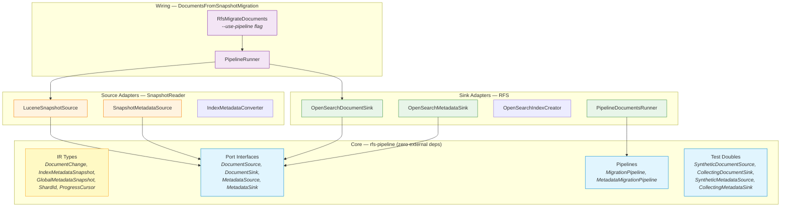

# Pipeline Architecture

The pipeline uses a **ports-and-adapters** (hexagonal) architecture. The core module (`rfs-pipeline`) defines IR types and port interfaces with zero dependencies on Lucene or OpenSearch. Adapters in separate modules implement the ports.

Key constraint: **RFS does not depend on SnapshotReader** and vice versa. They only share `rfs-pipeline`.

## Module Boundaries

| Module | Responsibility | Dependencies |
|---|---|---|
| `rfs-pipeline` | IR types, port interfaces, pipeline orchestration, test doubles | None (zero external deps) |
| `SnapshotReader` | Source adapters (`LuceneSnapshotSource`, `SnapshotMetadataSource`) | `rfs-pipeline`, Lucene |
| `RFS` | Sink adapters (`OpenSearchDocumentSink`, `OpenSearchMetadataSink`), work coordination | `rfs-pipeline`, OpenSearch client |
| `DocumentsFromSnapshotMigration` | Top-level wiring (`PipelineRunner`, CLI flag) | All of the above |
