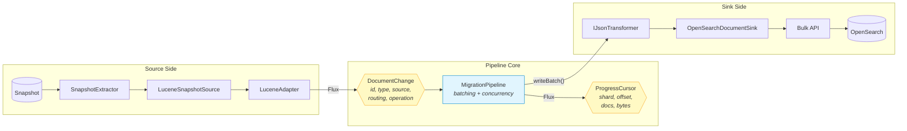
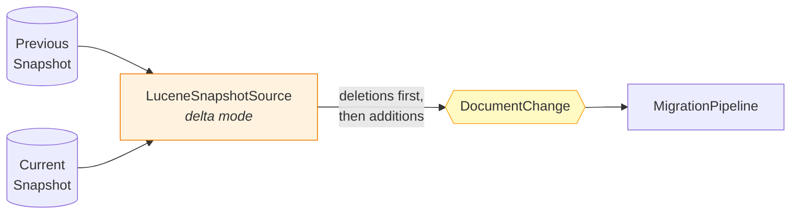

# Document Migration Data Flow

Documents flow from a snapshot through the pipeline core to OpenSearch. The IR (`DocumentChange`) is the boundary — source adapters produce it, sink adapters consume it.

## How It Works

1. `LuceneSnapshotSource` wraps `SnapshotExtractor` to read Lucene segments from a snapshot
2. `LuceneAdapter` converts `LuceneDocumentChange` → `DocumentChange` (stripping Lucene-specific fields)
3. `MigrationPipeline` batches documents by count and byte size, then calls `writeBatch()` on the sink
4. `OpenSearchDocumentSink` optionally applies `IJsonTransformer`, then sends a bulk request to OpenSearch
5. Each batch returns a `ProgressCursor` for resumability tracking

## Delta Snapshot Support

When configured with a previous snapshot, `LuceneSnapshotSource` uses `DeltaLuceneReader` to diff two snapshots and emit only the changes (additions and deletions).

