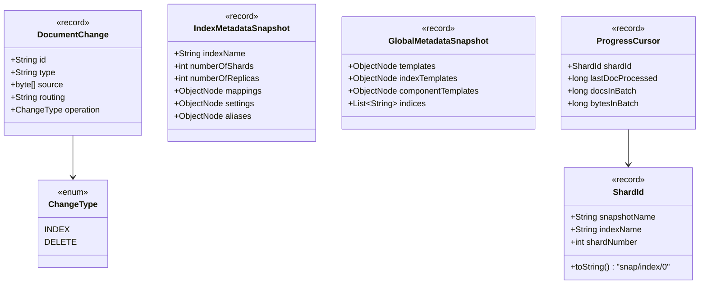
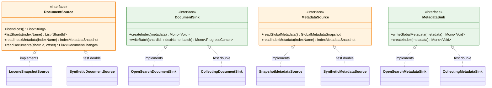

# IR Types and Port Interfaces

The pipeline defines a clean intermediate representation (IR) that is completely Lucene-agnostic. All types are Java `record`s with compact constructor validation and zero runtime dependencies.

## IR Types

## Port Interfaces

Four port interfaces define the boundary between the pipeline core and external systems.

