# Testing Strategy

The pipeline uses an **N+M** testing strategy instead of N×M. Source adapters and sink adapters are tested independently against real infrastructure, connected only through the IR.

## N+M vs N×M

```mermaid
flowchart TB
    subgraph SourceTests["Source-Side Tests (N tests, one per source version)"]
        direction LR
        RS[Real Snapshot<br/><i>ES 1.7 / 2.4 / 5.6 / 6.8 / 7.10 / 8.x</i>]
        LSS2[LuceneSnapshotSource]
        ASSERT1[Assert IR correctness]
        RS --> LSS2 -->|"Flux&lt;DocumentChange&gt;"| ASSERT1
    end

    subgraph SinkTests["Sink-Side Tests (M tests, one per target version)"]
        direction LR
        SDS[SyntheticDocumentSource<br/><i>test double</i>]
        ODS2[OpenSearchDocumentSink]
        TC[(Real Target<br/><i>OS 1.3 / 2.x / 3.x</i>)]
        SDS -->|"Flux&lt;DocumentChange&gt;"| ODS2 --> TC
    end

    subgraph E2ETests["Full Pipeline E2E (smoke pairs)"]
        direction LR
        SNAP[(Real Snapshot)] --> PIPE[MigrationPipeline] --> CLUSTER[(Real Cluster)]
    end

    style SourceTests fill:#fff3e0,stroke:#f57c00
    style SinkTests fill:#e8f5e9,stroke:#388e3c
    style E2ETests fill:#f3e5f5,stroke:#7b1fa2
```

Instead of N sources × M targets = **N×M integration tests**, we get:
- **N source tests** — validate reading from each source version
- **M sink tests** — validate writing to each target version
- **Smoke pairs** — a small set of full pipeline E2E tests for confidence

## Test Suite

| Test File | Module | Tests | Parameterized Runs | What It Validates |
|---|---|---|---|---|
| `LuceneSnapshotSourceEndToEndTest` | SnapshotReader | 7 | 63 (× 9 sources) | Real snapshots → IR |
| `OpenSearchDocumentSinkEndToEndTest` | RFS | 5 | 15 (× 3 targets) | IR → real clusters |
| `PipelineEndToEndTest` | DocumentsFromSnapshotMigration | 3 | 18 (× 6 smoke pairs) | Full pipeline E2E |

All tests use real Docker containers — no mocks.
