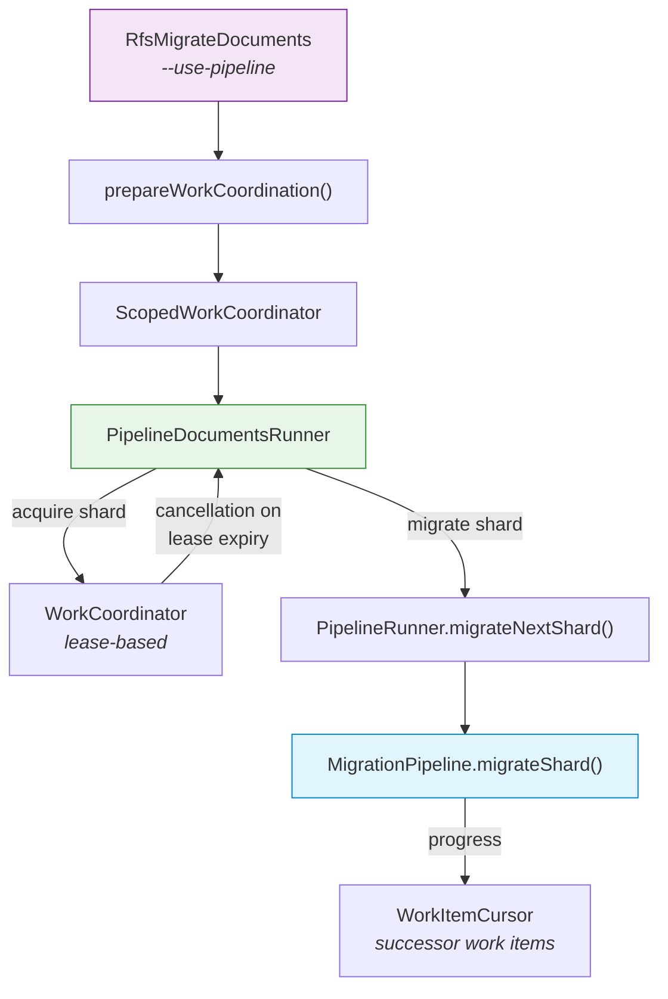
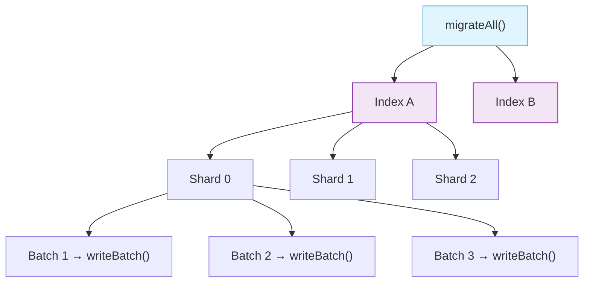

# Work Coordination

The pipeline supports two execution modes: standalone (single process) and coordinated (horizontal scaling across workers).

## Coordinated Mode (Production)

Multiple RFS workers each call `migrateNextShard()` in a loop. A shared `IWorkCoordinator` (backed by OpenSearch or DynamoDB) ensures no two workers process the same shard.

### How It Works

1. Work items are created per shard as `indexName__shardNumber__startingDocId`
2. `acquireNextWorkItem()` atomically assigns an unassigned shard to the calling worker
3. Worker gets a time-limited lease — must complete or the shard gets reassigned
4. Lease doubling on retry (exponential backoff for stuck shards)
5. Successor work items for mid-shard resume — if a worker's lease expires, a new work item is created with the `startingDocId` where it left off
6. On completion, `completeWorkItem()` marks it done

## Standalone Mode (Testing / Small Migrations)

`migrateAll()` processes everything in a single process with no coordination.

- Indices: sequential (`concatMap`)
- Shards within an index: configurable concurrency (`flatMap(shardConcurrency)`)
- Batches within a shard: sequential to preserve document ordering
- Batch boundaries: configurable by `maxDocsPerBatch` and `maxBytesPerBatch`

## Comparison

| | `migrateAll()` | `migrateNextShard()` |
|---|---|---|
| Scaling | Single process, parallel shards on one machine | Multiple workers, one shard per worker |
| Coordination | None | Lease-based via `IWorkCoordinator` |
| Resume | No | Yes, via `startingDocId` successor work items |
| Used by | `PipelineRunner.migrateDocuments()` | `runWithPipeline()` in `main()` |
