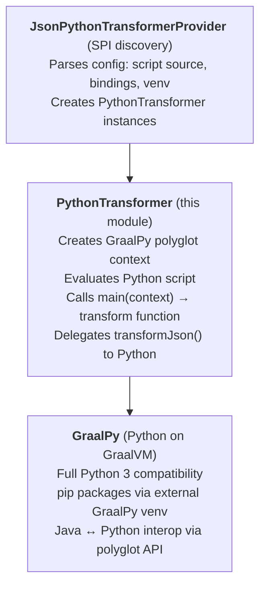

# jsonPythonTransformer

Core engine that executes Python transformation scripts inside the JVM using [GraalPy](https://www.graalvm.org/python/).

This module provides `PythonTransformer`, which implements `IJsonTransformer` and evaluates Python code
via the GraalVM Polyglot API. It supports the Python standard library, `dataclasses`, and pip packages
installed at runtime via an external [GraalPy venv](https://www.graalvm.org/python/docs/).

## Architecture

## Runtime venv support

Pass a `venvPath` to `PythonTransformer` to use an external GraalPy venv with arbitrary pip packages.
This is exposed to users via the `pythonModulePath` config key in `JsonPythonTransformerProvider`.

See the [jsonPythonTransformerProvider README](../jsonPythonTransformerProvider/README.md) for user-facing
documentation and a [complete example project](../jsonPythonTransformerProvider/custom_transform/).
